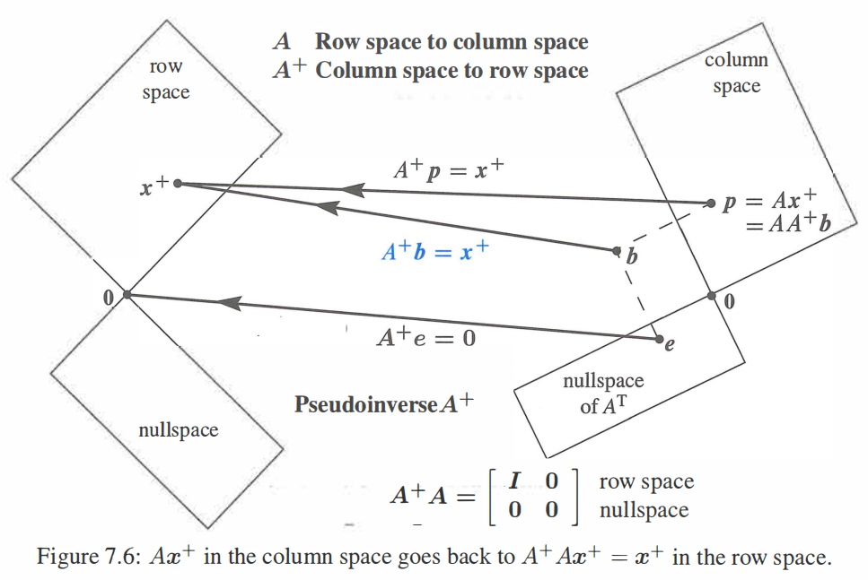

## SVD理解
借助矩阵$A$的4个子空间可以更好理解实际含义, $rank(A)=r$
- 选取$v_1,\cdots,v_r$为$C(A^T)$的单位正交基
- 选取$v_{r+1},\cdots,v_n$为$N(A)$的单位正交基. 因为$C(A^T)\bot N(A)$, $v_1,\cdots,v_n$为$\mathbb{R}^n$的一组正交基,即$V^TV=I$
- 选取$u_1,\cdots,u_r$为$C(A)$中单位向量, 根据映射关系确定$\sigma_i u_i=Av_i$. 后面可以证明, $u_1,\cdots,u_r$为$C(A)$的一组正交基
- 选取$u_{r+1},\cdots,u_m$为$N(A^T)$的一组单位正交基, 后面证明所以$u_1,\cdots,u_m$为$\mathbb{R}^m$的一组正交基

可以得到
$$
A\left[\boldsymbol{v}_{1} \cdots \boldsymbol{v}_{r}\right]=\left[\boldsymbol{u}_{1} \cdots \boldsymbol{u}_{r}\right]\left[\begin{array}{lll}
\sigma_{1} & & \\
& \cdot & \\
& & \sigma_{r}
\end{array}\right]
$$
补充零空间可以得到
$$
AV=U\Sigma =A\left[\boldsymbol{v}_{1} \cdots \boldsymbol{v}_{n}\right]=\left[\boldsymbol{u}_{1} \cdots \boldsymbol{u}_{m}\right]\left[\begin{array}{lll}
\sigma_{1} && & \\
& \cdot & &\\
& & \sigma_{r}&\\
& & &
\end{array}\right]
$$
得到$A=U\Sigma V^T=\sigma_{1}u_1v_1^T+\cdots+\sigma_{r}u_rv_r^T$
**SVD分解就是找到一组基,从而把复杂矩阵分解成简单rank=1矩阵**

对应$A^TA=V\Sigma^T\Sigma V^T=V\Lambda V^T=V\begin{bmatrix}
\sigma_1^2  &  & &\\
  & \ddots  & &\\
  &  &\sigma_r^2&\\
& & & 0
\end{bmatrix}V^T$
- 证明$u_1,\cdots,u_r$为$C(A)$的一组正交基, 同理由于两个子空间垂直,所以$u_1,\cdots,u_m$为$\mathbb{R}^m$的一组正交基
$$
u_i^Tu_j=(\frac{Av_i}{\sigma_i})^T(\frac{A\sigma_j}{\sigma_j})=\frac{v_i^TA^TAv_j}{\sigma_i\sigma_j}=\frac{v_i^TV\Lambda V^Tv_j}{\sigma_i\sigma_j}=\frac{\sigma _j^2v_i^Tv_j}{\sigma_i\sigma_j}=0
$$

综上所述,SVD分解为$A=U\Sigma V^T$,$U,V$分别是$\mathbb{R}^m, \mathbb{R}^n$的正交基,其中前$r$个向量分别是2个列空间的正交基,后补充向量为2个零空间的正交基

**SVD和特征值关系**
可以证明$A^TAv_i=V\Lambda Vv_i=\sigma _i^2v_i$, $AA^Tu_i=U\Lambda Uu_i=\sigma _i^2u_i$, 所以$A^TA,AA^T$的特征值就是$A$奇异值的平方, $v_i,u_i$分别是$A^TA,AA^T$的特征向量. 所以求解SVD也可以从特征值和特征向量入手

奇异值求解稳定,特征值受矩阵本生影响, 矩阵变化一个很小的量, 特征值可能会有明显变化
$A=\left[\begin{array}{llll}
0 & 1 & 0 & 0 \\
0 & 0 & 2 & 0 \\
0 & 0 & 0 & 3 \\
0 & 0 & 0 & 0
\end{array}\right]$特征值$\lambda = 0$, 奇异值$\sigma =3,2,1$, 变化很小的量
$A=\left[\begin{array}{llll}
0 & 1 & 0 & 0 \\
0 & 0 & 2 & 0 \\
0 & 0 & 0 & 3 \\
\frac{1}{60000} & 0 & 0 & 0
\end{array}\right]$ 特征值变为$\lambda=\frac{1}{10},\frac{i}{10},\frac{-1}{10},\frac{-i}{10}$, 奇异值$\sigma=3,2,1,\frac{1}{60000}$, $U,V$不变,只是分解后增加了一项很小的值$\sigma_4u_4v_4$

### 伪逆$A^+$
SVD分解对应$Av_i=\sigma u_i$, 对应把$C(A^T)$空间映射到$C(A)$空间,同样我们可以想办法找到映射关系反过来映射, 即$A^+u_i=\frac{1}{\sigma}v_i$, 即
$$
A^+=V\Sigma^+ U^T=\left[\boldsymbol{v}_{1} \cdots \boldsymbol{v}_{r} \cdots \boldsymbol{v}_{n}\right]\left[\begin{array}{lll}
\sigma_{1}^{-1} & & \\
& \ddots & \\
& & \sigma_{r}^{-1}
\end{array}\right]\left[\boldsymbol{u}_{1} \cdots \boldsymbol{u}_{r} \cdots \boldsymbol{u}_{m}\right]^{\mathrm{T}}
$$
其中$\Sigma^+$只是把$\Sigma$对应非零元素求倒,其实这里是想找到$A^{-1}$, 如果不存在的化就找到最接近的矩阵, 对应就是找$\Sigma=VAU^T$, 最接近单位矩阵就是上面的$\Sigma^+$, 对应$\Sigma^+\Sigma=\begin{bmatrix}
1  &  &  & \\
  &  \ddots &  & \\
  &  &  1& \\
  &  &  & 0
\end{bmatrix}$就是正交投影矩阵
$A^+$对应空间的映射关系如下, 刚好和$A$的映射关系相反

对应$AA^+,A^+A$分别把向量投影到$C(A), C(A^T)$
$$
AA^+=U\begin{bmatrix}
1  &  &  & \\
  &  \ddots &  & \\
  &  &  1& \\
  &  &  & 0
\end{bmatrix} U^T=u_1u_1^T+\cdots+u_ru_r^T
$$
$$
A^+A=V\begin{bmatrix}
1  &  &  & \\
  &  \ddots &  & \\
  &  &  1& \\
  &  &  & 0
\end{bmatrix} V^T=v_1v_1^T+\cdots+v_rv_r^T
$$
其中$u_ru_r^T, v_rv_r^T$分别是1维投影到向量$u,v$

## 极分解 Polar Decomposition $A = QS$
极分解从SVD分解衍生而来, 把方阵分解成旋转(rotation)和拉伸(stretching), 其中Q是正交矩阵, S是半正定矩阵, 如果A可逆,则S为正定矩阵.任意实方阵都可极分解A=QS
考虑复数的极坐标方式$x+iy=re^{i\theta}$,可以看成1x1矩阵的极分解
从SVD分解可以得到两种形式的极分解
$A=U\Sigma V^T=(UV^T)(V\Sigma V^T)=QS$, 或者$A=U\Sigma V^T=(U\Sigma U^T)(UV^T)=SQ$