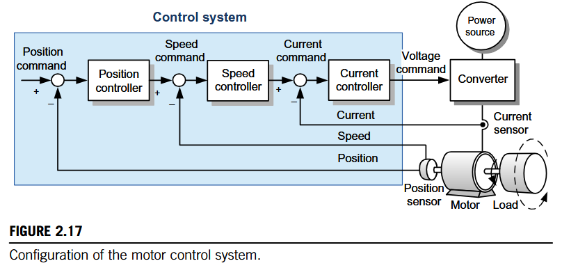
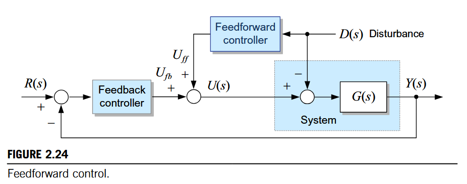
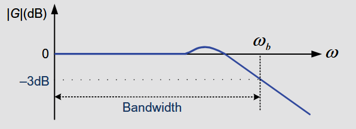
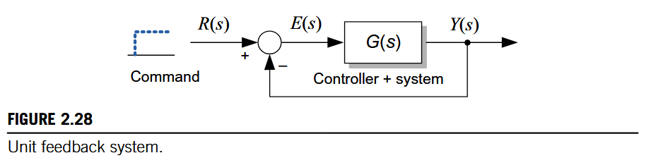
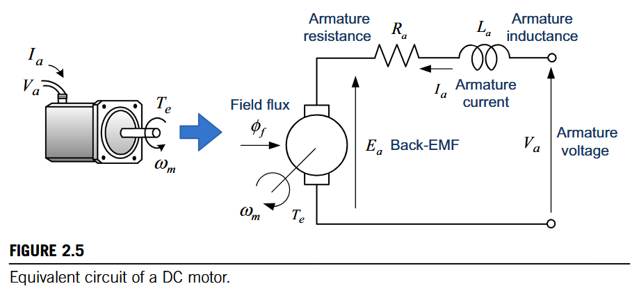
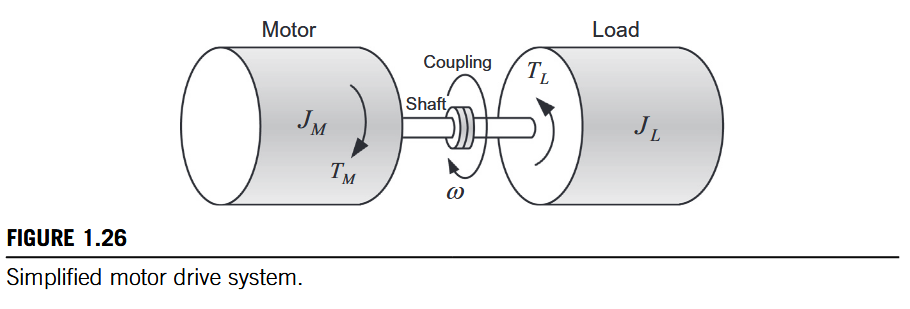
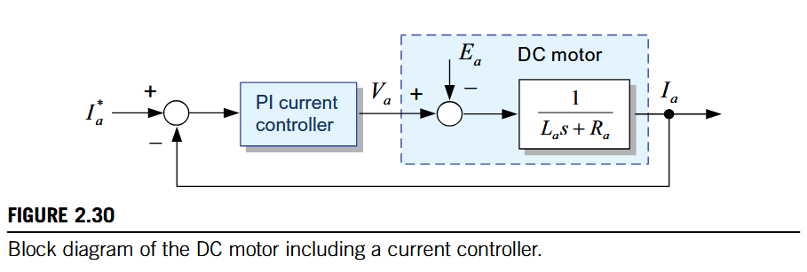
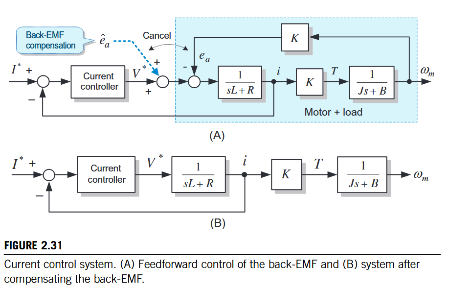
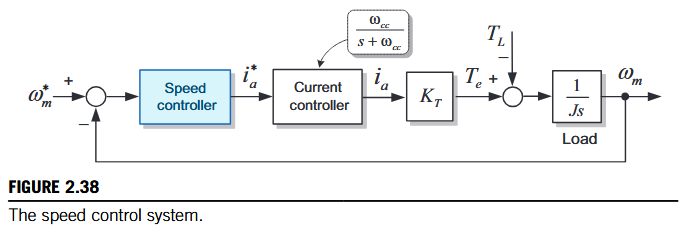
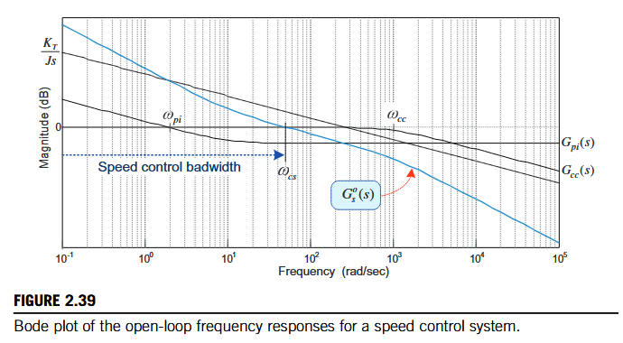

# 伺服控制[^1]

## 三环控制

主要逻辑如下

通常在控制系统中会增加前馈控制，快速消除干扰对输出的影响，如反电动势，提高控制的性能。另外运动控制中通常会计算运动所需要的力距进行前馈，以提高性能，毕竟反馈控制只有在有误差的时候才会产生控制率

## 控制系统指标

### 稳定性

稳定性对于控制系统来说是最重要的要求，通常可以分析传递函数的极点，如果都在左半平面，则系统是稳定的，实际使用中还需要知道稳定性（定量指标）

将评估控制系统稳定性的复杂任务简化为基于两个关键频率点的相位和增益的计算。

闭环传递函数指$R(s)$与$C(s)$之间的关系，即$\frac{G}{1+GH}$，为方便起见，闭环传递函数常常将$C(s)$，替换为$F(s)$，因为在物理系统中无法直接测量$C(s)$

开环传递函数定义为环路增益，即$E(s)$到$F(s)$的路径，等效为$GH$

闭环传递函数分母为0，即$1+GH=0$获取极点，如果极点在负半轴则系统稳定，如果在虚轴则等幅振荡，如果在正半轴则不稳定

$GH=-1$，对应有频率$w_c$，使得
$$
G(jw)H(jw)=-1=1\angle -180°
$$
意味着$s=\pm jw_c$满足方程，即为系统的极点，所以系统等幅振荡

> 当开环增益为单位增益（0分贝）且相位为‑180度时，系统会发生不稳定性。
>
> 这可以通过G/(1+GH)法则看出，当GH=0分贝‑180度时，该法则简化为G/0，因为0分贝‑180度等同于‑1
>
> | **分母为零 => 输出无穷大** | **在特定频率的稳态正弦输入下**，线性模型的输出幅值理论上是无穷的 |
> | -------------------------- | ------------------------------------------------------------ |
> | **GH = -1 => 等幅振荡**    | **系统自身的特征方程**在虚轴上有根，导致其**自然响应（零输入响应）** 是等幅正弦振荡。系统处于稳定与不稳定的边界 |

#### 增益裕度

在**相位达到 -180°** 的频率点（称为**相位穿越频率 $w_{pc}$**），开环增益 ∣GH∣ 距离 **1（即 0 dB）** 还有多少“衰减空间”
$$
GM\text{ (dB)}=0 \text{ dB}-|GH(w_{pc})|\text{ (dB)}
$$
其中$w_{pc}$为相位差-180°对应的频率

- **物理意义**：它表示系统在导致相位滞后180°的频率下，**增益还能增加多少倍**（线性比例）才会达到临界点。
  - **正值（例如 +10 dB）**：表示当前增益是安全的，还能放大 $10^{10/20}$≈3.161010/20≈3.16 倍才会振荡。
  - **负值**：表示系统已经不稳定。

#### 相位裕度

在**增益达到 0 dB** 的频率点（称为**增益穿越频率或截止频率 $w_{gc}$**），开环相位 ∠GH距离 **-180°** 还有多少“滞后空间”
$$
PM=\angle GH(w_{gc})-(-180°)=\angle GH(w_{gc})+180°
$$

其中$w_{gc}$为增益为0 dB下的频率

- **物理意义**：它表示系统在当前工作带宽（由 $w_{gc}$决定）下，**相位还能滞后多少度**才会达到临界点。相位裕度直接关系到闭环系统的**阻尼特性和动态响应**（如超调量）。
  - **正值（例如 45°）**：系统稳定，通常 PM 在 30°∼60°30°∼60° 之间被认为具有良好的动态性能和鲁棒性。
  - **零或负值**：系统处于临界稳定或不稳定。

**实践中，一个良好调谐系统的GM会根据应用和控制器类型介于6至20分贝之间；PM则介于35度至80度之间**（不同参考有差异，有的是GM=2-10 dB，PM=30-60°）

增益和相位裕度都比较大的系统是稳定的，但是响应迟缓，对应可提高参数以提高带宽，响应变快。

### 响应时间

系统响应速度和闭环系统的控制带宽有关，带宽越大，系统响应越快（响应更多的输入频率成分）

如下图所示，提高系统的比例增益可提高带宽，即响应速度。

带宽过大会导致系统对噪声敏感，变得不稳定

-3 dB对应半功率点，幅值衰减到0.707

### 稳态误差

可用终值定理计算（参考拉式变换章节），通常用阶跃输入看稳态误差

对应有
$$
e_{\infty}
=\lim_{s \to 0} s E(s)
= \lim_{s \to 0} \frac{s}{1+G(s)} R(s)
= \lim_{s \to 0} \frac{s}{1+G(s)} \cdot \frac{1}{s}
= \lim_{s \to 0} \frac{1}{1+G(s)}
$$
稳态误差取决于系统类型（0型， I, II）

- 0型

  系统$G(s)=\frac{K}{Ts+1}$,对应稳态误差为$\frac{1}{1+K}$

- I型

  系统$G(s)=\frac{K}{s(Ts+1)}$,对应稳态误差为0,即系统有积分环节，对应阶跃信号的稳态误差为0

## 直流电机建模

### 电枢电路

$$
V_a=R_ai_a+L_a\frac{di_a}{dt}+e_a
$$

### 反电动势

考虑矩形回路在固定磁场中的转动，矩形平面方向和磁场方向平行对应角度为0，参考电磁学章节$\pmb{\nabla}\times E=-\frac{\partial B}{\partial t}$，对应有
$$
e_a=\frac{\partial \phi}{\partial t}=\frac{\partial BS\cos(wt)}{\partial t}=-wBS\sin(wt)=-wBS\sin(\theta)=k_ew
$$
注：直流电机通过电刷近似得到$\theta$不变

也可通过匀强磁场中矩形回路中一根导电棒的匀速运动推导$e=BLv$

### 转矩

电流$I$：单位时间通过截面电荷量。设导线单位长度有N个电荷q，则有
$$
I=v\cdot 1\cdot N \cdot q=qNv
$$
长度为$L$导线上的力
$$
F=L\cdot N\cdot qvB=BIL
$$
针对恒定磁场中的转动矩形回路
$$
T=BIL\sin(wt)\cdot 2r=IBS\sin(\theta)=k_TI
$$
**注意：使用国际单位制有$k_T=k_e$**

### 机械负载系统

$$
T_M=J\frac{dw}{dt}+Bw+T_L
$$

## 控制器设计

### 电流控制器

使用PI控制

为提高控制性能，增加前馈补偿抵消反电动势的影响，结果如下

得到系统的传递函数为
$$
G_o=(k_p+\frac{k_i}{s})\frac{1}{Ls+R}=\frac{k_p}{Ls}(s+\frac{k_i}{k_p})\frac{1}{s+\frac{R}{L}}
$$
采用零极点对消消除直流电机的电流控制特性，使得PI控制器能够确定电流控制性能，对应有$\frac{k_i}{k_p}=\frac{R}{L}$,得到
$$
G_o=\frac{1}{\frac{L}{k_p}s}
$$
对应为I型系统，阶跃响应无稳态误差，对应开环传递函数就是积分环节，闭环控制相当于把电流误差作为电流的变化率，即控制的就是电流变化率，和位置环控制器思路一致

闭环传递函数
$$
G_c=\frac{1}{\frac{L}{k_p}s+1}=\frac{w_c}{s+w_c}
$$
对应一阶系统，响应不会超调，可系统时间常数$T=\frac{L}{k_p}$，$4T$为调节时间，达到稳定值的98%。

$w_c=\frac{k_p}{L}$为带宽，即截至频率

控制器设计

- 比例增益：$k_p=L_aw_c$
- 积分增益：$k_i=k_p\frac{R}{L}=R_aw_c$

### 速度控制器

传递函数包含3部分：PI速度控制器，PI电流控制器，电机和负载的机械系统
$$
G_s^o(s) = G_{pi}(s) G_c^c(s) \cdot \frac{K_T}{Js} = \left( K_{ps} + \frac{K_{is}}{s} \right) \cdot \frac{\omega_{cc}}{s + \omega_{cc}} \cdot \frac{K_T}{Js}
$$

$w_{cs}$为增益 交叉频率，可以通过设计使得成为速度环带宽，即在对应频率处近似为积分环节

$w_{pi}=\frac{k_{is}}{k_{ps}}$为PI拐角频率，通常设置为$w_{cs}$的1/5：太小导致稳态性能下降，太大导致系统超调

电流环带宽设置很高，至少比速度环带宽$w_{cs}$宽5倍，在$w_{cs}$附近增益基本为1，对应$G_c^c(s)=\frac{\omega_{cc}}{s + \omega_{cc}}=1$

PI拐角频率设置很低，速度环带宽$w_cs$的1/5，则在$w_{cs}$附近近似得到$G_{pi}(s)=k_{pi}+\frac{k_{is}}{s}\approx k_{ps}$

最后得到
$$
G_s^o{s}\approx k_{ps}\frac{k_T}{Js}
$$
对应积分环节，增益在0 dB处为截至频率，对应设计控制器

- 比例增益：$k_{ps}=\frac{w_{cs}J}{k_T}$
- 积分增益：$k_{is}=k_{ps}w_{pi}=k_{ps}\frac{w_{cs}}{5}=\frac{Jw_{cs}^2}{5k_T}$

另外一种设计方式如下，直接近似开环截至频率为速度环带宽，并设计对应点相位裕度45°。（电流环带宽远大于速度环带宽，电流环理想环节，对应在速度环带宽附近增益为1）
$$
K = \frac{k_T}{Jw^2}\sqrt{(k_pw)^2+k_i^2} = 1\\
\tan^{-1}\frac{k_pw}{k_i}=45°
$$
增益设计

- 比例增益：$k_p=\frac{Jw}{\sqrt{2}k_t}$
- 积分增益：$k_i=\frac{Jw^2}{\sqrt{2}k_t}$

这种参数设计点对应速度环带宽的截至频率可能不够准，对应增益交叉频率附近的相位可能不是±90°，即不是积分环节

### 位置控制器

P控制器，带宽远小于速度控制器，可以把速度控制近似为理想环节，对应得到传递函数
$$
G=k_p\frac{1}{s}
$$
和电流环类似可得到系统带宽$w_c=k_p$，所以位置环带宽确定后参数就确定了

# 附录

[^1]: Kim S H .Electric Motor Control: DC, AC, and BLDC Motors[J].  2017.

