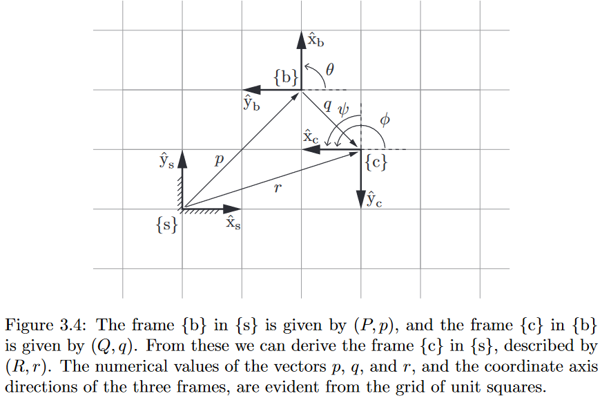
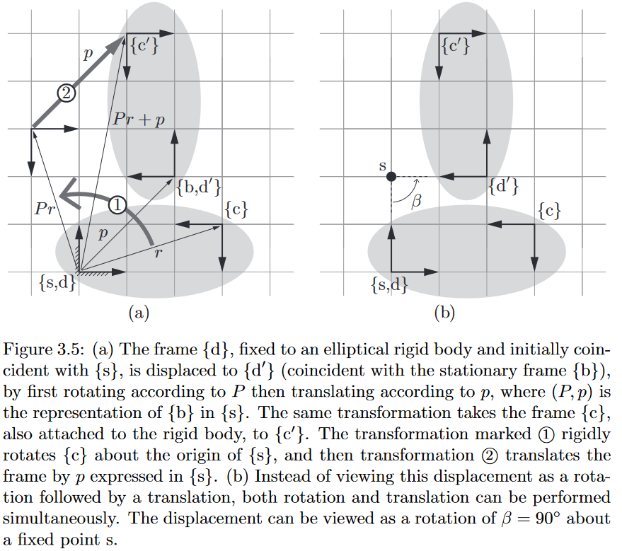

# 旋转矩阵
3个主要作用如下:
- 参考系($\{s\}$)下目标坐标系的表示
- 改变向量或坐标系的参考坐标系
- 旋转向量或坐标系
平面旋转只有1个自由度, 表示简单直观, 3维空间旋转3自由度,使用3个较度不够值观,可以隐式表示,即在高维空间中的面.比如3维度空间的球面只有2自由度, 隐式表示使用3个变量1个约束为$[x,y,z],x^2+y^2+z^2=r^2$, 很直观就知道是球面.如果只使用2自由度即经纬度角度则变成$[r\cos \phi \cos \theta ,r\cos \phi \sin \theta ,r\sin \phi]$.同样的针对3个旋转角度可以使用9个参数表示,$[x_b,y_b,z_b]=[x_s,y_s,z_s]^{s}_bR$
其中$^s_bR$第1-3列分别为$\{b\}$中$x,y,z$轴在$\{s\}$中的表示,即**旋转矩阵本身为一个坐标系在参考系下表示**.同样的有$[x_c,y_c,z_c]=[x_b,y_b,z_b]^{b}_cR$所以有
$$
[x_c,y_c,z_c]=[x_b,y_b,z_b]^{b}_cR=[x_s,y_s,z_s]^{s}_bR^{b}_cR=[x_s,y_s,z_s]^{s}_cR
$$
对应$^{s}_bR$可以看成改变了$^{b}_cR$参考系, 即**旋转矩阵改变了原本向量或矩阵的参考系**

初始$\{s\},\{d\}$重合,$\{c\}$相对$\{d\}$固连(刚体), $\{d\}$旋转到$\{d'\}$后求对应的$\{c'\}$, 即
$$
^{s}_{c'}R=^{s}_{b'}R^{b'}_{c'}R=^{s}_{b'}R^{b}_{c}R=^{s}_{b'}R^{s}_{c}R
$$
对应$^{s}_{b'}R$旋转$\{c\}$到$\{c'\}$, 即**旋转矩阵可以表示对向量或者坐标系的旋转**

