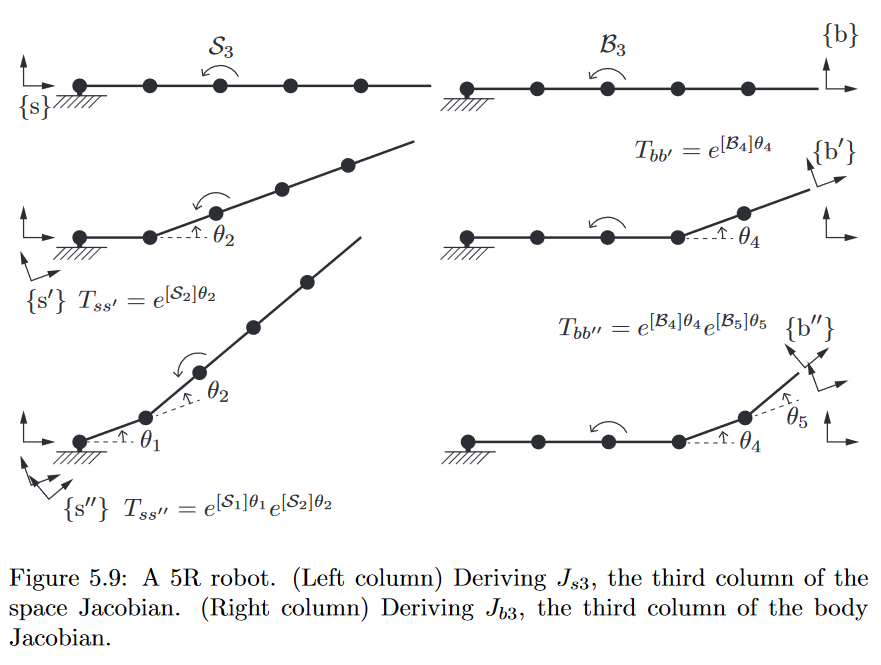

<!-- @import "[TOC]" {cmd="toc" depthFrom=1 depthTo=3 orderedList=false} -->

<!-- code_chunk_output -->

- [旋转矩阵](#旋转矩阵)
  - [基本性质](#基本性质)
    - [矩阵左乘和右乘](#矩阵左乘和右乘)
  - [SO(3)性质](#so3性质)
    - [so(3)](#so3)
    - [姿态指数坐标](#姿态指数坐标)
- [齐次矩阵](#齐次矩阵)
  - [基本性质](#基本性质-1)
    - [齐次矩阵左右乘](#齐次矩阵左右乘)
  - [SE(3)性质](#se3性质)
    - [se(3)](#se3)
- [正运动学](#正运动学)
- [微分运动学](#微分运动学)
  - [空间雅可比](#空间雅可比)
  - [物体雅可比](#物体雅可比)
  - [速度雅可比](#速度雅可比)
  - [力映射](#力映射)
  - [奇异分析](#奇异分析)

<!-- /code_chunk_output -->

主要参考**现代机器人学(MODERN ROBOTICS MECHANICS, PLANNING, AND CONTROL)**[^1]
# 旋转矩阵
## 基本性质
3个主要作用如下:
- 参考系($\{s\}$)下目标坐标系的表示
- 改变向量或坐标系的参考坐标系
- 旋转向量或坐标系

平面旋转只有1个自由度, 表示简单直观, 3维空间旋转3自由度,使用3个较度不够值观,可以隐式表示,即在高维空间中的面.比如3维度空间的球面只有2自由度, 隐式表示使用3个变量1个约束为$[x,y,z],x^2+y^2+z^2=r^2$, 很直观就知道是球面.如果只使用2自由度即经纬度则坐标变成$[r\cos \phi \cos \theta ,r\cos \phi \sin \theta ,r\sin \phi]$.同样的针对3个旋转角度可以使用9个参数表示,$[x_b,y_b,z_b]=[x_s,y_s,z_s]^{s}_bR$
其中$^s_bR$第1-3列分别为$\{b\}$中$x,y,z$轴在$\{s\}$中的表示,可以简单理解成坐标轴在基坐标系下线性组合,即**旋转矩阵本身为一个坐标系在参考系下表示**.同样的有$[x_c,y_c,z_c]=[x_b,y_b,z_b]^{b}_cR$所以有
$$
[x_c,y_c,z_c]=[x_b,y_b,z_b]^{b}_cR=[x_s,y_s,z_s]^{s}_bR^{b}_cR=[x_s,y_s,z_s]^{s}_cR
$$
对应$^{s}_bR$可以看成改变了$^{b}_cR$参考系, 即**旋转矩阵改变了原本向量或矩阵的参考系**

初始$\{s\},\{d\}$重合,$\{c\}$相对$\{d\}$固连(刚体), $\{d\}$旋转到$\{d'\}$后求对应的$\{c'\}$, 即
$$
^{s}_{c'}R=^{s}_{b'}R^{b'}_{c'}R=^{s}_{b'}R^{b}_{c}R=^{s}_{b'}R^{s}_{c}R
$$
对应$^{s}_{b'}R$旋转$\{c\}$到$\{c'\}$, 即**旋转矩阵可以表示对向量或者坐标系的旋转**

### 矩阵左乘和右乘
$^{s}_{c'}R=e^{[w_s]\theta} \cdot ^{s}_{c}R=^{s}_{b'}R^{s}_{c}R$, 这里其实是相对基坐标系的旋转,即$[w_s]$为基坐标系下轴,使用相对于物体坐标系则是右乘
$$
^{s}_{c'}R=e^{[w_s]\theta} \cdot ^{s}_{c}R=e^{[^s_cRw_c]\theta} \cdot ^{s}_{c}R=e^{^s_cR[w_c]^s_cR^T\theta} \cdot ^{s}_{c}R=^s_cRe^{[w_c]\theta}
$$

## SO(3)性质
旋转矩阵$R=[a,b,c]$9个元素表示3个自由度姿态,对应6个约束, 列向量模长=1, 两列垂直,对应$R^TR=I$, $\det |R|=c^T(a\times b)=1$,对应右手坐标系,左手坐标系$\det|R|=-1$
旋转矩阵属于特殊正交群(special orthogonal group, SO(3)),即$R\in SO(3)$, 位姿属于特殊欧几里得群(special Euclidean group, SE(3))

$$
SO(3)=\left\{\boldsymbol{C}\in\mathbb{R}^{3\times3}|\boldsymbol{C}\boldsymbol{C}^\mathrm{T}=\boldsymbol{1},\det\boldsymbol{C}=1\right\}
$$

群$SO(n)$:
- 封闭性 (closure): $AB$ is also in the group
- 结合律 (associativity): $(AB)C=A(BC)$
- 存在幺元 (identity): $\exists I \in SO(n), AI=IA=A$
- 存在逆 (invertibility): $\exists A^{-1} \in SO(n), A^{-1}A=AA^{-1}=I$

旋转矩阵是$SO(3)$群证明如下:
closure
$A,B\in SO(3)$, 有$(AB)^TAB=I$, $\det|AB|=\det|A|\det|B|=1$, 所以$AB\in SO(3)$

associativity
矩阵乘法决定, 简单通过线性组合证明:$A(BC)=A(B[c_1,\cdots, c_n])=A[Bc_1,\cdots, Bc_n]=[ABc_1,\cdots, ABc_n]=(AB)[c_1,\cdots, c_n]=(AB)C$
其中$A(Bc_i)=ABc_i$证明参考    

identity
单位阵$I$

invertibility
对于满秩矩阵(可逆)$A$, 若$A^{-1}A=I$, 则$AA^{-1}=USV^T(USV^T)^{-1}=I$. 对于$R^TR=I$, 得到$R^{-1}=R^T$(可以证明$RR^T=I$)

### so(3)
主要性质
- $[w_s]=\dot R R^{-1}$, 基坐标系$\{s\}$下姿态矩阵变化对应的角速度
- $[w_b]=R^{-1} \dot R$, 物体坐标系$\{b\}$下姿态矩阵变化对应的角速度,实际在$\{s\}$系观测,然后在$\{b\}$系表示, 这里的$\{b\}$相当于与$\{s\}$瞬时固连,同时与物体坐标系重合

姿态变化对应角速度求解,旋转矩阵各轴都是单位向量, 求导即对应点的线速度为$w\times r$
$$
\dot R=w_s \times [r_1, r_2,r_3]=[w_s]R=\begin{bmatrix}
0  & -z & y & \\
z  & 0 & -x & \\
-y  & x &  0&
\end{bmatrix}R
$$
即$[w_s]=\dot RR^{-1}$,$[w_s] \in so(3)$为基坐标系下转轴对应反对称矩阵
重要性质$R[\omega]R^{T}=[R\omega]$证明如下

$$
\begin{aligned}
&R[\omega]R^{T} \left.=\quad\left[\begin{array}{ccc}r_1^T(\omega\times r_1)&r_1^T(\omega\times r_2)&r_1^T(\omega\times r_3)\\r_2^T(\omega\times r_1)&r_2^T(\omega\times r_2)&r_2^T(\omega\times r_3)\\r_3^T(\omega\times r_1)&r_3^T(\omega\times r_2)&r_3^T(\omega\times r_3)\end{array}\right.\right] \\
&=\quad\left[\begin{array}{ccc}0&-r_3^T\omega&r_2^T\omega\\r_3^T\omega&0&-r_1^T\omega\\-r_2^T\omega&r_1^T\omega&0\end{array}\right] \\
&=\quad[R\omega],
\end{aligned}
$$

同时因为$w_s=^s_bRw_b$, 则有$$[w_b]=[^s_bR^{-1}w_s]=^s_bR^{-1}[w_s]^s_bR=^s_bR^{-1} \dot R$$

### 姿态指数坐标
如下图中绕轴转动的$p$点,对应有$\dot p=[w]p$, 参考标定微分方程求解, 向量也可以证明解为$p_t=e^{[w]t}p_0=Rp_0$, 替换得到$p_{\theta}=e^{[w]\theta}p_0=Rp_0$

$$
\begin{aligned}R(w,\theta)&=e^{[\hat{\omega}]\theta}\\&=I+[\hat{\omega}]\theta+[\hat{\omega}]^2\frac{\theta^2}{2!}+[\hat{\omega}]^3\frac{\theta^3}{3!}+\ldots\\&=I+\left(\theta-\frac{\theta^3}{3!}+\frac{\theta^5}{5!}-\cdots\right)[\hat{\omega}]+\left(\frac{\theta^2}{2!}-\frac{\theta^4}{4!}+\frac{\theta^6}{6!}-\cdots\right)[\hat{\omega}]^2\\&=I+\sin\theta [\hat{\omega}]+(1-\cos\theta)[\hat{\omega}]^2\in SO(3)\end{aligned}
$$
其中$[w]^3=-[w]$,对应Rodrigues’ formula
证明$(e^{A})^{-1}=e^{-A}$, 首先利用分解$A=Q\Lambda Q^T$, 则$(e^{A})^{-1}e^{-A}=Qe^{\Lambda}Q^TQe^{-\Lambda}Q^T=I$, 原式得证明

有指数运算当然也有对数反运算,具体不再详细推导
$$
\begin{array}{rcll}\exp:&[\hat\omega]\theta\in so(3)&\to&R\in SO(3)\\\log:&R\in SO(3)&\to&[\hat\omega]\theta\in so(3)\end{array}
$$

这里使用点的速度,同时也可以求角速度(或者理解成3个点同时求速度)
- $\dot R=[w_s]R$, 得到$R_{\theta}=e^{[w_s]{\theta}}R_0$
- $\dot R=R[w_b]$, 得到$R_{\theta}=R_0e^{[w_b]{\theta}}$
从这里也可以看到同一个角速度不同表示, 可以是相对初始姿态基坐标系旋转左乘,也可以是相对同一个轴(但是在物体坐标系表示)右乘

# 齐次矩阵
## 基本性质
齐次矩阵表示空间中6个自由度,具体证明属于$SE(3)$群的4个性质容易证明就不再推导, 推导三维向量一般用$Tx=Rx+p$
$$T=\left[\begin{array}{cc}R&p\\0&1\end{array}\right] = \begin{bmatrix}
I  & p\\
0  &1
\end{bmatrix}
\begin{bmatrix}
R  & 0\\
0  &1
\end{bmatrix}
\in SE(3)$$
齐次矩阵对整个空间中点进行旋转和平移,不改变点之间的相互关系,即旋转和平移相对整个刚体,刚体选择3个不共线的点即可定义坐标系完全表示
- $\|Tx-Ty\|=\|x-y\|$, 点之间的距离保持不变
- $\langle Tx-Tz,Ty-Tz\rangle=\langle x-z,y-z\rangle $ 向量之间的夹角保持不变

同姿态坐标系类似, 齐次矩阵也有3种功能,类似姿态坐标系即可证明
- 参考系下目标坐标系的表示
- 改变向量或坐标系的参考坐标系
- 旋转向量或坐标系

### 齐次矩阵左右乘
齐次矩阵左/右乘分别相对基坐标系和物体坐标系进行线性变换
$$
\begin{gathered}
T_{sb^{\prime}} =TT_{sb}=\mathrm{Trans}(p)\operatorname{Rot}(\hat{\omega},\theta)T_{sb}\quad\mathrm{(fixed~frame)} \\
=\left[\begin{array}{cc}R&p\\0&1\end{array}\right]\left[\begin{array}{cc}R_{sb}&p_{sb}\\0&1\end{array}\right]=\left[\begin{array}{cc}RR_{sb}&Rp_{sb}+p\\0&1\end{array}\right] \\
T_{sb''} =T_{sb}T=T_{sb}\text{ Trans}(p)\operatorname{Rot}(\hat{\omega},\theta)\quad\text{(body frame)} \\
=\left[\begin{array}{cc}R_{sb}&p_{sb}\\0&1\end{array}\right]\left[\begin{array}{cc}R&p\\0&1\end{array}\right]=\left[\begin{array}{cc}R_{sb}R&R_{sb}p+p_{sb}\\0&1\end{array}\right]. 
\end{gathered}
$$

## SE(3)性质
类似求角速度,这里求解body twist$[\mathcal{V}_b]$(twist 空间速度)和spatial twist$[\mathcal{V}_s]$:
$$
\begin{aligned}
T^{-1}\dot{T}& =\left[\begin{array}{cc}R^T&-R^Tp\\0&1\end{array}\right]\left[\begin{array}{cc}\dot{R}&\dot{p}\\0&0\end{array}\right] \\
&=\left[\begin{array}{cc}R^T\dot{R}&R^T\dot p\\0&0\end{array}\right] \\
&=\left[\begin{array}{cc}[\omega_b]&v_b\\0&0\end{array}\right]\\
&=[\mathcal{V} _b]
\end{aligned}
$$
$$
\begin{aligned}
\dot{T}T^{-1}& =\left[\begin{array}{cc}\dot{R}&\dot{p}\\0&0\end{array}\right]\left[\begin{array}{cc}R^T&-R^Tp\\0&1\end{array}\right] \\
&=\left[\begin{array}{cc}\dot{R}R^T&\dot{p}-\dot{R}R^Tp\\0&0\end{array}\right] \\
&=\left[\begin{array}{cc}[\omega_s]&v_s\\0&0\end{array}\right]\\
&=[\mathcal{V} _s]
\end{aligned}
$$

- $w_b$ is the angular velocity expressed in $\{b\}$, and $w_s$ is the angular velocity expressed in $\{s\}$. 
- $v_b$ is the linear velocity of a point at the origin of $\{b\}$} expressed in $\{b\}$, and $v_s$ is the linear velocity of a point at the origin of $\{s\}$ expressed in $\{s\}$.
这里含义都是基于基坐标系观测目标刚体运动,分别是物体坐标系,以及与物体坐标系固连同时和基坐标系瞬时重合的坐标系,最后分别在两个坐标系下表示线速度和角速度

推导不同坐标系下twist转换关系
$$
[\mathcal{V}_s ]=\dot TT^{-1}=^s_bT[\mathcal{V}_b ]^s_bT^{-1}=\begin{bmatrix}
R[w_b]R^T  & -R[w_b]R^Tp+Rv_b\\
0  &0
\end{bmatrix}
$$
从这里也可以得到前面使用的结论$[w_s]=[Rw_b]=R[w_b]R^T$, 同时可以得到
$$
\mathcal{V}_s=\begin{bmatrix}
w_s \\
v_s
\end{bmatrix} =\begin{bmatrix}
R  & 0\\
[p]R  &R
\end{bmatrix}\mathcal{V}_b=[Ad_T]\mathcal{V}_b
$$
其中$[Ad_T]$为伴随矩阵
容易证明:
- $[\mathrm{Ad}_{T_1}][\mathrm{Ad}_{T_2}]\mathcal{V}=[\mathrm{Ad}_{T_1T_2}]\mathcal{V}$
- $[\mathrm{Ad}_T]^{-1}=[\mathrm{Ad}_{T^{-1}}]$, 可以对$\mathcal{V}$取2次变换$T,T^{-1}$即可证明

### se(3)
从上面推导可以得到$\dot T=[\mathcal{V_s}]T$, 同姿态一致,微分方程求解为$T_{\theta}=e^{[\mathcal{V_s}]\theta}T_0$. 同时也有$\dot T=T[\mathcal{V_b}]$, $T_{\theta}=T_0e^{[\mathcal{V_b}]\theta}$即左右乘分别相对基坐标系以及物体坐标系.
对应可以使用指数坐标$\mathcal{S}=\begin{bmatrix}w \\ v\end{bmatrix}$, 即$\mathcal{V}=\mathcal{S}\theta$
- $ω \ne 0$: $\mathcal{S} = \mathcal{V}/‖ω‖ = (ω/‖ω‖, v/‖ω‖)$. The screw axis $\mathcal{S}$ is simply $\mathcal{V}$ normalized by the length of the angular velocity vector. The angular velocity about the screw axis is  $ θ = ‖ω‖$, such that $\mathcal{S}θ = \mathcal{V}$.
- $ω = 0$: $\mathcal{S} = \mathcal{V}/‖v‖ = (0, v/‖v‖)$. The screw axis $\mathcal{S}$ is simply $\mathcal{V}$ normalized by the length of the linear velocity vector. The linear velocity along the screw axis is  ̇ $θ = ‖v‖$, such that $\mathcal{S} θ = \mathcal{V}$.
指数运算得到位姿,如果是纯移动, 则$e^{[\mathcal{S}]\theta}=\left[\begin{array}{cc}I&v\theta\\0&1\end{array}\right]$, 如果有转动则如下
$$
\left.e^{[\mathcal{S}]\theta}=\left[\begin{array}{cc}e^{[\omega]\theta}&\left(I\theta+(1-\cos\theta)[\omega]+(\theta-\sin\theta)[\omega]^2\right)v\\0&1\end{array}\right.\right]
$$
同样的有对数运算
$$
\begin{array}{rcll}\exp:&[\mathcal{S}]\theta\in se(3)&\to&T\in SE(3)\\\log:&T\in SE(3)&\to&[\mathcal{S}]\theta\in se(3)\end{array}
$$

推导wrench变换坐标系, $\mathcal{F}=\begin{bmatrix}r\times f \\f\end{bmatrix}=\begin{bmatrix}m \\f\end{bmatrix}$
利用能量守恒定理有
$$
\mathcal{V_b}^T\mathcal{F_b} =\mathcal{V_s}^T\mathcal{F_s} =(Ad_{^s_bT}\mathcal{V_b})^T\mathcal{F_s}=\mathcal{V_b}^T(Ad_{^s_bT})^T\mathcal{F_s}
$$
即$\mathcal{F_b} =(Ad_{^s_bT})^T\mathcal{F_s}$

# 正运动学
根据公式$T_{\theta}=e^{[\mathcal{V_s}]\theta}T_0$(这里的$\mathcal{V_s}$相对于单位化后的旋量,和$\mathcal{S}等价$),可以很容易得到正运动学
$$
T_{\theta}=e^{[\mathcal{S}_1]\theta_1}\cdots e^{[\mathcal{S}_n]\theta_n}T_0
$$
其中$T_0$是各个关节零位是工具相对基坐标系位姿,$\mathcal{S_i}$为关节$i$在基坐标系下旋量. 注意先后顺序,后面的关节不影响前面关节旋量, 所以从后开始

同理可以得到物体坐标系下推导
$$
T_{\theta}=T_0e^{[\mathcal{B}_1]\theta_1}\cdots e^{[\mathcal{B}_n]\theta_n}
$$
其中$\mathcal{B}$为物体坐标系下关节旋量,当然也可以由基坐标系下正运动学进行推导替换$e^{M^{-1}PM}=M^{-1}e^PM$.前面关节不影响后面关节的物体旋量,所以从前开始

# 微分运动学
## 空间雅可比
基坐标系下使用$[\mathcal{V_s}]=\dot TT^{-1}$推导得到
$$
[\mathcal{V_s}]=J_s \dot \theta
$$
其中第$i$列为$J_{si}(\theta)=\mathrm{Ad}_{e^{[\mathcal{S}_1]\theta_1}\cdots e^{[\mathcal{S}_{i-1}]\theta_{i-1}}}\left(\mathcal{S}_i\right)$, 即当前构型下关节$i$在基坐标系下的空间速度(旋量)
## 物体雅可比
同理也可以推导物体坐标系下雅可比
$$
[\mathcal{V_b}]=J_b \dot \theta
$$
其中第$i$列为$J_{bi}(\theta)=\mathrm{Ad}_{e^{-[\mathcal{B}_n]\theta_n}...e^{-[\mathcal{B}_{i+1}]\theta_{i+1}}}(\mathcal{B}_i)$, 即当前构型下关节$i$在物体坐标系下的空间速度(旋量)
可视化参考下图, 求关节12转动之后当前构型关节3的旋量,即需要把零位下旋量(即当前构型下相对$\{s''\}$)转换到$\{s\}$系, 即$[\mathcal{S_3'}]=Ad_{e^{\mathcal{S_1}\theta_1}e^{\mathcal{S_2}\theta_2}}[\mathcal{S_3}]$

那么两个雅可比之间转换其实就是不同坐标系下旋量之间的转换,即
$$
J_s(\theta)=[\mathrm{Ad}_{T_{sb}}]J_b(\theta)
$$

## 速度雅可比
速度和角速度都是基坐标系观察物体坐标系,且在基坐标系下表示
$$
\begin{bmatrix}
w \\
v
\end{bmatrix}=\begin{bmatrix}
^s_bR  &0 \\
0  &^s_bR
\end{bmatrix}\begin{bmatrix}
w_b \\
v_b
\end{bmatrix}=\begin{bmatrix}
^s_bR  &0 \\
0  &^s_bR
\end{bmatrix}J_b\dot \theta=J_v\dot \theta
$$
即$J_v=\begin{bmatrix}
^s_bR  &0 \\
0  &^s_bR
\end{bmatrix}J_b$

## 力映射
根据能量守恒定理推导,这里主要针对非冗余机械臂,$\tau^T\dot{\theta}=\mathcal{F}_b^T\mathcal{V}_b$, 得到
$$
\tau=J_s^T(\theta)\mathcal{F}_s\\
\tau=J_b^T(\theta)\mathcal{F}_b
$$

## 奇异分析
雅可比奇异与在某个坐标系下表示无关,不同坐标系下雅可比转换通过伴随矩阵,即$J_s=Ad_{^s_bT}J_b$, 伴随矩阵可逆,所以分析奇异时可以把参考坐标系任意放置.主要奇异构型如下
- 2旋转轴共线: 2列雅可比相同
- 3旋转轴平行且共面: 3列雅可比线性相关
- 4旋转轴交于1个点: 参考坐标系原点选在交点, 4列雅可比线性相关
- 4旋转轴共面: 参考坐标系z轴垂直于对应面, 4列雅可线性相关
- 6旋转轴交于1条线: 参考坐标系z轴为对应线, 6列雅可线性相关

[^1]: https://hades.mech.northwestern.edu/index.php/Modern_Robotics