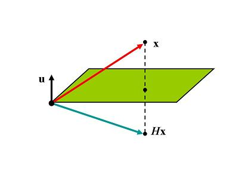
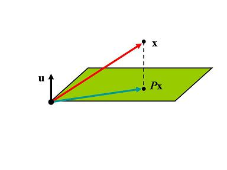

<!-- @import "[TOC]" {cmd="toc" depthFrom=2 depthTo=3 orderedList=false} -->

<!-- code_chunk_output -->

- [基本矩阵定义](#基本矩阵定义1)
  - [初等行变换对应基本矩阵](#初等行变换对应基本矩阵)
- [基本矩阵的几何意义](#基本矩阵的几何意义2)
  - [基本矩阵的特征值](#基本矩阵的特征值)
  - [几何意义](#几何意义)
- [矩阵和的行列式](#矩阵和的行列式3)

<!-- /code_chunk_output -->

## 基本矩阵定义[^1]
理解复杂系统关键是找到里面的基本元素, 对应一般矩阵则是找到基本矩阵,研究基本矩阵则可以知道一般矩阵的含义

令$u,v$为$n$维实(复)列向量,若$v^Tu \ne -1$, 则$I+uv^T$为基本矩阵, 其中$uv^T \in \mathbb{R}^{n\times n}$(外积), 如果$u,v$其中有1个为零向量,则基本矩阵退化为单位矩阵

基本矩阵转置也是基本矩阵$(I+uv^T)^T=I+vu^T$, 其中$v^Tu=u^Tv\ne 1$

猜测基本矩阵的逆也是基本矩阵$(I+uv^T)^{-1}=I+kuv^T$, 则有
$$
(I+uv^T)(I+kuv^T)=I+(1+k+kv^Tu)uv^T
$$
上式子右边等于$I$, 得到$k=-\frac{1}{(1+v^Tu)}$, 这也是需要$v^Tu\ne -1$的原因

计算基本矩阵行列式$|I=uv^T|=|I|+v^T(adjI)u=1+v^Tu$, 其中$I=\frac{adjI}{|I|}=adjI$, 其中$adjI$表示$I$的伴随矩阵

### 初等行变换对应基本矩阵

在高斯消去法中, 每个基本的行变换都对应1个基本矩阵,
1. 交换, 行$i$于行$j$互换位置
2. 伸缩, 行$i$乘非零常数$c$
3. 取代, 行$i$乘非零常数$c$的结果加进行$j$, $i\ne j$
对单位矩阵进行初等行变换即为基本矩阵

例如3维基本矩阵可以归纳处基本矩阵的形态$I+uv^T$
$$
\begin{array}{l}
E_{1}=\left[\begin{array}{lll}
0 & 1 & 0 \\
1 & 0 & 0 \\
0 & 0 & 1
\end{array}\right]=I+\left[\begin{array}{rrr}
-1 & 1 & 0 \\
1 & -1 & 0 \\
0 & 0 & 0
\end{array}\right]=I+\left[\begin{array}{r}
1 \\
-1 \\
0
\end{array}\right]\left[\begin{array}{lll}
-1 & 1 & 0
\end{array}\right]=I+\left(\mathbf{e}_{1}-\mathbf{e}_{2}\right)\left(\mathbf{e}_{2}-\mathbf{e}_{1}\right)^{T}, \\
E_{2}=\left[\begin{array}{lll}
1 & 0 & 0 \\
0 & c & 0 \\
0 & 0 & 1
\end{array}\right]=I+\left[\begin{array}{ccc}
0 & 0 & 0 \\
0 & c-1 & 0 \\
0 & 0 & 0
\end{array}\right]=I+(c-1)\left[\begin{array}{l}
0 \\
1 \\
0
\end{array}\right]\left[\begin{array}{lll}
0 & 1 & 0
\end{array}\right]=I+(c-1) \mathbf{e}_{2} \mathbf{e}_{2}^{T}, \\
E_{3}=\left[\begin{array}{lll}
1 & 0 & 0 \\
c & 1 & 0 \\
0 & 0 & 1
\end{array}\right]=I+\left[\begin{array}{lll}
0 & 0 & 0 \\
c & 0 & 0 \\
0 & 0 & 0
\end{array}\right]=I+c\left[\begin{array}{l}
0 \\
1 \\
0
\end{array}\right]\left[\begin{array}{lll}
1 & 0 & 0
\end{array}\right]=I+c \mathbf{e}_{2} \mathbf{e}_{1}^{T},
\end{array}
$$
其中, $e_i$是第$i$个标准单位向量(第$i$元=1,其余为0), 推广到$n$维矩阵如下, 并使用基本矩阵逆矩阵计算公式推导逆矩阵
1. 交换, 行$i$于行$j$互换位置: $E_1=I_n-(e_i-e_j)(e_j-e_i)^T$, 计算逆矩阵得$E_1^{-1}=E_1$, 连续两次交换就是单位矩阵并没有做什么
2. 伸缩, 行$i$乘非零常数$c$: $E_2(c)=I_n+(c-1)e_ie_i^{T}$, $E_2(c)^{-1}=E_c(\frac{1}{c})$
3. 取代, 行$i$乘非零常数$c$的结果加进行$j$, $i\ne j$: $E_3(c)=I_n+ce_ie_j^T$, $E_3(c)^{-1}=E_3(-c)$

**定理: 方阵$A$非奇异的充要条件是$A$为基本矩阵乘积**
- 如果$A$非奇异,使用高斯-约当法把矩阵化简直至单位矩阵, 则$E_k\cdots E_2E_1A=I$, 得到$A=E_1^{-1}E_2^{-1}\cdots E_k^{-1}$
- 如果$A=E_1E_2\cdots E_n$, 基本矩阵非奇异, 乘积也非奇异, 因为$|A|=|E_1E_2\cdots E_n|=|E_1||E_2|\cdots |E_n|=\ne 0$

## 基本矩阵的几何意义[^2]
### 基本矩阵的特征值
$(I+uv^T)u=(1 + v^Tu)u$, 所以$1+v^Tu$和$u$分别是特征值和特征向量.
另外考虑垂直于$v$的$n-1$子空间$\mathcal{V}$线性独立向量$x_1, x_2,\cdots, x_{n-1}$, 则有$(I+uv^T)x_i=x_i$, $1,x_i$分别为特征值和特征向量, 又有$u\notin \mathcal{V}$, 所以
$$
I+uv^T=S\begin{bmatrix}
1+v^Tu  &  & &\\
  &  1& &\\
  &  & \ddots & \\
  &  & &1
\end{bmatrix}S^{-1}
$$
其中$S=\begin{bmatrix}  u&  x_1&  \cdots & x_{n-1}\end{bmatrix}$, 所以$|I+uv^T|=1+v^Tu$

### 几何意义
$(I+uv^T)x=x+(v^Tx)u$, 所以基本矩阵就是对输入矢量$x$进行平移$(v^Tx)u$
1. 基本镜射矩阵, 令$||u||=1$, $v=-2u$, 对应$H=I-2uu^T$

2. 基本投影矩阵, 令$||u||=1$, $v=-u$, 得到$P=I-uu^T$

3. 基本列运算矩阵, 参考上面3个初等行变换矩阵
- 交换: $E_1=I_n-(e_i-e_j)(e_j-e_i)^T = E_1-2uu^T$, 其中$u=\frac{1}{\sqrt{2}}\frac{e_i-e_j}{||e_i-e_j||}$, 所以交换矩阵就是按照$e_i-e_j$为超镜射平面法向量的基本镜射矩阵
- 伸缩: $E_2x=x+(c-1)e_ie_i^{T}x$, 说明只是把$x_i$伸缩了$c$倍
- 取代, 行$E_3x=x+ce_ie_j^Tx$, 把向量$x$沿着$e_i$方向平移了$cx_j$单位

## 矩阵和的行列式[^3]
矩阵乘积行列式比较简单$|AB|=|A||B|$, 矩阵和的行列式相对比较麻烦

1. 首先证明$|A+UV^T|=|I_m+V^TA^{-1}U||A|$, 其中$A$为可逆矩阵, $B=UV^T$, 其中$U,V\in \mathcal{R}^{n\times n}$
设计分块矩阵
$$
\left[\begin{array}{cc}
A^{-1} & 0 \\
V^{T} A^{-1} & I_{m}
\end{array}\right]\left[\begin{array}{cc}
A & U \\
-V^{T} & I_{m}
\end{array}\right]=\left[\begin{array}{cc}
I_{n} & A^{-1} U \\
0 & I_{m}+V^{T} A^{-1} U
\end{array}\right]
$$
对应求行列式得到
$$
\begin{vmatrix}
A & U \\
-V^{T} & I_{m}
\end{vmatrix}=\begin{vmatrix}
I_{n} & A^{-1} U \\
0 & I_{m}+V^{T} A^{-1} U
\end{vmatrix}
\begin{vmatrix}
A^{-1} & 0 \\
V^{T} A^{-1} & I_{m}
\end{vmatrix}^{-1}=
|I_{m}+V^{T} A^{-1} U||A|
$$
同时设计分块矩阵
$$
\left[\begin{array}{cc}
A & U \\
-V^{T} & I_{m}
\end{array}\right]
\left[\begin{array}{cc}
I_n & 0 \\
V^T & I_{m}
\end{array}\right]
=\left[\begin{array}{cc}
A+UV^T & A^{-1} U \\
0 & I_{m}
\end{array}\right]
$$
求行列式证明原等式
$$
|A+UV^T|=
\begin{vmatrix}
A & U \\
-V^{T} & I_{m}
\end{vmatrix}=
|I_{m}+V^{T} A^{-1} U||A|
$$
2. 对应特殊矩阵,当$m=1$时, $U=u, V=v$为$n$维列向量,则有
$$
|A+uv^T|=(1+v^TA^{-1}u)|A|=|A|+v^T(adjA)u
$$
其中$adjA$为$A$的伴随矩阵

[^1]: https://ccjou.wordpress.com/2010/02/02/%e7%89%b9%e6%ae%8a%e7%9f%a9%e9%99%a3-%e5%8d%81%ef%bc%9a%e5%9f%ba%e6%9c%ac%e7%9f%a9%e9%99%a3/
[^2]:　https://ccjou.wordpress.com/2011/01/10/%E5%9F%BA%E6%9C%AC%E7%9F%A9%E9%99%A3%E7%9A%84%E5%B9%BE%E4%BD%95%E6%84%8F%E7%BE%A9/
[^3]: https://ccjou.wordpress.com/2009/12/04/%e7%9f%a9%e9%99%a3%e5%92%8c%e4%b9%8b%e8%a1%8c%e5%88%97%e5%bc%8f-%e4%b8%8a/