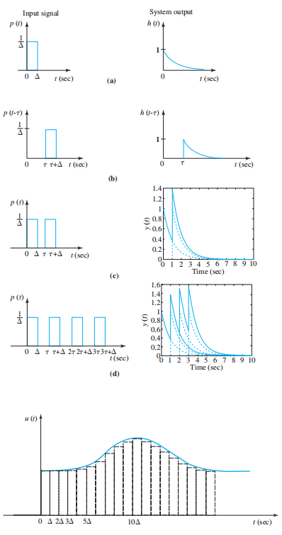
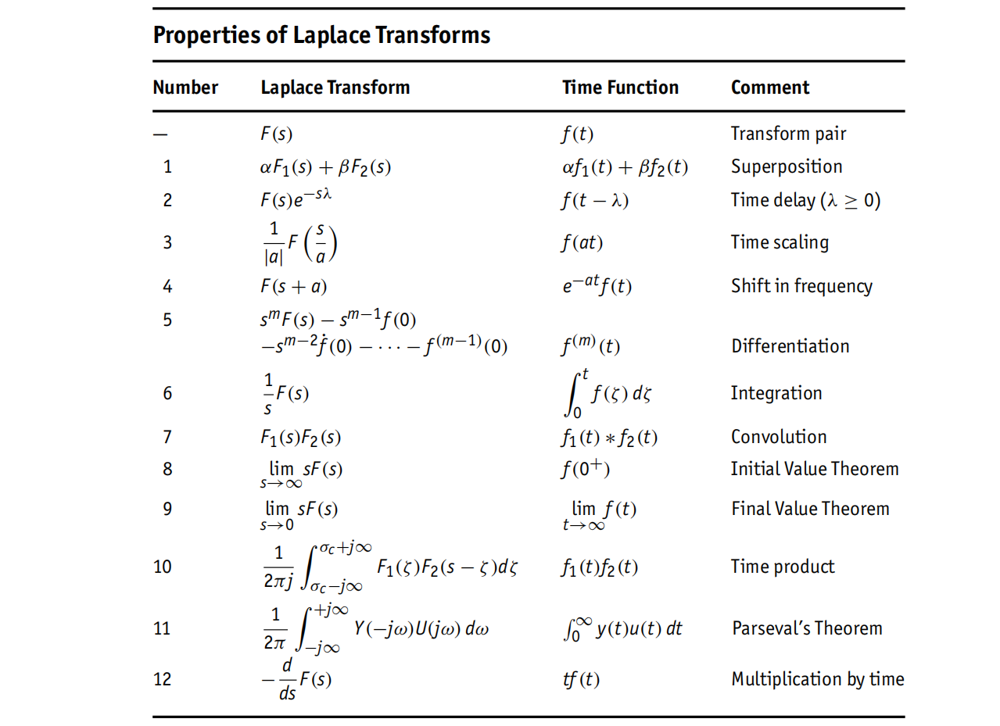
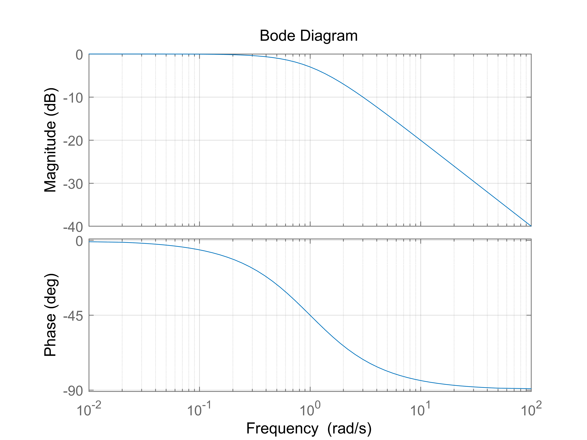
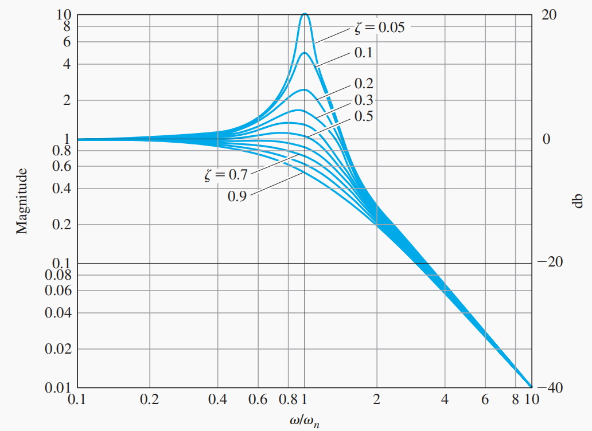
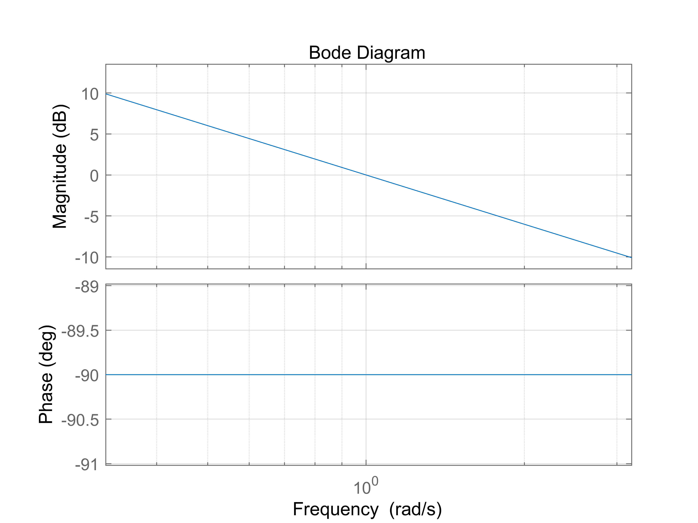
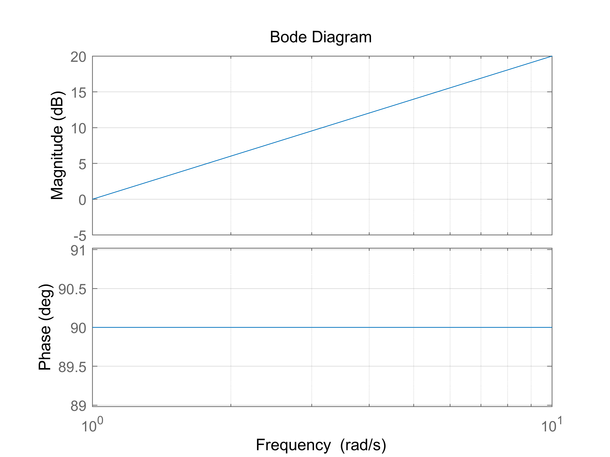
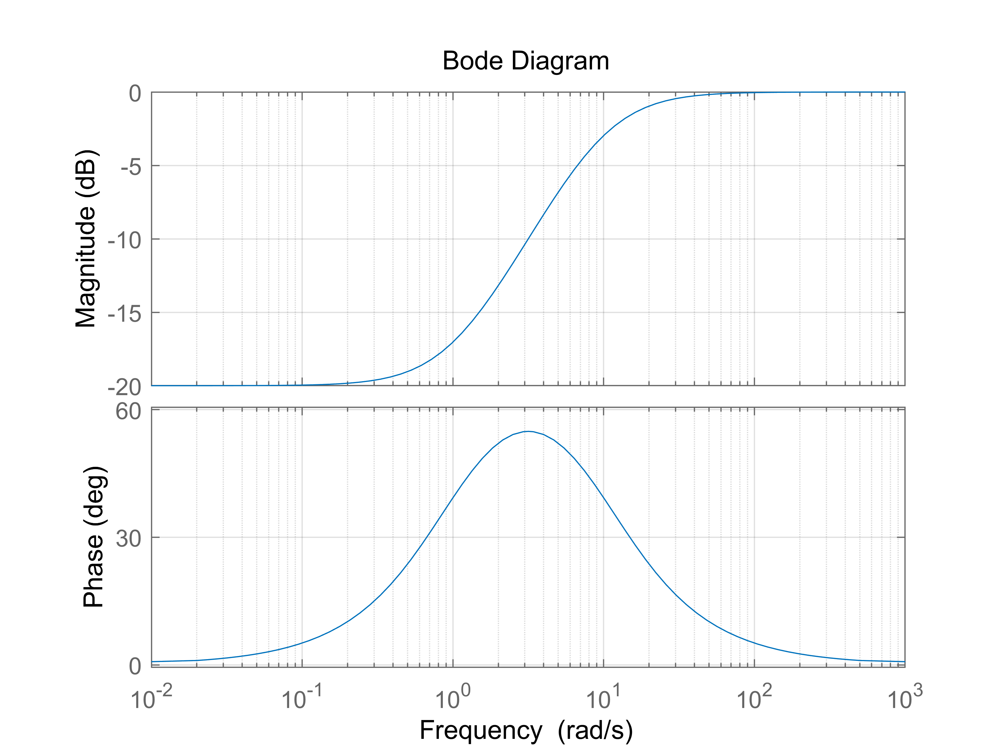
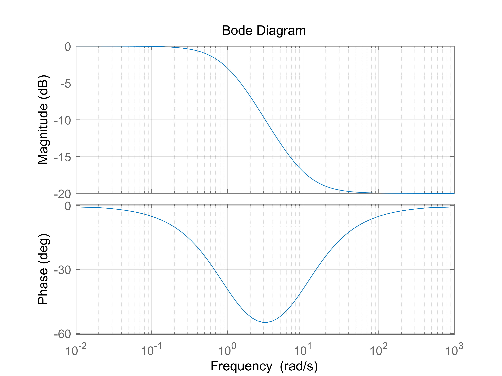
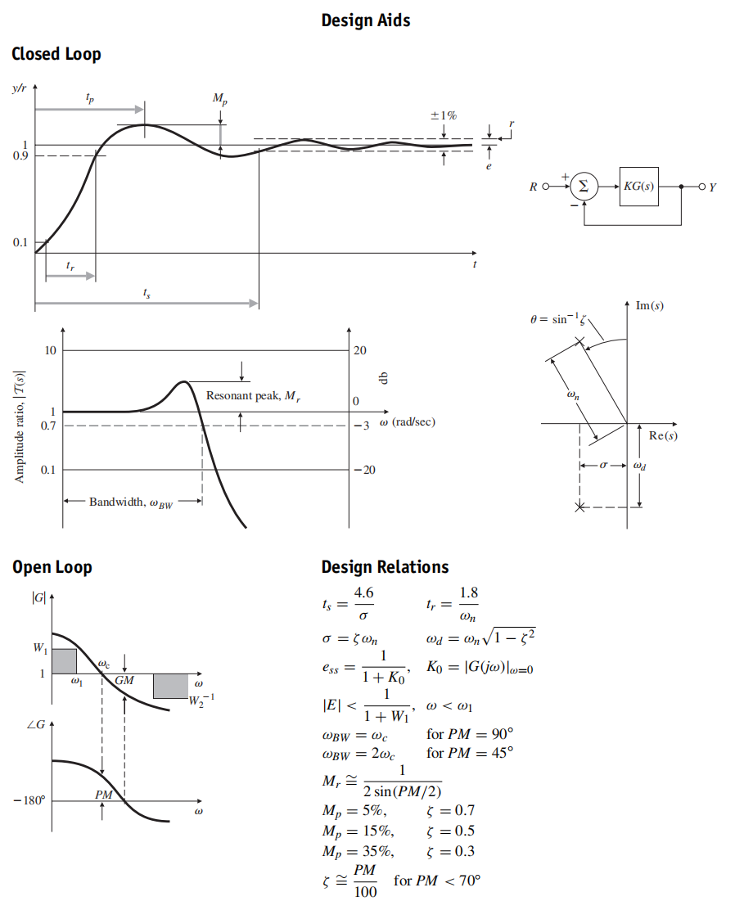

<!-- @import "[TOC]" {cmd="toc" depthFrom=2 depthTo=3 orderedList=false} -->

<!-- code_chunk_output -->

- [卷积响应](#卷积响应)
- [传递函数](#传递函数)
- [频率响应frequency response](#频率响应frequency-response)
- [伯德图](#伯德图)
  - [典型函数频率响应](#典型函数频率响应)
- [附加零极点的作用](#附加零极点的作用)
- [PID控制](#pid控制)
- [其他](#其他)
- [引用](#引用)
- [附录](#附录)
  - [拉式变换表](#拉式变换表)

<!-- /code_chunk_output -->

线性时不变系统(LTI)[^1]
- 线性:满足叠加原理,输出信号为各输入单独对应输出的叠加:
  系统输入$x_{k}(t)$对应输出$y_k(t)$, 那么输入$\sum_{k}c_kx_k(t)$对应输出$\sum_{k}c_ky_k(t)$, 同样可以拓展到积分
  线性系统非常重要，主要由于我们能够解，另外物理基本定理通常是线性的，电学规律的麦克斯韦方程组就是线性的，量子力学的伟大定律也是线性方程[^4]
- 时不变:系统参数不随时间变化,即输入信号时间滞后,输出信号形状不变,时间滞后相同
  输入$x_t$对应输出$y_t$, 那么输入延后$x_{t-\tau}$对应输出$y_{t-\tau}$
线性时不变系统响应: 输入信号与系统的冲击响应的卷积, 即把输入分成简单信号分别求响应后求和

拉式变换时线性变换
$\mathcal{L}(af(t)+bg(t))=a\mathcal{L}f(t)+b\mathcal{L}g(t)$

- 常用简单变换
$\mathcal{L}t^n=\int_{0}^{+\infty}e^{-st}t^ndt=\frac{n!}{s^{n+1}}$
$\mathcal{L}e^{at}=\frac{1}{s-a}$
$\mathcal{L}1=\frac{1}{s}$   阶跃信号
$\mathcal{L}\dot f=sF-f0$

- 拉式反变换: 待推导确认
$f=\mathcal{L}^{-1}F$
$\mathcal{L}^{-1}(aF+bG)=a\mathcal{L}^{-1}F+b\mathcal{L}^{-1}G$
- **时移**
阶跃信号$u_{t}$时移后为$u_{t-c}$, 即从$t=c$开始信号从0变为1, 对应$u_t=u_{t-c}$
$\mathcal{L}u_t=\int_0^{+\infty}u_ts^{st}dt=\int_c^{+\infty}s^{st}dt=\frac{e^{-cs}}{s}$
$\mathcal{L}u_tf_{t-c}=\int_c^{+\infty}f_{t-c}s^{st}dt=e^{-cs}\mathcal{L}f_t=e^{-cs}F$

拉式变换[^2]可用来解方程[Solving IVP's With Laplace Transforms](https://tutorial.math.lamar.edu/classes/de/LaplaceIntro.aspx)
求系统在一般输入信号下的响应,把一般输入信号转换分解成简单的基本信号(脉冲信号和指数函数信号),
然后由叠加原理得到一般输入的响应.傅里叶变换形式中有指数函数分解,正交函数,够丰富

## 卷积响应
参考[^3]将输入分解成单位脉冲,脉冲响应的和为系统的响应

$$
y(t)=\int_{-\infty}^{\infty} u(\tau) h(t-\tau) d \tau
$$
直观理解就是把输入函数划分为无穷多个脉冲, 每个脉冲对应的响应的和
变量代换$\tau_{1}=t-\tau$得

$$
y(t)=\int_{\infty}^{-\infty} u\left(t-\tau_{1}\right) h\left(\tau_{1}\right)\left(-d \tau_{1}\right)=\int_{-\infty}^{\infty} h(\tau) u(t-\tau) d \tau
$$
直观理解就是脉冲响应每个时间对应的所有输入的和,这里是固定脉冲响应的每个时刻,上面是固定输入函数的时刻
这就是卷积[^5], **卷积定理: 时域或频域的卷积时对应另一个域的乘积**
针对两个函数的拉式变换
$F(s)=\int_{-\infty}^{+\infty}e^{-su}f(u)du$
$G(s)=\int_{-\infty}^{+\infty}e^{-sv}g(v)dv$

$F(s)\cdot G(s)=\int_{-\infty}^{+\infty}\int_{-\infty}^{+\infty}e^{-s(u+v)}f(u)g(v)dudv$
令$t=u+v$则
$F(s)\cdot G(s)=\int_{-\infty}^{+\infty}\int_{-\infty}^{+\infty}e^{-st}f(u)g(t-u)dudt=\int_{-\infty}^{+\infty}e^{-st}\int_{-\infty}^{+\infty}f(u)g(t-u)dudt=\int_{-\infty}^{+\infty}e^{-st}(f*g)dt$

时域卷积: 输出信号 = 输入信号 * 系统时域脉冲响应 = $\mathcal{L^{-1}}$ ($\mathcal{L}$输入信号 ·  $\mathcal{L}$时域脉冲响应)
$\mathcal{L}$输出信号 = $\mathcal{L}$输入信号 ·  $\mathcal{L}$时域脉冲响, 所以系统的传递函数就是脉冲响应(频域, 即时域脉冲响应函数的拉式变换). **这个性质非常重要, 系统的输出为输入与脉冲响应的卷积, 通过拉式变换变换成拉式域的乘积,避免了卷积的复杂计算**

卷积定理可用于理解滤波器设计, FIR数字滤波器本质上就是用输入信号与一些列系数的卷积

## 传递函数
基本信号指数函数${e^{st}}$作为输入,得到传递函数就是脉冲响应的拉氏变换$H(s)$

$$
\begin{aligned}
y(t) &=\int_{-\infty}^{\infty} h(\tau) u(t-\tau) d \tau \\
&=\int_{-\infty}^{\infty} h(\tau) e^{s(t-\tau)} d \tau \\
&=\int_{-\infty}^{\infty} h(\tau) e^{s t} e^{-s \tau} d \tau \\
&=\int_{-\infty}^{\infty} h(\tau) e^{-s \tau} d \tau e^{s t} \\
&=H(s) e^{s t}
\end{aligned}
$$

根据定义域不同分为双边拉式变换$[-\infty, +\infty]$, 单边拉式变换$[0, +\infty]$,单边认为之前时刻输入都是0，和实际更符合。这里需要函数$f(t)$分段连续: 有限断点、上下界有限

## 频率响应frequency response
频率响应通过线性时不变系统对正弦输入的**稳态响应**来分析系统的性能.选用正弦信号是因为所有信号都可以通过傅里叶变换分解成正弦信号的和且更容易通过物理元器件实现.其他信号包括指数信号, 脉冲信号
- 传递函数分析
针对一般正弦输入
$$u_t=M\sin (wt+\phi)=A\sin (wt)+B\cos (wt)=\frac{A}{2j}(e^{jwt}-e^{-jwt})+ \frac{B}{2}(e^{jwt}+e^{-jwt})$$
拉式变化得到
$$
\mathcal{L}u=\frac{A}{2j}(\frac{1}{s-jw}-\frac{1}{s+jw}) +\frac{B}{2}(\frac{1}{s-jw}+\frac{1}{s+jw})=\frac{Aw+Bs}{s^2+w^2}
$$
输出
$$
X(s)=U(s)G(s)=\frac{Aw+Bs}{(s+jw)(s-jw)}\frac{N(s)}{D(s)}  =\frac{K_1}{s+jw}+\frac{K_2}{s-jw}+\frac{c_1}{s+s_{p1}}+\cdots +\frac{c_n}{s+s_{pn}}
$$
其中$K_1=\frac{B+Aj}{2}G(-jw)$,$K_2=\frac{B-Aj}{2}G(jw)$
输出$x(t)=\mathcal{L}X(s)=K_1e^{-jwt}+K_2e^{jwt}+c_1e^{s_{p1}t} +\cdots +c_ne^{s_{pn}t}$,需要传递函数所有极点的实部都小于0才能保证系统的稳定,也才有分析频率响应的意义,对应的稳态响应为$x(t)=K_1e^{-jwt}+K_2e^{jwt}$, 这里是实数信号,通过公式$\overline{x(t)}=x(t)$也可以得到$\overline{K_1}=K_2$, 即系数共轭.$\overline{G(jw)} =\int_{-\infty }^{+\infty} fe^{jwt}dt=G(-jwt)$,即$G(jw)$,$G(-jw)$共轭
所以
$$x(t)=\frac{B+Aj}{2}G(-jw)e^{-jwt}+\frac{B-Aj}{2}G(jw)e^{jwt}=|G(jw)|M\sin (\angle G(jw)+wt+\phi)$$
所以这里对应幅值和相位都有改变,幅值的比值就是幅频响应,相位改变就是相频响应.
- 指数信号分析
首先使用欧拉公式把正弦(余弦)信号表示成两个指数函数的和
$A \cos (\omega t)=\frac{A}{2}\left(e^{j \omega t}+e^{-j \omega t}\right)$
再使用上式中令$s=jw$,则对于$u(t)=e^{jwt}$的响应为$y(t)=H(jw)e^{jwt}$,$u(t)=e^{-jwt}$的响应为$y(t)=H(-jw)e^{-jwt}$,所以最终响应:
$$
y(t)=\frac{A}{2}\left[H(j \omega) e^{j \omega t}+H(-j \omega) e^{-j \omega t}\right]
$$
令$H(j \omega)=M(\omega) e^{j \varphi(\omega)}$,则有
$$
\begin{aligned}
y(t) &=\frac{A}{2} M\left(e^{j(\omega t+\varphi)}+e^{-j(\omega t+\varphi)}\right) \\
&=A M \cos (\omega t+\varphi)
\end{aligned}
$$
其中:
$$
M=|H(j \omega)|, \varphi=\angle H(j \omega)
$$
同理可以得到输入$sin(wt)$, 对应系统输出$Asin(wt+\phi)$, 其中幅值和相位差都是脉冲响应传递函数引入的
也就是说传递函数为$H(s)$的系统,如果输入为$A$的正弦信号,那么输出也是同频率的幅值为$AM$正弦信号,且相位有$\varphi$的移动,这里分析得到的结果直接就是稳态响应, 瞬态的在哪里?

## 伯德图
伯德图就是不同频率下传递函数幅值和相位的响应

分贝(dB, Decibel)[^6], “分”（deci-）指十分之一，单位是“贝”或“贝尔”, 纪念Alexander Graham Bell, 通常很少用bel,一般只用decibel. 分别为能量比值, 定义为测量功率与参考功率比值对数的10倍
$$
L_{dB}=10\log_{10}\frac{P_m}{P_r}
$$
如果用幅值,因为幅值的平方对应功率,所以对应用幅值表示为
$$
L_{dB}=10\log_{10}\frac{P_m}{P_r}=20\log_{10}\frac{M_o}{M_i}
$$

对数可以把乘法转换为加法, 通常加法更容易计算和绘图$20\log MN=20\log M+20\log N$, **对于串联系统$G=G_1G_2=A_1e^{i\theta _1}A_2e^{i\theta _2}=A_1A_2e^{i(\theta _1+\theta _2)}$,幅值相乘,相位相加**.对应幅值比例$20\log |G|=20\log |G_1|+20\log |G_2|=20\log A_1+20\log A_2$, 即直接把各自幅值直接相加, 图像上可以分别绘制单个简单传递函数幅值(dB),然后进行相加

### 典型函数频率响应
- 1阶系统
$G=\frac{a}{s+a}$, 幅值$|G|=\frac{a}{\sqrt{w^2+a^2}}$, $\angle G=-\tan^{-1} \frac{w}{a}$(可以分别把分子分母用$Ae^{i\theta}$表示, 使用复数运算)时频率响应如下, 可以通过上面的技巧进行手绘
当$w\ll a$时, $|G|=1$, $\angle G=0$, 即水平线
当$a\ll w$时, $|G|=\frac{a}{w}$, 对应斜率-20dB/10倍频率直线,$\angle G=-\frac{\pi}{2}$,即水平线, 这就是对应的渐近线, 手绘即可得到大致图形
当$w=a$时为截止频率, $|G|=\frac{1}{\sqrt{2}}$, 即对应功率为原来一半
**1阶系统高频部分输入的幅值被有效抑制,对应低通滤波器**.$G=\frac{1}{s+1}$就是一阶巴特沃斯滤波器(Butterworth Filter)

- 2阶系统
$$
H(s)=\frac{\omega_{n}^{2}}{s^{2}+2 \zeta \omega_{n} s+\omega_{n}^{2}}=\frac{\omega_{n}^{2}}{\left(s+\zeta \omega_{n}\right)^{2}+\omega_{n}^{2}\left(1-\zeta^{2}\right)}
$$
式中$\omega_{n}$为无阻尼自然频率,$\zeta$为阻尼比.
分析传递函数幅值求最大值对应频率为$w=w_n\sqrt{1-2\xi ^2}$, 即为共振频率, 对应需要满足$\xi < \sqrt{0.5}$, 当$\xi$很小时就是约等于固有频率. 当$\xi=0$时, $|G|=\frac{w_n^2}{w_n^2-w^2}$, 当$w=w_n$时, $|G|\to +\infty $, 系统不稳定, 符合临界稳定(根在虚轴上)但不满足BIBO稳定.日常生活中也有很多共振现象,比如小提琴通过共振的箱体放大琴弦本生振动的音量

二阶系统对应的根为
$$
s=-\sigma \pm j \omega_{d}
$$
$$
\sigma=\zeta \omega_{n} \text { and } \omega_{d}=\omega_{n} \sqrt{1-\zeta^{2}}
$$
通过查表或者借助拉式变换的位移性质推导得到系统的单位脉冲响应的输出为
$$
h(t)=\frac{\omega_{n}}{\sqrt{1-\zeta^{2}}} e^{-\sigma t}\left(\sin \omega_{d} t\right) 1(t)
$$
据此可以分析$s$平面不同位置的输出变换趋势.
- 积分器, $G=\frac{1}{s}$
如下图所示,**频率很低处输出幅值比输入大, 需要额外能量, 所以积分器无法通过被动元件实现**, 需要额外供能

- 微分, $G=s$
和积分类似,在频率较高地方,幅值比输入大, 需要额外供能

- 比例控制器, 不改变相位, 幅值同比例
- 超前补偿器, 如$G=\frac{s+1}{s+10}=\frac{1}{10}(s+1)(\frac{1}{0.1s+1})$, 可以看成3个传递函数串联, 分别绘制幅频响应后叠加即可得到最后的响应如下.不需要额外供能, 相位超前

- 滞后补偿器, 如$G=\frac{0.1s+1}{s+1}$, 相位滞后

- PD控制器, 高频部分幅值放大, 需要必须要滤波器去除高频信号才能提高稳定性

## 附加零极点的作用
这里都是直接在最后的传递函数上增加零点和极点，和后面的pd、pi控制不同，后面是在开环传递函数基础上增加，研究闭环传递函数
1. 附加零点
  - 零点在左半平面分成两项就是原来的响应+原来响应的导数。导致增加超调和减小上升时间
  - 零点在右半平面分成两项就是原来的响应-原来响应的导数。导致减小超调，可能引起节约响应刚开始朝错误的方向运动（有右半平面的零点为非最小相位系统）

2. 附加极点
  延长了上升时间

## PID控制
这里和前面分开，增加的控制项是直接作用于开环传递函数
- P控制，提高比例增益可以降低稳态误差，但高增益导致系统不稳定
- I控制，具有消除稳态误差的鲁棒性，但会降低系统的稳定性（根轨迹想右压）
- D控制，**提高阻尼增加系统的稳定性**

带宽等于闭环特征根的自然频率：对于闭环阻尼$\zeta=0.7$，$\omega_{BW}=\omega_{n}$，其他阻尼比，带宽近似，误差不超过2倍。可以用于估计上升时间

穿越频率$\omega_{c}$:幅值为1或者0dB处的频率

相位阈度PM=30°一般任务是达到满意的最低值

频率响应稳定设计简单准则: 调整幅值曲线的斜率,使之在附近的10倍频程内以斜率为-1穿过幅值1的曲线(相位-90°左右,PM在90°左右)

对于标准的二阶系统,相位阈度和系统闭环阻尼如下:
$$
\zeta \cong \frac{\mathrm{PM}}{100}
$$

二阶系统,伯德图中幅值的峰值与阻尼比关系如下:
$$
|G(j \omega)|=\frac{1 \mid}{2 \zeta} \quad \text { at } \omega=\omega_{n}
$$

##　其他
1. 二阶系统中工程上常取$\zeta = 0.7$作为最饥饿阻尼洗漱
2. 当引入的实数极点与主导极点的模值之比大于５时，非主导极点对时间响应的影响可以忽略．（主导极点：左半复平面离虚轴最近，且周围没有零点的极点，其余极点远离虚轴）
3. 在系统开环放大洗漱比较适当，动态性能比较好的情况下，略去开环系统小时间常数环节(系数相对其他项较小的项)不会引起较大误差；当系统开环系数较大，动态性能较差的情况下需要慎重（自动控制原理-第四版-高国燊-P102）
4. 惯性环节$G = {K \over {Ts + 1}}$过渡时间为$3T$,即时间响应稳定在稳态值的0.05附近

## 引用
[^1]: https://en.wikipedia.org/wiki/Linear_time-invariant_system
[^2]: https://en.wikipedia.org/wiki/Laplace_transform
[^3]: Franklin, Gene F.Feedback control of dynamic systems / Gene F. Franklin, J. David Powell,
Abbas Emami-Naeini. — Seventh edition
[^4]: https://www.feynmanlectures.caltech.edu/I_25.html
[^5]: https://en.wikipedia.org/wiki/Convolution
[^6]: https://en.wikipedia.org/wiki/Decibel

## 附录
### 拉式变换表
