<!-- @import "[TOC]" {cmd="toc" depthFrom=2 depthTo=3 orderedList=false} -->

<!-- code_chunk_output -->

- [卷积响应](#卷积响应)
- [传递函数](#传递函数)
- [频率响应frequency response](#频率响应frequency-response)
- [伯德图](#伯德图)
  - [典型函数频率响应](#典型函数频率响应)
  - [典型函数的时域响应](#典型函数的时域响应)
- [附加零极点的作用](#附加零极点的作用)
- [PID控制](#pid控制)
- [其他](#其他)
- [引用](#引用)
- [附录](#附录)
  - [拉式变换表](#拉式变换表)

<!-- /code_chunk_output -->

线性时不变系统(LTI)[^1]
- 线性: 满足叠加原理, 输出信号为各输入单独对应输出的叠加:
  系统输入$x_{k}(t)$对应输出$y_k(t)$, 那么输入$\sum_{k}c_kx_k(t)$对应输出$\sum_{k}c_ky_k(t)$, 同样可以拓展到积分
  线性系统非常重要，主要由于我们能够解，另外物理基本定理通常是线性的，电学规律的麦克斯韦方程组就是线性的，量子力学的伟大定律也是线性方程[^4]
- 时不变: 系统参数不随时间变化, 即输入信号时间滞后, 输出信号形状不变,时间滞后相同
  输入$x_t$对应输出$y_t$,  那么输入延后$x_{t-\tau}$对应输出$y_{t-\tau}$
  线性时不变系统响应:  输入信号与系统的冲击响应的卷积, 即把输入分成简单信号分别求响应后求和

拉式变换时线性变换
$$
\mathcal{L}(af(t)+bg(t))=a\mathcal{L}f(t)+b\mathcal{L}g(t)
$$

- 常用简单变换
  $\mathcal{L}t^n=\int_{0}^{+\infty}e^{-st}t^ndt=\frac{n!}{s^{n+1}}$
  $\mathcal{L}e^{at}=\frac{1}{s-a}$
  $\mathcal{L}1=\frac{1}{s}$   阶跃信号
  $\mathcal{L}\dot f=sF-f(0)$

  **通常情况下都认为初始状态为0，所以直接忽略了f0，补充如果不忽略对系统产生的影响**

- 拉式反变换: 待推导确认
  $f=\mathcal{L}^{-1}F$
  $\mathcal{L}^{-1}(aF+bG)=a\mathcal{L}^{-1}F+b\mathcal{L}^{-1}G$

- **时移**
阶跃信号$u_{t}$时移后为$u_{t-c}$, 即从$t=c$开始信号从0变为1, 对应$u_t=u_{t-c}$
$\mathcal{L}u_t=\int_0^{+\infty}u_ts^{-st}dt=\int_c^{+\infty}s^{-st}dt=\frac{e^{-cs}}{s}$
$\mathcal{L}u_tf_{t-c}=\int_c^{+\infty}f_{t-c}s^{-st}dt=e^{-cs}\mathcal{L}f_t=e^{-cs}F$

- 终值定理
$\mathcal{L}(f')=\int_0^{+\infty}f'e^{-st}dt=sF(s)-f(0)$
取极限得到$\lim_{s \to 0} \int_0^{+\infty}f'e^{-st}dt=f(+\infty )-f(0)=\lim_{s \to 0}sF(s)-f(0)$, 所以$f(+\infty )=\lim_{s \to 0}sF(s)$

拉式变换[^2]可用来解方程[Solving IVP's With Laplace Transforms](https://tutorial.math.lamar.edu/classes/de/LaplaceIntro.aspx)
求系统在一般输入信号下的响应,把一般输入信号转换分解成简单的基本信号(脉冲信号和指数函数信号),
然后由叠加原理得到一般输入的响应.傅里叶变换形式中有指数函数分解,正交函数,够丰富

## 卷积响应
参考[^3]将输入分解成单位脉冲,脉冲响应的和为系统的响应

$$
y(t)=\int_{-\infty}^{\infty} u(\tau) h(t-\tau) d \tau
$$
直观理解就是把输入函数划分为无穷多个脉冲, 每个脉冲对应的响应的和
变量代换$\tau_{1}=t-\tau$得
$$
y(t)=\int_{\infty}^{-\infty} u\left(t-\tau_{1}\right) h\left(\tau_{1}\right)\left(-d \tau_{1}\right)=\int_{-\infty}^{\infty} h(\tau) u(t-\tau) d \tau
$$
直观理解就是脉冲响应每个时间对应的所有输入的和,这里是固定脉冲响应的每个时刻,上面是固定输入函数的时刻
这就是卷积[^5], **卷积定理: 时域或频域的卷积时对应另一个域的乘积**
针对两个函数的拉式变换
$F(s)=\int_{-\infty}^{+\infty}e^{-su}f(u)du$
$G(s)=\int_{-\infty}^{+\infty}e^{-sv}g(v)dv$

$F(s)\cdot G(s)=\int_{-\infty}^{+\infty}\int_{-\infty}^{+\infty}e^{-s(u+v)}f(u)g(v)dudv$
令$t=u+v$则
$F(s)\cdot G(s)=\int_{-\infty}^{+\infty}\int_{-\infty}^{+\infty}e^{-st}f(u)g(t-u)dudt=\int_{-\infty}^{+\infty}e^{-st}\int_{-\infty}^{+\infty}f(u)g(t-u)dudt=\int_{-\infty}^{+\infty}e^{-st}(f*g)dt$

时域卷积: 输出信号 = 输入信号 * 系统时域脉冲响应 = $\mathcal{L^{-1}}$ ($\mathcal{L}$输入信号 ·  $\mathcal{L}$时域脉冲响应)
$\mathcal{L}$输出信号 = $\mathcal{L}$输入信号 ·  $\mathcal{L}$时域脉冲响, 所以系统的传递函数就是脉冲响应(频域, 即时域脉冲响应函数的拉式变换). **这个性质非常重要, 系统的输出为输入与脉冲响应的卷积, 通过拉式变换变换成拉式域的乘积,避免了卷积的复杂计算**

卷积定理可用于理解滤波器设计, FIR数字滤波器本质上就是用输入信号与一些列系数的卷积

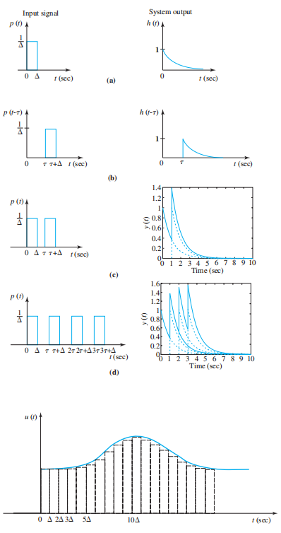

## 传递函数
传递函数定义: 零初始条件下,系统输出的拉式变换与系统输入的拉式变换的比值, $G(s)=\frac{X(s)}{U(s)}$. 可以通过卷积推导$x(t)=u(t)\ast g(t)$, 即系统的输出是输入信号与系统脉冲响应的卷积, 两边拉式变换得到前式(前提是零初始条件), 即传递函数就是系统脉冲响应的拉式变换.
非零初始条件: 在初始时刻赋予系统能量,使得系统达到初始状态,脉冲输入.以简单1阶系统为例,$\frac{dx}{dt}+ax=u$, 两边拉式变换得到$sX(s)-x_0+aX(s)=U(s)$, 即$G(s)=\frac{X(s)}{U_1(s)}=\frac{1}{s+a}$, 其中$U_1(s)=x_0+U(s)$, 相当于系统有两个输入, 其中初始条件$x_0$,对应脉冲输入.可以两个输入分别求响应后再加起来得到最后的输出(LTI)
基本信号指数函数${e^{st}}$作为输入,得到传递函数就是脉冲响应的拉氏变换$H(s)$
$$
\begin{aligned}
y(t) &=\int_{-\infty}^{\infty} h(\tau) u(t-\tau) d \tau \\
&=\int_{-\infty}^{\infty} h(\tau) e^{s(t-\tau)} d \tau \\
&=\int_{-\infty}^{\infty} h(\tau) e^{s t} e^{-s \tau} d \tau \\
&=\int_{-\infty}^{\infty} h(\tau) e^{-s \tau} d \tau e^{s t} \\
&=H(s) e^{s t}
\end{aligned}
$$

根据定义域不同分为双边拉式变换$[-\infty, +\infty]$, 单边拉式变换$[0, +\infty]$,单边认为之前时刻输入都是0，和实际更符合。这里需要函数$f(t)$分段连续: 有限断点、上下界有限

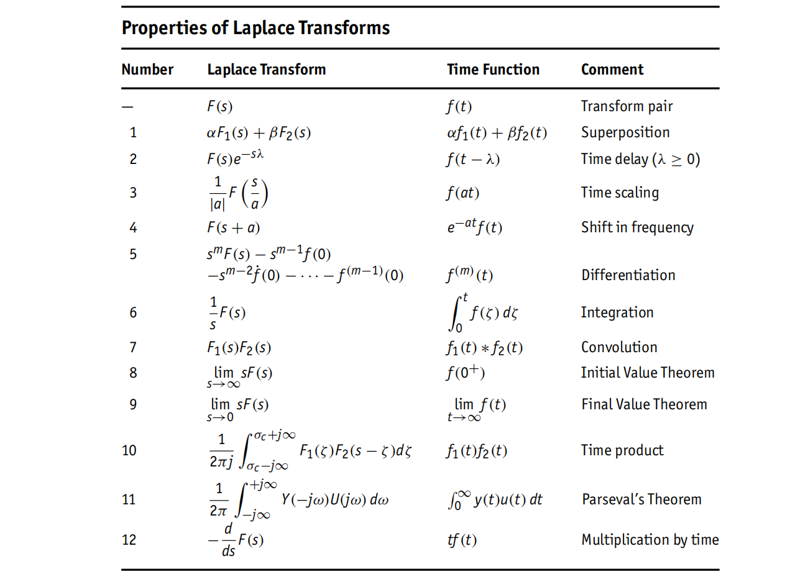

## 频率响应frequency response
频率响应通过线性时不变系统对正弦输入的**稳态响应**来分析系统的性能.选用正弦信号是因为所有信号都可以通过傅里叶变换分解成正弦信号的和且更容易通过物理元器件实现.其他信号包括指数信号, 脉冲信号
- 传递函数分析
针对一般正弦输入
$$u_t=M\sin (wt+\phi)=A\sin (wt)+B\cos (wt)=\frac{A}{2j}(e^{jwt}-e^{-jwt})+ \frac{B}{2}(e^{jwt}+e^{-jwt})$$
拉式变化得到
$$
\mathcal{L}u=\frac{A}{2j}(\frac{1}{s-jw}-\frac{1}{s+jw}) +\frac{B}{2}(\frac{1}{s-jw}+\frac{1}{s+jw})=\frac{Aw+Bs}{s^2+w^2}
$$
输出
$$
X(s)=U(s)G(s)=\frac{Aw+Bs}{(s+jw)(s-jw)}\frac{N(s)}{D(s)}  =\frac{K_1}{s+jw}+\frac{K_2}{s-jw}+\frac{c_1}{s+s_{p1}}+\cdots +\frac{c_n}{s+s_{pn}}
$$
其中$K_1=\frac{B+Aj}{2}G(-jw)$,$K_2=\frac{B-Aj}{2}G(jw)$
输出$x(t)=\mathcal{L}X(s)=K_1e^{-jwt}+K_2e^{jwt}+c_1e^{s_{p1}t} +\cdots +c_ne^{s_{pn}t}$,需要传递函数所有极点的实部都小于0才能保证系统的稳定,也才有分析频率响应的意义,对应的稳态响应为$x(t)=K_1e^{-jwt}+K_2e^{jwt}$, 这里是实数信号,通过公式$\overline{x(t)}=x(t)$也可以得到$\overline{K_1}=K_2$, 即系数共轭.$\overline{G(jw)} =\int_{-\infty }^{+\infty} fe^{jwt}dt=G(-jwt)$,即$G(jw)$,$G(-jw)$共轭
所以
$$x(t)=\frac{B+Aj}{2}G(-jw)e^{-jwt}+\frac{B-Aj}{2}G(jw)e^{jwt}=|G(jw)|M\sin (\angle G(jw)+wt+\phi)$$
所以这里对应幅值和相位都有改变,幅值的比值就是幅频响应,相位改变就是相频响应.

- 指数信号分析
首先使用欧拉公式把正弦(余弦)信号表示成两个指数函数的和
$A \cos (\omega t)=\frac{A}{2}\left(e^{j \omega t}+e^{-j \omega t}\right)$
再使用上式中令$s=jw$,则对于$u(t)=e^{jwt}$的响应为$y(t)=H(jw)e^{jwt}$,$u(t)=e^{-jwt}$的响应为$y(t)=H(-jw)e^{-jwt}$,所以最终响应:
$$
y(t)=\frac{A}{2}\left[H(j \omega) e^{j \omega t}+H(-j \omega) e^{-j \omega t}\right]
$$
令$H(j \omega)=M(\omega) e^{j \varphi(\omega)}$,则有
$$
\begin{aligned}
y(t) &=\frac{A}{2} M\left(e^{j(\omega t+\varphi)}+e^{-j(\omega t+\varphi)}\right) \\
&=A M \cos (\omega t+\varphi)
\end{aligned}
$$
其中:
$$
M=|H(j \omega)|, \varphi=\angle H(j \omega)
$$
同理可以得到输入$sin(wt)$, 对应系统输出$Asin(wt+\phi)$, 其中幅值和相位差都是脉冲响应传递函数引入的
也就是说传递函数为$H(s)$的系统,如果输入为$A$的正弦信号,那么输出也是同频率的幅值为$AM$正弦信号,且相位有$\varphi$的移动,这里分析得到的结果直接就是稳态响应, 瞬态的在哪里?

## 伯德图
伯德图就是不同频率下传递函数幅值和相位的响应

分贝(dB, Decibel)[^6], “分”（deci-）指十分之一，单位是“贝”或“贝尔”, 纪念Alexander Graham Bell, 通常很少用bel,一般只用decibel. 分别为能量比值, 定义为测量功率与参考功率比值对数的10倍
$$
L_{dB}=10\log_{10}\frac{P_m}{P_r}
$$
如果用幅值,因为幅值的平方对应功率,所以对应用幅值表示为
$$
L_{dB}=10\log_{10}\frac{P_m}{P_r}=20\log_{10}\frac{M_o}{M_i}
$$

对数可以把乘法转换为加法, 通常加法更容易计算和绘图$20\log MN=20\log M+20\log N$, **对于串联系统$G=G_1G_2=A_1e^{i\theta _1}A_2e^{i\theta _2}=A_1A_2e^{i(\theta _1+\theta _2)}$,幅值相乘,相位相加**.对应幅值比例$20\log |G|=20\log |G_1|+20\log |G_2|=20\log A_1+20\log A_2$, 即直接把各自幅值直接相加, 图像上可以分别绘制单个简单传递函数幅值(dB),然后进行相加

### 典型函数频率响应
- 1阶系统
$G=\frac{a}{s+a}$, 幅值$|G|=\frac{a}{\sqrt{w^2+a^2}}$, $\angle G=-\tan^{-1} \frac{w}{a}$(可以分别把分子分母用$Ae^{i\theta}$表示, 使用复数运算)时频率响应如下, 可以通过上面的技巧进行手绘
当$w\ll a$时, $|G|=1$, $\angle G=0$, 即水平线
当$a\ll w$时, $|G|=\frac{a}{w}$, 对应斜率-20dB/10倍频率直线,$\angle G=-\frac{\pi}{2}$,即水平线, 这就是对应的渐近线, 手绘即可得到大致图形
当$w=a$时为截止频率, $|G|=\frac{1}{\sqrt{2}}$, 即对应功率为原来一半
**1阶系统高频部分输入的幅值被有效抑制,对应低通滤波器**.$G=\frac{1}{s+1}$就是一阶巴特沃斯滤波器(Butterworth Filter)
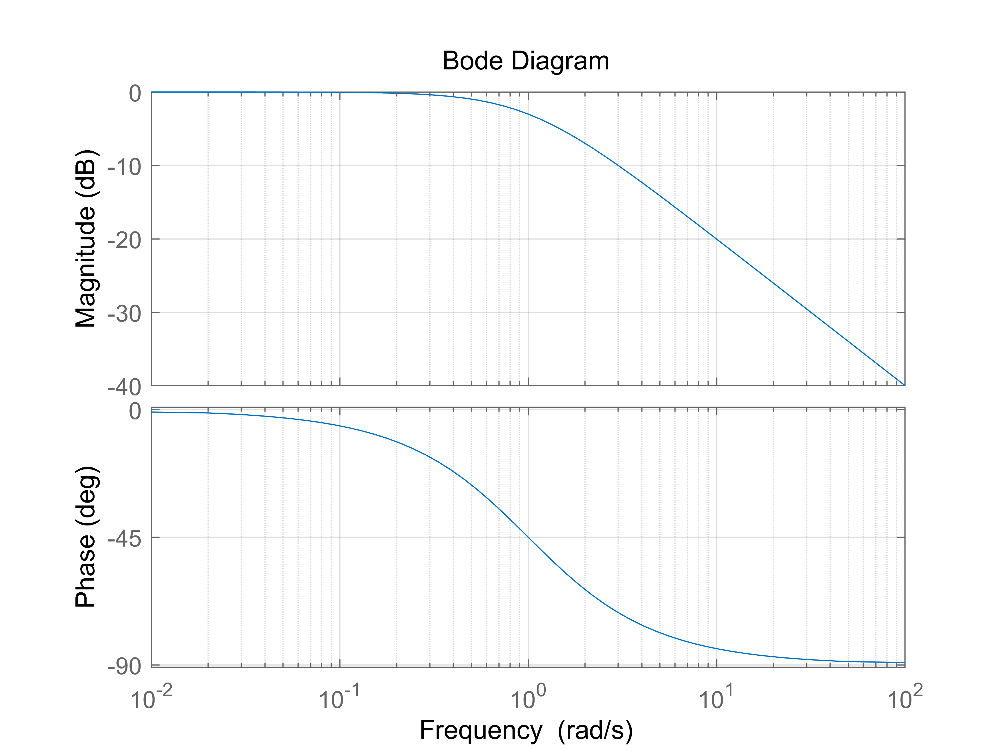
- 2阶系统
$$
H(s)=\frac{\omega_{n}^{2}}{s^{2}+2 \zeta \omega_{n} s+\omega_{n}^{2}}=\frac{\omega_{n}^{2}}{\left(s+\zeta \omega_{n}\right)^{2}+\omega_{n}^{2}\left(1-\zeta^{2}\right)}
$$
式中$\omega_{n}$为无阻尼**自然频率**,$\zeta$为阻尼比.
分析传递函数幅值求最大值对应频率为$w=w_n\sqrt{1-2\xi ^2}$, 即为共振频率(也叫**阻尼固有频率**, Damped Natural Frequency), 对应需要满足$\xi < \sqrt{0.5}$, 当$\xi$很小时就是约等于固有频率. 当$\xi=0$时, $|G|=\frac{w_n^2}{w_n^2-w^2}$, 当$w=w_n$时, $|G|\to +\infty $, 系统不稳定, 符合临界稳定(根在虚轴上)但不满足BIBO稳定.日常生活中也有很多共振现象,比如小提琴通过共振的箱体放大琴弦本生振动的音量
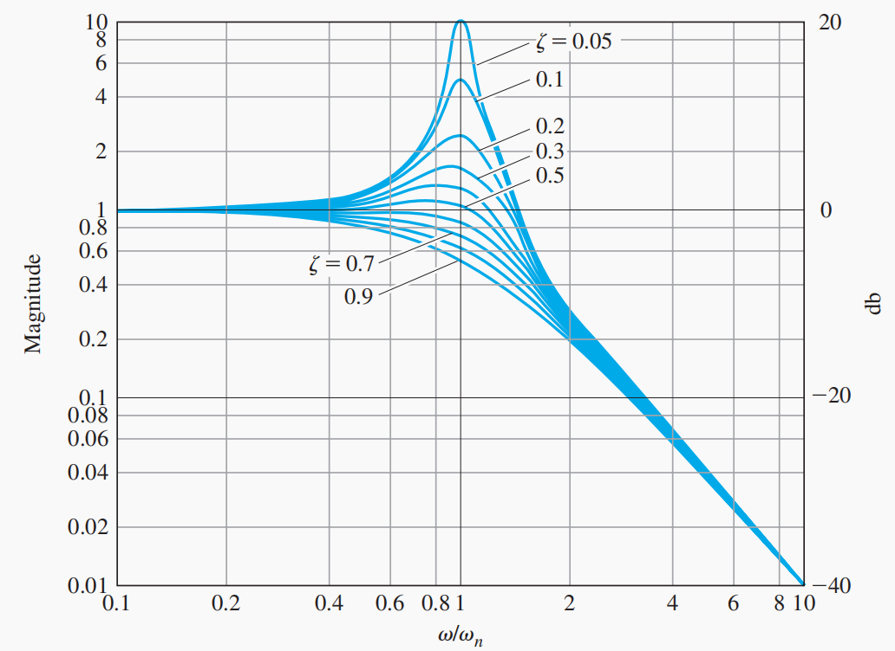
二阶系统对应的根为
$$
s=-\sigma \pm j \omega_{d}
$$
$$
\sigma=\zeta \omega_{n} \text { and } \omega_{d}=\omega_{n} \sqrt{1-\zeta^{2}}
$$
通过查表或者借助拉式变换的位移性质推导得到系统的单位脉冲响应的输出为
$$
h(t)=\frac{\omega_{n}}{\sqrt{1-\zeta^{2}}} e^{-\sigma t}\left(\sin \omega_{d} t\right) 1(t)
$$
据此可以分析$s$平面不同位置的输出变换趋势.
- 积分器, $G=\frac{1}{s}$
如下图所示,**频率很低处输出幅值比输入大, 需要额外能量, 所以积分器无法通过被动元件实现**, 需要额外供能
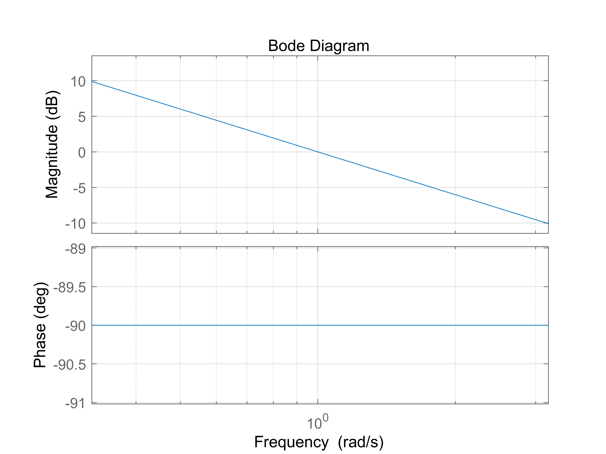
- 微分, $G=s$
和积分类似,在频率较高地方,幅值比输入大, 需要额外供能
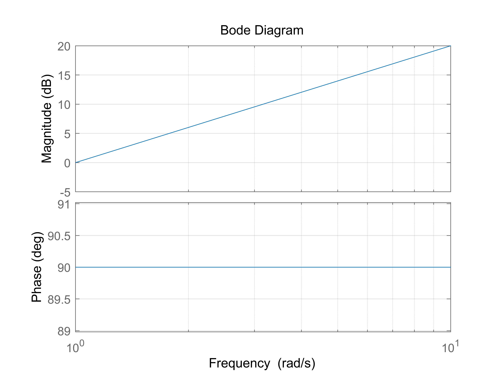
- 比例控制器, 不改变相位, 幅值同比例
- 超前补偿器, 如$G=\frac{s+1}{s+10}=\frac{1}{10}(s+1)(\frac{1}{0.1s+1})$, 可以看成3个传递函数串联, 分别绘制幅频响应后叠加即可得到最后的响应如下.不需要额外供能, 相位超前
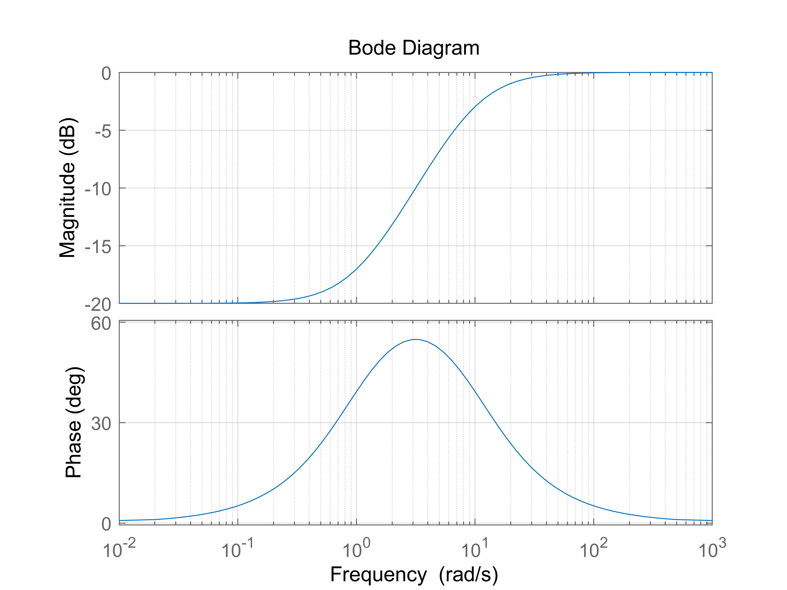
- 滞后补偿器, 如$G=\frac{0.1s+1}{s+1}$, 相位滞后
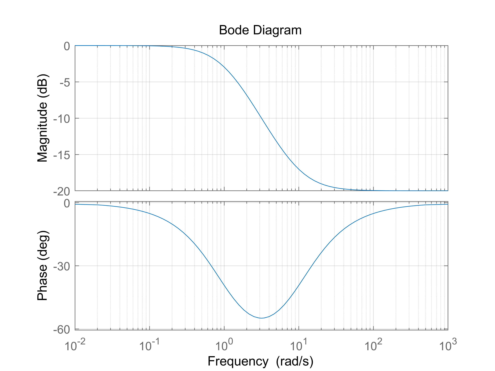
- PD控制器, 高频部分幅值放大, 需要必须要滤波器去除高频信号才能提高稳定性

### 典型函数的时域响应
- 1阶系统
输入阶跃信号1, $X(s)=\frac{1}{s}\frac{a}{s+a}$, 输出$x=\mathcal{L}^{-1}(\frac{1}{s-0}-\frac{1}{s+a})=e^{0t}-e^{-at}=1-e^{-at}$
时间常数(Time Constant):$\tau =\frac{1}{a}$, 对应$x\approx 0.63$
调节时间(稳定时间, Settling Time):$T_s=t\tau=\frac{4}{a}$, 对应$x(T_s)\approx 0.98$, 即系统输出与终值差距2%时间(后续时间差值都在次范围内)
- 2阶系统
主要指标包括上升时间,最大超调量,稳定时间.针对阶跃信号1, $X(s)=\frac{1}{s}\frac{w_n^2}{s^2+2\zeta w_ns+w_n^2}$, 系统的3个根分别为$s_{p1}=0,s_{p2}=-\zeta w_n+w_n\sqrt{\zeta ^2-1} ,s_{p3}=-\zeta w_n-w_n\sqrt{\zeta ^2-1}$, 每个根决定了系统的输出, 可以借助1阶系统稳定时间分析得到2阶系统稳定时间为$T_s=\frac{4}{\zeta w_n} $, 这是针对有虚部解的情况. 如果2个都是实根, 取最小根的稳定时间 

## 稳定裕度

将评估控制系统稳定性的复杂任务简化为基于两个关键频率点的相位和增益的计算。

闭环传递函数指$R(s)$与$C(s)$之间的关系，即$\frac{G}{1+GH}$，为方便起见，闭环传递函数常常将$C(s)$，替换为$F(s)$，因为在物理系统中无法直接测量$C(s)$

开环传递函数定义为环路增益，即$E(s)$到$F(s)$的路径，等效为$GH$

闭环传递函数分母为0，即$1+GH=0$获取极点，如果极点在负半轴则系统稳定，如果在虚轴则等幅振荡，如果在正半轴则不稳定

$GH=-1$，对应有频率$w_c$，使得
$$
G(jw)H(jw)=-1=1\angle -180°
$$
意味着$s=\pm jw_c$满足方程，即为系统的极点，所以系统等幅振荡

> 当开环增益为单位增益（0分贝）且相位为‑180度时，系统会发生不稳定性。
>
> 这可以通过G/(1+GH)法则看出，当GH􀀁=0分贝‑180度时，该法则简化为G/0，因为0分贝‑180度等同于‑1
>
> | **“分母为零 => 输出无穷大”** | **在特定频率的稳态正弦输入下**，线性模型的输出幅值理论上是无穷的 |
> | ---------------------------- | ------------------------------------------------------------ |
> | **“GH = -1 => 等幅振荡”**    | **系统自身的特征方程**在虚轴上有根，导致其**自然响应（零输入响应）** 是等幅正弦振荡。系统处于稳定与不稳定的边界 |

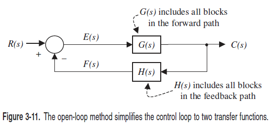

### 增益裕度

在**相位达到 -180°** 的频率点（称为**相位穿越频率 $w_{pc}$**），开环增益 ∣GH∣ 距离 **1（即 0 dB）** 还有多少“衰减空间”
$$
GM\text{ (dB)}=0 \text{ dB}-|GH(w_{pc})|\text{ (dB)}
$$
其中$w_{pc}$为相位差-180°对应的频率

- **物理意义**：它表示系统在导致相位滞后180°的频率下，**增益还能增加多少倍**（线性比例）才会达到临界点。
  - **正值（例如 +10 dB）**：表示当前增益是安全的，还能放大 $10^{10/20}$≈3.161010/20≈3.16 倍才会振荡。
  - **负值**：表示系统已经不稳定。

### 相位裕度

在**增益达到 0 dB** 的频率点（称为**增益穿越频率或截止频率 $w_{gc}$**），开环相位 ∠GH距离 **-180°** 还有多少“滞后空间”
$$
PM=\angle GH(w_{gc})-(-180°)=\angle GH(w_{gc})+180°
$$

其中$w_{gc}$为增益为0 dB下的频率

- **物理意义**：它表示系统在当前工作带宽（由 $w_{gc}$决定）下，**相位还能滞后多少度**才会达到临界点。相位裕度直接关系到闭环系统的**阻尼特性和动态响应**（如超调量）。
  - **正值（例如 45°）**：系统稳定，通常 PM 在 30°∼60°30°∼60° 之间被认为具有良好的动态性能和鲁棒性。
  - **零或负值**：系统处于临界稳定或不稳定。

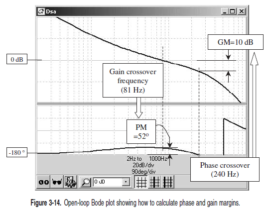

**实践中，一个良好调谐系统的GM会根据应用和控制器类型介于6至20分贝之间；PM则介于35度至80度之间**

## 区域调谐[^7]

调谐的一个挑战在于需要调整多个增益，且每个增益会影响众多性能指标。基于区域的调谐过程旨在逐个调整这些多重调谐增益。这可通过将每个增益项的影响视作在特定频率区域内占主导地位来实现。以PI控制为例
$$
\frac{C(s)}{R(s)}=\frac{sK_p+K_IK_p}{\frac{s^2}{G}+sK_p+K_IK_p}
$$
频率区域的角度考虑需关注分母部分

- 高频段：$s$值较大且$s^2\over G$主导了分母。在极高频率下，几乎所有的控制系统都会根据对象增益（电感、电容、惯性等）作出响应；在这些频率下，响应已超出控制器的调节范围
- 中频段：随着频率降低，$sK_p$项将占据主导地位，比例增益占主导（这里取决于$G,K_p$之间的比例），频率仍然过高，积分增益难以产生显著效果
- 低频段：频率进一步降低时，积分项将占据主导，分子分母只剩下常量

> 可根据伯德图理解，分母2阶对应有两个转折频率

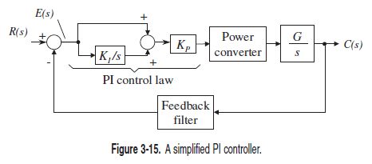

### 区域1：比例

应用基于区域的调谐方法，首先调谐最高频率项。假设对象增益$G$不可更改，则从调谐$K_p$开始

如果应用允许，将KI设为零，并将KP设得非常低。注意，某些应用无法容忍缺少积分项的情况，例如运动控制中当速度环应用于垂直负载时（负载可能下坠）

**施加方波并逐步提高KP，直到产生明显的超调。超调量的可接受程度取决于具体应用——许多应用可容忍10%至15%的超调，而有些则完全不能接受。对于要求高响应性的应用，应尽可能提高KP**

分析开环增益$\frac{K_PG}{s}$，调$K_p$时设置$K_I=0$，在低频时，开环相位-90°。因此，当KI=0时，无论KP设置得多低，系统都不会变得不稳定。从比例控制器开始的一个优势是，设计师可以从极低的KP值起步，几乎不会有不稳定性风险。

PI控制器开环增益$\frac{sK_pG+K_IK_pG}{s^2}$，低频段所呈现的‑180度相位，相对更容易不稳定，不是很好调整

高KP值导致的不稳定现象是什么原因造成的？
不稳定是由相位滞后累积至‑180度且增益为0分贝引起的。此处设备的相位固定为‑90度，但功率转换器和反馈滤波器产生的相位滞后会随频率升高而增加；实际物理器件都是有带宽的，对超过带宽的频率响应越来越小。提升KP 值是为了在最小稳定裕度内提供尽可能高的响应性。若最大化后的KP 仍不足，设计师必须考虑减少环路组件的相位滞后，例如通过提高功率转换器或反馈装置的响应速度。

### 区域2：积分

在KP 最大化后，应将注意力转向由积分项控制的下一区域。积分增益至关重要，因为它能消除长期误差。调谐时，积分增益的数值对更高频率(KP)区域的稳定性影响甚微；这意味着调**整$K_I$ 无需回头修改$K_p$**

从零开始提升KI直至超调量过大——通常介于10%至30%之间

KI对增益交叉频率处的增益影响甚微，但仍会在该频率处引入10度的相位滞后，从而等量降低相位裕度。需注意的是，PI控制器存在超调现象。所有PI控制器
在响应方波时都会产生一定超调，这是该方法的固有缺陷之一

**基于分区的程序可扩展至更复杂的控制器。关键在于将控制律划分为多个分区，然后从最高分区开始依次调谐各环节参数，直至最低分区。**

规则的一个例外情况是使用PID控制器调节单积分装置时。此时，比例项与微分项共同构成单一分区。调谐此类控制器时，应先将积分增益和微分增益归零，以低于正常值的稳定裕度为基准调谐比例项（可允许比最终调谐时多10%至20%的超调量），随后添加少量微分增益以提高稳定裕度。通过这种方式，微分增益与比例增益共同构成最高频率分区。而作为次低分区的积分区，其调谐方式与PI控制器中的处理相同。

## 附加零极点的作用

这里都是直接在最后的传递函数上增加零点和极点，和后面的pd、pi控制不同，后面是在开环传递函数基础上增加，研究闭环传递函数
1. 附加零点
  - 零点在左半平面分成两项就是原来的响应+原来响应的导数。导致增加超调和减小上升时间
  - 零点在右半平面分成两项就是原来的响应-原来响应的导数。导致减小超调，可能引起节约响应刚开始朝错误的方向运动（有右半平面的零点为非最小相位系统）

2. 附加极点
    延长了上升时间

## PID控制
这里和前面分开，增加的控制项是直接作用于开环传递函数
- P控制，提高比例增益可以降低稳态误差，但高增益导致系统不稳定
- I控制，具有消除稳态误差的鲁棒性，但会降低系统的稳定性（根轨迹想右压）
- D控制，**提高阻尼增加系统的稳定性**

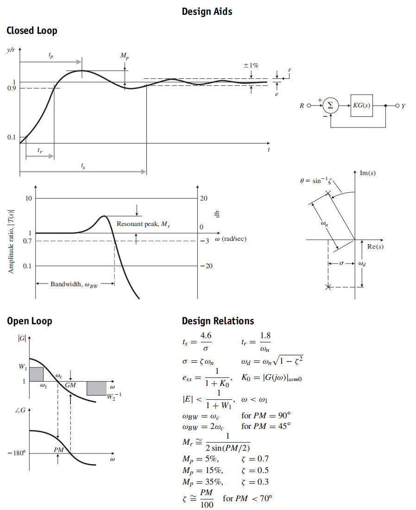
带宽等于闭环特征根的自然频率：对于闭环阻尼$\zeta=0.7$，$\omega_{BW}=\omega_{n}$，其他阻尼比，带宽近似，误差不超过2倍。可以用于估计上升时间

穿越频率$\omega_{c}$:幅值为1或者0dB处的频率

相位阈度PM=30°一般任务是达到满意的最低值

频率响应稳定设计简单准则: 调整幅值曲线的斜率,使之在附近的10倍频程内以斜率为-1穿过幅值1的曲线(相位-90°左右,PM在90°左右)

对于标准的二阶系统,相位阈度和系统闭环阻尼如下:
$$
\zeta \cong \frac{\mathrm{PM}}{100}
$$

二阶系统,伯德图中幅值的峰值与阻尼比关系如下:
$$
|G(j \omega)|=\frac{1 \mid}{2 \zeta} \quad \text { at } \omega=\omega_{n}
$$

##　其他
1. 二阶系统中工程上常取$\zeta = 0.7$作为最饥饿阻尼洗漱
2. 当引入的实数极点与主导极点的模值之比大于５时，非主导极点对时间响应的影响可以忽略．（主导极点：左半复平面离虚轴最近，且周围没有零点的极点，其余极点远离虚轴）
3. 在系统开环放大洗漱比较适当，动态性能比较好的情况下，略去开环系统小时间常数环节(系数相对其他项较小的项)不会引起较大误差；当系统开环系数较大，动态性能较差的情况下需要慎重（自动控制原理-第四版-高国燊-P102）
4. 惯性环节$G = {K \over {Ts + 1}}$过渡时间为$3T$,即时间响应稳定在稳态值的0.05附近

## 引用
[^1]: https://en.wikipedia.org/wiki/Linear_time-invariant_system
[^2]: https://en.wikipedia.org/wiki/Laplace_transform
[^3]: Franklin, Gene F. Feedback control of dynamic systems [M]
[^4]: https://www.feynmanlectures.caltech.edu/I_25.html
[^5]: https://en.wikipedia.org/wiki/Convolution
[^6]: https://en.wikipedia.org/wiki/Decibel
[^7]: Ellis G .Observers in Control Systems a Practical Guide[J].academic press, 2002.

## 附录
### 拉式变换表
