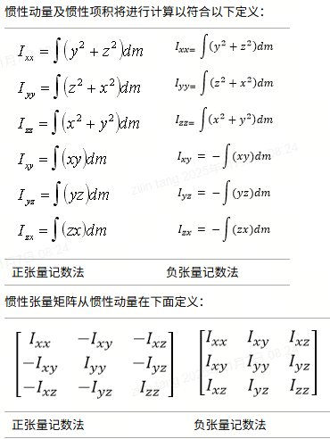

<!-- @import "[TOC]" {cmd="toc" depthFrom=2 depthTo=3 orderedList=false} -->

<!-- code_chunk_output -->

- [机械臂动力学](#机械臂动力学)
  - [牛顿欧拉递推动力学](#牛顿欧拉递推动力学)

<!-- /code_chunk_output -->

# 机械臂动力学

## 运动学基础

### 李群

**群**由⼀个集合以及⼀个⼆元运算所组成，它的运算需要满⾜以下四个条件：

1. 封闭性（closure）
2. 结合律（associativity）
3. 存在⼳元（identity）
4. 存在逆（invertibility）

**李群**([Lie group](https://browse.library.kiwix.org/viewer#wikipedia_en_all_maxi_2025-08/Lie_group))是一个微分流形（differential manifold）

> 流形：流形上每点的领域等同于（同胚）欧几里得空间的开集，比如地球表面局部近似平面，整体是球面
>
> 微分流形：群上的运算是光滑的，可以在流形上进行微分操作，或者说，群运算中，输入进行微小的改变，输出也是微小的改变

常见群

- 一般线性群（$GL(n,\mathbb R)$，简写$GL(n)$）：元素都是$n\times n$可逆矩阵，群运算为矩阵乘法，逆运算为矩阵求逆
- 特殊线性群（$SL(n,\mathbb R)$，简写$SL(n)$）：元素是行列式为1的$n\times n$的矩阵
- 正交群（$O(n)$，orthogonal group）: 满足$M^TM=I$，即正交矩阵
- 特殊正交群（$SO(n)$，special orthogonal group）：行列式为1的正交矩阵群
- 欧几里得群($E(n)$, Euclidean group) ：$   E ( n )  = O ( n )\ltimes  \mathbb { R } ^ { n } $
- 特殊欧几里得群($SE(n)$, special Euclidean group) ：$   SE ( n )  = SO ( n )\ltimes  \mathbb { R } ^ { n } $

> 多个群组合得到新的群
>
> 积：
>
> - 直积（dircet product）：给定两个群$G,H$，直积记为$G\times H$，元素对$(g,h),g\in G,h\in H$，群运算为$( g _ { 1 } \, , h _ { 1 } ) ( g _ { 2 } \, , h _ { 2 } ) = ( g _ { 1 } \, g _ { 2 } \, , h _ { 1 } h _ { 2 } )$
>
> - 半直积（semi-dircet product）：记为$G\ltimes H$，元素对为$(g,h)$， 群运算为$( g _ { 1 } \, , h _ { 1 } ) ( g _ { 2 } \, , h _ { 2 } ) = ( g _ { 1 } \, g _ { 2 } \, , h _ { 1 } + g _ { 1 } ( h _ { 2 } ) )$
>
> 作用：
>
> - 相似（similarity）：$S(g,M)=gMg^{-1}$
> - 合同（congruence）：$S(g,M)=gMg^{T}$

|  性质  |                           $SO(3)$                            |                           $SE(3)$                            |
| :----: | :----------------------------------------------------------: | :----------------------------------------------------------: |
| 封闭性 | ${ C _ { 1 } , C _ { 2 } \in S O ( 3 ) \Rightarrow C _ { 1 } C _ { 2 } \in S O ( 3 ) }$ | $T _ { 1 } , T _ { 2 } \in S E ( 3 ) \Rightarrow T _ { 1 } T _ { 2 } \in S E ( 3 )$ |
| 结合律 | $C _ { 1 } ( C _ { 2 } C _ { 3 } ) = ( C _ { 1 } C _ { 2 } ) C _ { 3 } = C _ { 1 } C _ { 2 } C _ { 3 } $ | $T _ { 1 } ( T _ { 2 } T _ { 3 } ) = ( T _ { 1 } T _ { 2 } ) T _ { 3 } = T _ { 1 } T _ { 2 } T _ { 3 } $ |
|  幺元  | $C , \mathbf { 1 } \in S O ( 3 ) \Rightarrow C \mathbf { 1 } = 1 C = C$ | $T , \mathbf { 1 } \in S E ( 3 ) \Rightarrow T \mathbf { 1 } = 1 T = T$ |
|   逆   |   $C \in S O ( 3 ) \Rightarrow C ^ { - 1 } \in S O ( 3 )$    |   $T \in S E ( 3 ) \Rightarrow T ^ { - 1 } \in S E ( 3 )$    |

### 李代数

#### 切向量

李代数是单元元素上的切空间(tangent space)

考虑在群$G$中通过单位元的光滑路径,它是一个光滑映射$\gamma: \mathbb{R}\to G$,并满足$\gamma(0)=e$.在这些路径上引入一个等价关系:如果两个路径在0处的一阶导数相等,则两路径等价.切向量(tangent vector)就是关于这个关系的等价类.能够证明该等价类的空间是向量空间.本质上,它是指考虑$e$附近关于某一局部坐标系的导数.

$SO(n)$李代数：通过单位元的路径定义为$\gamma(t)=M(t),M(0)=I$，有$M(t)^TM=I$，对$t$求导并令$t=0$，得到
$$
\dot M(0)^T+\dot M(0)=0
$$
对应为反对称矩阵，即对应的李代数为$so(n)$

#### 伴随表示(adjoint representation)

定义李群$G$和关于元素$g\in G$的共轭为
$$
\Psi _ { g } : G \to G , \quad h \mapsto g \cdot h \cdot g ^ { - 1 }
$$

> “轭”：架在两头牛背上的横木，使它们同步行走。
>
> “共轭”：“按一定规律相配的一对”。李群中共轭是连接**整体群结构**与**局部线性结构**的核心概念，核心思想是**变换参考系**

群上一个简单路径用表示为$\gamma:t\to I+tX+t^2Q(t)$，其中$X$为李代数元素，$Q(t)$为余数，确保路径的像在群中，对共轭进行求导并令$t=0$得
$$
\text{Ad}(g)X=gXg^{-1}
$$

> **指数映射和伴随表示的联系**
> $$
> e^{\text{Ad}_gX}=g\cdot e^X\cdot g^{-1}
> $$

##### $so(3)$伴随

##### 

$$
\begin{align}
R \Omega R ^ { \operatorname { T } } & = R ( \omega \times r _ { 1 } \ \mid \omega \times  { r _ { 2 } } \ \mid \omega \times r _ { 3 } )\\
&=\begin{array} { r } { \left( \begin{array} { c c c c } { 0 } & { r _ { 1 } \cdot ( \omega \times r _ { 2 } ) } & { r _ { 1 } \cdot ( \omega \times r _ { 3 } ) } \\ { r _ { 2 } \cdot ( \omega \times r _ { 1 } ) } & { 0 } & { r _ { 2 } \cdot ( \omega \times r _ { 3 } ) } \\ { r _ { 3 } \cdot ( \omega \times r _ { 1 } ) } & { r _ { 3 } \cdot ( \omega \times r _ { 2 } ) } & { 0 } \end{array} \right) } \end{array}\\
&=\begin{array} { r } { \left( \begin{array} { c c c } { 0 } & { \omega \cdot ( \boldsymbol { r } _ { 2 } \times \boldsymbol { r } _ { 1 } ) } & { \omega \cdot ( \boldsymbol { r } _ { 3 } \times \boldsymbol { r } _ { 1 } ) } \\ { \omega \cdot ( \boldsymbol { r } _ { 1 } \times \boldsymbol { r } _ { 2 } ) } & { 0 } & { \omega \cdot ( \boldsymbol { r } _ { 3 } \times \boldsymbol { r } _ { 2 } ) } \\ { \omega \cdot ( \boldsymbol { r } _ { 1 } \times \boldsymbol { r } _ { 3 } ) } & { \omega \cdot ( \boldsymbol { r } _ { 2 } \times \boldsymbol { r } _ { 3 } ) } & { 0 } \end{array} \right) } \end{array}\\
&=\left( \begin{array} { c c c } { { 0 } } & { { { \it \displaystyle - r _ { 3 } \cdot \omega } } } & { { r _ { 2 } \cdot \omega } } \\ { { r _ { 3 } \cdot \omega } } & { { 0 } } & { { - r _ { 1 } \cdot \omega } } \\ { { - \, r _ { 2 } \cdot \omega } } & { { r _ { 1 } \cdot \omega } } & { { 0 } } \end{array} \right)\\
&=[Rw]
\end{align}
$$

考虑对应的坐标系变换，$w_a,w_b$分别为坐标系$\{a\},\{b\}$下的同一个角速度向量的表示，两个坐标系之间的变换为$^a_bR$，对应有$w_a=^a_bRw_b$，结合伴随则有
$$
[w_a]=^a_bR[w_b]^a_bR^T=[^a_bRw_b]
$$
该伴随变换把$[w_b]$变换到了新坐标系得到$[w_a]$

##### $se(3)$伴随

$$
\begin{bmatrix}
\Omega'  & v'\\
0  & 1
\end{bmatrix}  = \begin{bmatrix}
R  & t\\
0  & 1
\end{bmatrix}
\begin{bmatrix}
\Omega  & v\\
0  & 1
\end{bmatrix}
\begin{bmatrix}
R^T  & -R^Tt\\
0  & 1
\end{bmatrix}
=\begin{bmatrix}
R\Omega R^T  & Rv-R\Omega R^Tt\\
0  & 1
\end{bmatrix}
=\begin{bmatrix}
[Rw]  & [t]Rw+Rv\\
0  & 1
\end{bmatrix}
$$

对应有
$$
\begin{bmatrix}
w' \\
v'
\end{bmatrix}=
\begin{bmatrix}
R  & 0\\
[t]R  &R
\end{bmatrix}
\begin{bmatrix}
w \\
v
\end{bmatrix}
$$
考虑坐标变换$s_a=\begin{bmatrix}w_a \\v_a\end{bmatrix}$，为坐标系$\{a\}$下的旋量，$s_b=\begin{bmatrix}w_b \\v_b\end{bmatrix}$，为坐标系$\{b\}$下的旋量，两个坐标系的变换为$^a_bT=
\begin{bmatrix}
R  &t\\
0  &1
\end{bmatrix}$，则有$w_a=^a_bRw_b,v_a=^a_bRv_b-[^a_bRw_b]t=^a_bRv_b+[t]^a_bRw_b$，和伴随变换有一致，即**速度旋量的坐标变换**为
$$
s_a=\begin{bmatrix}
w_a \\
v_a
\end{bmatrix}=
\begin{bmatrix}
^a_bR  & 0\\
[^a_bt]^a_bR  &^a_bR
\end{bmatrix}
\begin{bmatrix}
w_b \\
v_b
\end{bmatrix}=\text{Ad}(^a_bT)s_ b
$$
该伴随变换就是把$s_a$，变换到新坐标系得到$s_b$

#### 换位子

研究**伴随表示的微分**，假设$g$是群中靠近单位元的矩阵，近似为$\approx I+tX+\theta(t^2)$，对应$g^{-1}\approx I-tX+\theta(t^2)$，对普通元素$Y$的共轭为
$$
(I+tX)Y(I-tX)=Y+t(XY-YX)+\theta(t^2)
$$
对$t$求导并令$t=0$得到$XY-YX$，记为$[X,Y]=XY-YX$，称为两个元素的**李括号(Lie bracket)**或**换位子(commutator)**。可以看成定义在李代数上的自身的表示，定义为伴随表示，改用小写字母，即
$$
ad(x)y=XY-YX=[X,Y]
$$
其中$x,y$为向量空间，$X,Y$为矩阵空间，$[x]=X,[y]=Y$

> 可用于迭代更新变换坐标系

##### $so(3)$换位子

$$
[X,Y]=XY-YX=[x][y]-[y][x]=[Xy]=[\text{ad}(x)y]
$$

其中$\text{ad}(x)=[X]=x^{ \wedge }=\begin{bmatrix}
x_1 \\
x_2 \\
x_3
\end{bmatrix}^{\wedge }= \left[ 
\begin{array} { c c c } { { 0 } } & { { - x _ { 3 } } } & { { x _ { 2 } } } 
\\ { { x _ { 3 } } } & { { 0 } } & { { - x _ { 1 } } } 
\\ { { - x _ { 2 } } } & { { x _ { 1 } } } & { { 0 } } 
\end{array} \right] \in \mathbb { R } ^ { 3 \times 3 }$

> 比如针对$X=[x],Y=[y],Z=[z]$，其中$x=[1,0,0]^T,y=[0,1,0]^T,z=[0,0,1]^T$,对应有如下关系（坐标轴叉乘）
> $$
> \begin{align}
> [X,Y] = [ad(x)y] = [Z]\\
> [Z,X] = [ad(z)x] = [Y]\\
> [Y,Z] = [ad(y)z] = [X]\\
> \end{align}
> $$
> 

##### $se(3)$换位子

$$
[X,Y]=XY-YX=x^{\wedge}y^{\wedge}-y^{\wedge}x^{\wedge}=(x^{\curlywedge}y)^{\wedge}=(\text{ad}(x)y)^{\wedge}
$$

其中$\text{ad}(x)=x^{ \curlywedge}=\begin{bmatrix}
w \\
v
\end{bmatrix}^{\curlywedge}= 
\begin{bmatrix}
[w]  & 0\\
[v]  &[w]
\end{bmatrix}
 \in \mathbb { R } ^ { 6 \times 6 }$ ， $x^{\wedge}=\begin{bmatrix}
w \\
v
\end{bmatrix}^{\wedge}= 
\begin{bmatrix}
[w]  & v\\
0  &0
\end{bmatrix}
 \in \mathbb { R } ^ { 4 \times 4 }$

> 针对$w_i=[1,0,0,0,0,0]^T,w_j=[0,1,0,0,0,0]^T,w_k=[0,0,1,0,0,0]^T,v_i=[0,0,0,1,0,0]^T,v_j=[0,0,0,0,1,0]^T,v_k=[0,0,0,0,0,1]^T$
>
> 对应有
> $$
> \begin{matrix}
> [w_i^{\wedge},w_j^{\wedge}] = w_k^{\wedge}  &  [w_j^{\wedge},w_k^{\wedge}] = w_i^{\wedge}& [w_k^{\wedge},w_i^{\wedge}] = w_j^{\wedge}\\
> [w_i^{\wedge},v_j^{\wedge}] = v_k^{\wedge}  &  [w_j^{\wedge},v_k^{\wedge}] = v_i^{\wedge}& [w_k^{\wedge},v_i^{\wedge}] = v_j^{\wedge}\\
> [v_i^{\wedge},v_j^{\wedge}] = 0  &  [v_j^{\wedge},v_k^{\wedge}] = 0& [v_k^{\wedge},v_i^{\wedge}] = 0\\
> \end{matrix}
> $$
> 其实就是3组简单作用，对应各自三维向量的叉乘
> $$
> \begin{matrix}
> [w_1^{\wedge},w_2^{\wedge}] = (ad(w_1)w_2)^{\wedge}=(\begin{bmatrix}
> [w_1]  &0 \\
> 0  &[w_1]
> \end{bmatrix}
> \begin{bmatrix}
> w_2 \\
> 0
> \end{bmatrix})^{\wedge}
> =(\begin{bmatrix}
> [w_1]w_2 \\
> 0
> \end{bmatrix})^{\wedge}\\
> 
> [w_1^{\wedge},v_2^{\wedge}] = (ad(w_1)v_2)^{\wedge}=(\begin{bmatrix}
> [w_1]  &0 \\
> 0  &[w_1]
> \end{bmatrix}
> \begin{bmatrix}
> 0 \\
> v_2
> \end{bmatrix})^{\wedge}
> =(\begin{bmatrix}
> 0 \\
> [w_1]v_2
> \end{bmatrix})^{\wedge}\\
> 
> 
> [v1^{\wedge},v_2^{\wedge}] = (ad(v_1)v_2)^{\wedge}=(\begin{bmatrix}
> 0  &0 \\
> [v_1]  &0
> \end{bmatrix}
> \begin{bmatrix}
> 0 \\
> v_2
> \end{bmatrix})^{\wedge}
> =0^{\wedge}\\
> \end{matrix}
> $$
> 其中$w_1,w_2,v_1,v_2$都是三维向量
>
> **可用于不同坐标系变换的迭代**

### 机器人雅可比矩阵和导数

#### 雅可比矩阵

> 常用于数值优化

单参数字群微分对应求解机器人雅可比矩阵
$$
{ \binom { \omega } { v } } = ( \dot { \theta } _ { 1 } s _ { 1 } + \dot { \theta } _ { 2 } s _ { 2 } + \dot { \theta } _ { 3 } s _ { 3 } + \dot { \theta } _ { 4 } s _ { 4 } + \dot { \theta } _ { 5 } s _ { 5 } + \dot { \theta } _ { 6 } s _ { 6 } )
$$
对应得到雅可比矩阵$J=[s_1,s_2,s_3,s_4,s_5,s_6]$，这里和旋量是在同一个坐标系，直观理解就是每个刚体对指定点（基座/末端）的贡献

#### 李群导数

> 常用于数值优化，包括精度标定等

对于群上更一般路径的微分，用指数表示为
$$
\pmb { g } ( t ) \, = \, \mathrm { e } ^ { \pmb { X } ( t ) }
$$
Hausdorff证明了
$$
\begin{array} { r } {\left( \frac { \mathrm { d } } { \mathrm { d } t } \mathbf { e } ^ { X } \right) \mathrm { e } ^ { - X } = \dot { X } + \frac { 1 } { 2 ! } [ X , \dot { X } ] + \frac { 1 } { 3 ! } [ X , [ X , \dot { X } ] ] + \frac { 1 } { 4 ! } [ X , [ X , [ X , \dot { X } ] ] ] + \cdots } \end{array}
$$
等式右边还是李代数元素，记为$X_d$， 对应有$\frac { \mathrm { d } } { \mathrm { d } t }  \mathrm { e } ^ { X }  = X_d\mathbf { e } ^ { X }$，增加变量并利用偏导结果和求导顺序无关进行推导
$$
\frac { \partial ^ { 2 } } { \partial t \partial \mu } \mathrm { e } ^ { \mu \mathbf { \boldsymbol { X } } ( t ) } = \frac { \partial } { \partial t } ( \mathrm { e } ^ { \mu \mathbf { \boldsymbol { X } } ( t ) } \mathbf { \boldsymbol { X } } ( t ) \, ) = \dot { \mathbf { \boldsymbol { X } } _ { \mathrm { d } } ^ { \mu } } \mathrm { e } ^ { \mu \mathbf { \boldsymbol { x } } ( t ) } \mathbf { \boldsymbol { X } } ( t ) + \mathrm { e } ^ { \mu \mathbf { \boldsymbol { X } } ( t ) } \dot { \mathbf { \boldsymbol { X } } } ( t )
$$
以及
$$
{ { \frac { \partial ^ { 2 } } { \partial \mu \partial t } \mathrm { e } ^ { \mu { \bf X } ( t ) } = \frac { \partial } { \partial \mu } ( X _ { \mathrm { d } } ^ { \mu } \mathrm { e } ^ { \mu { \bf X } ( t ) } ) } } { { = \left( \frac { \partial } { \partial \mu } X _ { \mathrm { d } } ^ { \mu } \right) \mathrm { e } ^ { \mu { \bf X } ( t ) } \left. + X _ { \mathrm { d } } ^ { \mu } \mathrm { e } ^ { \mu X ( t ) } X ( t ) \right. } }
$$
其中$X _ { \mathrm { d } } ^ { \mu } = \frac { \partial } { \partial t } ( \, \mathrm { e } ^ { \mu X ( t ) } \, ) \, e ^ { - \mu X ( t ) }$

两种求导方式相等得到
$$
\left( \frac { \partial } { \partial \mu } \pmb { X } _ { \mathrm { ~ d ~ } } ^ { \mu } \right) = \, \mathrm { e } ^ { \mu \pmb { X } ( t ) } \, \dot { \pmb { X } } ( t ) \, \mathrm { e } ^ { - \mu \pmb { X } ( t ) }
$$
李代数元素$X$改写到向量空间$x$得到
$$
\left( { \frac { \partial } { \partial \mu } } \pmb { x } _ { \mathsf { a } } ^ { \mu } \right) = \operatorname { A d } ( \, \mathbf { e } _ { \phantom { \mu } . } ^ { \mu \pmb { x } ( t ) } \, ) \, { \dot { \pmb { x } } } = \, \mathrm { e } ^ { \mathrm { a d } ( \mu \mathfrak { x } ) } \, { \dot { \pmb { x } } } 
$$
对$\mu$积分得到
$$
x _ { \mathrm { d } } = x _ { \mathrm { d } } ^ { 1 } = \int _ { 0 } ^ { 1 } \mathbf { e } ^ { \mathrm { { a d } } ( \mu , \kappa ) } \, \mathrm { { d } } \mu \dot { x }
$$
当$\mu=0$时群元素为常数，对应$x_d^0=0$，对指数进行级数展开后逐项目积分得到
$$
x _ { \mathrm { d } } = \sum _ { k = 0 } ^ { \infty } \, \frac { 1 } { ( k + 1 ) ! } \mathrm { a d } ^ { k } ( \pmb { x } ) \dot { \pmb { x } }
$$

#### 角速度

使用旋转矩阵$R=[r_1,r_2,r_3]$，表示姿态，则有$\dot R=[\dot r_1,\dot r_2,\dot r_3]=w_s\times [r_1,r_2,r_3]=[w_s]R$，得到
$$
[w_s]=\dot RR^{-1}
$$
同时有$[w_s]=[Rw_b]=[w_b]R^T=\dot RR^{-1}$， 其中$R=^{s}_bR$，得到
$$
[w_b]=R^{-1}\dot R
$$

> $[w_s]$：基坐标系下的角速度
>
> $[w_b]$：物体坐标系下的角速度
>
> 结合李群导数可知对应的$x_d=w_s$

#### 速度旋量

类似旋转矩阵进行求导
$$
\dot TT^{-1}=\begin{bmatrix}
\dot R  & \dot t\\
0  &0
\end{bmatrix}
\begin{bmatrix}
R^T  & -R^Tt\\
0  &1
\end{bmatrix}
=\begin{bmatrix}
[w_s]  & -[w_s]t+\dot t\\
0  &0
\end{bmatrix}
=\begin{bmatrix}
[w_s]  & v_s\\
0  &0
\end{bmatrix}
=\mathcal{V}_s
$$

$$
T^{-1}\dot T=
\begin{bmatrix}
R^T  & -R^Tt\\
0  &1
\end{bmatrix}\begin{bmatrix}
\dot R  & \dot t\\
0  &0
\end{bmatrix}
=\begin{bmatrix}
[w_b]  & R^T\dot t\\
0  &0
\end{bmatrix}
=\begin{bmatrix}
[w_b]  & v_b\\
0  &0
\end{bmatrix}
=\mathcal{V}_b
$$

> $[\mathcal{V}_s]$：基坐标系下的速度旋量（与刚体固连，且瞬时和基坐标系重合的坐标系的角速度和线速度在基坐标系下的表示）
>
> $[\mathcal{V}_b]$：物体坐标系下的速度旋量（与刚体固连，且瞬时和物体坐标系如工具坐标系重合的坐标系的角速度和线速度在物体坐标系下的表示）
>
> 结合李群导数可知对应的$x_d=\mathcal{V}_s$

## 动力学基础

### 牛顿运动定理

[Newton's laws of motion](https://browse.library.kiwix.org/viewer#wikipedia_zh_all_maxi_2025-09/牛顿运动定律)

- **第一定律**：假若施加于某物体的[外力](https://browse.library.kiwix.org/viewer#wikipedia_zh_all_maxi_2025-09/力)为零，则该物体的运动[速度](https://browse.library.kiwix.org/viewer#wikipedia_zh_all_maxi_2025-09/速度)不变（[惯性](https://browse.library.kiwix.org/viewer#wikipedia_zh_all_maxi_2025-09/慣性)定律）

- **第二定律**：施加于物体的外力等于此物体的[质量](https://browse.library.kiwix.org/viewer#wikipedia_zh_all_maxi_2025-09/質量)与[加速度](https://browse.library.kiwix.org/viewer#wikipedia_zh_all_maxi_2025-09/加速度)的乘积（加速度定律）
  $$
  \mathbf { F } = { \frac { d \mathbf { p } } { d t } } =m\frac{\mathrm{d}\mathbf{v}}{\mathrm{d}t}=m\mathbf{a}
  $$
  
- **第三定律**：当两个物体相互作用于对方时，彼此施加于对方的力，其大小相等、方向相反（作用力与[反作用力](https://browse.library.kiwix.org/viewer#wikipedia_zh_all_maxi_2025-09/反作用力)定律）

### 欧拉运动定理

[Euler's laws of motion](https://browse.library.kiwix.org/viewer#wikipedia_en_all_maxi_2025-08/Euler's_laws_of_motion)是牛顿运动定理多粒子（刚体）的扩展形式

- 第一定理：从某惯性参考系观测，施加于刚体的合外力，等于刚体质量与质心加速度的乘积
  $$
  \mathbf { F }_{ext} = { \frac { d \mathbf { p_{cm} } } { d t } }
  $$

  > 从牛顿第二定理推导，合力如下，内部相互作用力抵消可得欧拉第一运动定理
  > $$
  > \sum_{i=1}^nF_i=\sum_{i=1}^n\frac{dm_iv_i}{dt}=\frac{d^2\sum_{i=1}^nm_ir_i}{dt^2}=m\frac{d^2r_{cm}}{dt}=\frac{dP_{cm}}{dt}
  > $$

  

- 第二定理：设定某惯性参考系的固定点O（例如，原点）为参考点，施加于刚体的净外力矩，等于角动量的时间变化率
  $$
  \mathbf{M}  _ { o } ^ { ( e x t ) } = { \frac { d\mathbf{L}_ { o } } { d t } }
  $$

  > 单质点转动
  > $$
  > \frac{dL}{dt}=\frac{d(r\times mv)}{dt} =\frac{dr}{dt}\times mv+r\times \frac{dmv}{dt} =r\times F=\tau
  > $$
  > 这里也可以使用能量来定义转矩，平动可看成转动中心无限远的转动
  > $$
  > \frac{dE}{dt} =  \frac{d\frac{1}{2}mv^2}{dt}=F^Tv=F^T[w]r=-F^T[r]w=([r]F)^Tw=\tau^Tw=\tau^T\frac{d\theta}{dt}\\
  > $$
  > 刚体转动
  > $$
  > \begin{align}
  > \tau_o & = \sum_{i = 1}^n\frac{dL_i}{dt} = \frac{d}{dt} \sum_{i = 1}^nL_i \\
  >        & = \frac{d}{dt}(r_{cm}+r_i)\times m_i(v_{cm}+v_i)\\
  >        & = \frac{d}{dt}(r_{cm}\times m_iv_{cm}+r_i\times m_iv_i)\\
  >        & = r_{cm}\times F_{cm}+\frac{d}{dt}(r_i\times m_iv_i)\\
  > \end{align}
  > $$
  > 转到质心得到
  > $$
  > \tau_{cm}=\frac{dL_{cm}}{dt}
  > $$

### 单刚体运动方程

欧拉运动定理进一步推导得到单刚体运动方程的矩阵方式，使用旋量和余旋量表示如下，其中$s=[w^T,v^T]^T$为基坐标系（惯性坐标系）下刚体的旋量
$$
F_{ext}=\frac{dp_{cm}}{dt}=\frac{d}{dt}m(v+[w]r_{cm})=\frac{d}{dt}(mv+[r_{cm}]^Tw)
$$

$$
\tau_{ext} = \frac{dL_{i}}{dt} = \frac{d}{dt}m_i(r_i\times (v+[w]r_{i})) = \frac{d}{dt}(m[r_{cm}]v+Iw) \\
$$

> 微分内容分别对应线动量和角动量

**刚体运动方程**写成矩阵形式如下
$$
\frac{d\mathcal{M}  }{dt}=\mathcal{W} 
$$
其中力旋量$\mathcal{W}=[\tau,F]^T$，动量为
$$
\mathcal{M}=\cal{N}s=\begin{bmatrix}
I  & mC\\
mC^T  &mI_{3}
\end{bmatrix}\begin{bmatrix}
w \\
v
\end{bmatrix}
$$

#### 运动方程推导

假设物体以速度旋量$\dot q$移动，则动量为$N\dot q$，进一步研究如下对速度旋量和力旋量对时间的导数，考虑$s$为固定在移动刚体上的旋量，可以将$s$看成与刚体上一个关节相联系的旋量，作为时间的函数$s$的位置为
$$
s(t)=\text{e}^{ad(z)}s(0)
$$
其中$z$是$t$的函数，进行求导得到
$$
\frac { \mathrm { d } } { \mathrm { d } t } \text {e} ^ { \text {ad} ( z ) } \, s ( 0 ) = \text {ad} ( z  _ { \mathrm { d } } ) \, \text {e} ^ { \text {ad} ( z ) } \, s ( 0 ) = \text { ad } (z _ { \mathrm { d } } ) \, s ( t ) = \left[ z _ { \mathrm { d } } \, , s ( t ) \right]
$$
其中$z_d$是运动的瞬时速度旋量

> 参考李群导数中速度旋量的计算，$\text{ad}(z)$替换$X$，并可通过替换$e^{\text{ad}(z)}=\begin{bmatrix}
> R  & 0\\
> [t]R  &R
> \end{bmatrix}$化简得到
> $$
> e^{\text{ad}(z)}\text {ad}(\dot z) e^{-\text{ad}(z)}=(e^{\text{ad}(z)}\dot z)^{\curlywedge}
> $$

对动量（余旋量）求导
$$
\frac { \mathrm { d } } { \mathrm { d } t } \mathcal{M}(t) = \frac { \mathrm { d } } { \mathrm { d } t } (e^{-ad^T(z)}\mathcal{M}(0))
                                                           = - \mathrm { a d } ^ { \mathrm { T } } \left( z _ { \mathrm { d } } \right) \mathrm { e } ^ { - \mathrm { a d } ^ { \mathrm { T } } \left( z \right) } \, \mathcal { M } ( 0 ) 
 = \left\{ z _ { \mathrm { d } } \, , \mathcal { M } ( t ) \right\}
$$
惯性矩阵为$\mathbf { \cal{N} } ( t ) = \mathbf { \boldsymbol { e } } ^ { - \mathrm { { a d } } ^ { \mathrm { { T } } } ( z ) } \, \mathbf { \cal{N} } ( 0 ) \, \mathbf { \boldsymbol { e } } ^ { - \mathrm { { a d } } ( z ) }$
$$
\frac { \mathrm { d } } { \mathrm { d } t } \cal{N} ( t ) = - \, \mathrm { a d } ^ { \mathrm { T } } ( z _ { \mathrm { d } } ) \cal{N} ( t ) - \cal{N} ( t ) \, \mathrm { a d } ( z _ { \mathrm { d } } )
$$

> 对矩阵$A$有关系式$\frac{dA}{dt}=(\frac{dA^T}{dt})^T,(e^A)^T=e^{A^T}$
> $$
> \frac{d}{dt}e^{-\text{ad}(z)}=(\frac{d}{dt}e^{-\text{ad}^T(z)})^T=(-\text{ad}^T(z_d)e^{-\text{ad}^T(z)})^T=-e^{-\text{ad}(z)}\text{ad}(z_d)
> $$

把上面的结果代入到单刚体方程中，出现的上述两种形式中的物体的瞬时速度旋量可以确定为$z_d=\dot q$，得到
$$
\mathcal{W}=\frac { \mathrm { d } } { \mathrm { d } t } { \cal N } \dot { \pmb q } = { \cal N } \ddot { \pmb q } - ( \mathrm { a d } ^ { \mathrm { T } } ( \dot { \pmb q } ) { \cal N } + { \cal N } \mathrm { a d } ( \dot { \pmb q } ) ) \dot { \pmb q } = { \cal N } \ddot { \pmb q } + \{ \dot { \pmb q } , { \cal N } \dot { \pmb q } \}
$$

#### 惯量和力旋量

从能量角度推导转动惯量
$$
E =  \frac{1}{2}mv^Tv=\frac{1}{2}m(w\times r)^T(w\times r)=\frac{1}{2}w^T(-m[r]^2)w
$$
使用负张量计数法如下
$$
I = -m[r]^2=m\begin{bmatrix}
y^2+z^2  &-xy  &-xz \\
-xy  &  x^2+z^2& -yz\\
-xz  &  -yz&x^2+y^2
\end{bmatrix}=\begin{bmatrix}
I_{xx}  &I_{xy}  &I_{xz} \\
I_{xy}  &  I_{xz}& I_{yz}\\
I_{xz}  &  I_{yz}&I_{zz}
\end{bmatrix}
$$

> solidworks正负张量记数法定义
>
> 

从角动量角度

$L=r\times mv=-m[r]^2w=Iw$，可以得到$\tau=\frac{d(Iw)}{dt}=\dot Iw+I\dot w$

利用李代数关系式$[[w]r]=[w][r]-[r][w]$，可得
$$
\begin{align}
\dot Iw & = -m([\dot r][r]+[r][\dot r])w\\
        & = -m([[w]r][r]+[r][[w]r])w\\
        & = -m[w][r]^2\\
        & = [w]Iw\\
\end{align}
$$
得到欧拉方程[Euler's equations (rigid body dynamics) ](https://browse.library.kiwix.org/viewer#wikipedia_en_all_maxi_2025-08/Euler's_equations_(rigid_body_dynamics))
$$
\tau=w\times Iw+I\alpha
$$
刚体的动能由速度和动量给出
$$
E =\frac{1}{2}\mathcal{M}^Ts=\frac{1}{2}s^TNs
$$
根据能量守恒可推导不同坐标系下的惯量
$$
\frac{1}{2}s_a^TN_as_a=\frac{1}{2}s_b^TN_bs_b=\frac{1}{2}(\text{Ad}(^b_aT)s_a)^TN_b\text{Ad}(^b_aT)s_a=\frac{1}{2}s_a^T\text{Ad}(^b_aT)^TN_b\text{Ad}(^b_aT)s_a
$$
则有**惯性矩阵坐标变换**为
$$
N_b=(H^T)^{-1}N_aH^{-1}=\text{Ad}(^b_aT)^{-T}N_a\text{Ad}(^b_aT)^{-1}
$$
同理可以根据能量守恒得到$\mathcal{M}_a^Ts_a=\mathcal{M}_b^Ts_b=((\text{Ad}^b_aT)^T\mathcal{M}_b)^Ts_a$，即**动量坐标变换**为
$$
\mathcal{M}_b=(\text{Ad}^b_aT)^{-T}\mathcal{M}_a=\text{e}^{-\text{ad}^Ts}\mathcal{M}_a
$$

推导动量伴随变换的微分，将力旋量的伴随写成$\mathcal{M}=e^{-t\text{ ad}^Ts}\mathcal{M}_0$，对$t$求导并令$t=0$得到$-\text{ad}^Ts\mathcal{M}$，由此定义旋量在余旋量上的作用
$$
\{s,\mathcal{M}\}=-\text{ad}^Ts\mathcal{M}
$$
同理可以不同坐标系下功率相等推导**力旋量坐标变换**
$$
\mathcal{W}_b=(\text{Ad}^b_aT)^{-T}\mathcal{W}_a
$$

### 串联机器人运动方程

这里推导6个串联连杆组成的机器人的运动方程，每个连杆都有一个单刚体的运动方程，受到的力旋量

- 重力产生的力旋量$\mathcal { G }_i$，通过连杆质心的纯力
- 电机产生的力旋量$\mathcal{T}_i$，与机器人的关节旋量具有相同的节距和轴，对转动关节是纯力矩；除末端连杆外都包含两个关节，即两个电机力旋量
- 关节上的反作用力选量$\mathcal{R}_i$,作用于自身关节旋量不做功

得到6个方程如下

$$
\begin{array} { r } { { N } _ { 1 } \ddot { q } _ { 1 } + \{ \dot { q } _ { 1 } , { N } _ { 1 } \dot { q } _ { 1 } \} = \mathcal { G } _ { 1 } + \mathcal { T } _ { 1 } - \mathcal { T } _ { 2 } + \mathcal { R } _ { 1 } - \mathcal { R } _ { 2 } } \\ { { N } _ { 2 } \ddot { q } _ { 2 } + \{ \dot { q } _ { 2 } , { N } _ { 2 } \dot { q } _ { 2 } \} = \mathcal { G } _ { 2 } + \mathcal { T } _ { 2 } - \mathcal { T } _ { 3 } + \mathcal { R } _ { 2 } - \mathcal { R } _ { 3 } } \\ { \vdots \quad \quad \quad \quad \quad \quad \quad \quad \quad \quad \quad \quad \quad } \\ { { N } _ { 5 } \ddot { q } _ { 5 } + \{ \dot { q } _ { 5 } , N _ { 5 } \dot { q } _ { 5 } \} = \mathcal { G } _ { 6 } + \mathcal { T } _ { 5 } - \mathcal { T } _ { 6 } + \mathcal { R } _ { 6 } - \mathcal { R } _ { 6 } } \\ { { N } _ { 6 } \ddot { q } _ { 6 } + \{ \dot { q } _ { 6 } , N _ { 6 } \dot { q } _ { 6 } \} = \mathcal { G } _ { 6 } + \mathcal { T } _ { 6 } + \mathcal { R } _ { 6 } . } \end{array}
$$
把最后一个方程逐个与前面方程相加得到
$$
\mathcal { T } _ { i } + \mathcal { R } _ { i } = \, \sum _ { j = i } ^ { 6 } \, ( N _ { j } \ddot { \pmb q } _ { j } + \{ \dot { \pmb q } _ { j } \, , N _ { j } \dot { \pmb q } _ { j } \} - \mathcal { G } _ { j } ) \, , \quad i = 1 , 2 , \cdots , 6 .
$$
为去掉反作用力，与关节旋量配对得到6个标量方程为
$$
\tau _ { i } \, = \, \sum _ { j = i } ^ { 6 } \, ( { \ddot { q } } _ { j } ^ { \top } { \bf N } _ { i } s _ { i } + { \dot { q } } _ { j } ^ { \top } { \bf N } _ { j } [ s _ { i } \, , { \dot { q } } _ { j } ] - Q _ { i } ^ { \top } s _ { i } ) \, , \quad i = 1 , 2 , \cdots , 6
$$
如果指令重力是$-z$方向，重力的力旋量为
$$
\mathcal { G } _ { i } = N_ig
$$
其中$\mathcal { G } _ { i } = \binom { - \, m g c _ { i } \times k } { - \, m g k }$,$k$是$z$方向的单位向量

运动方程可写成
$$
\tau _ { i } \, = \, \sum _ { j = i } ^ { 6 } \, ( ( \ddot { q } _ { j } - g ) ^ { \mathrm { T } } N _ { j } s _ { i } + \dot { q } _ { j } ^ { \mathrm { T } } N _ { j } \big [ s _ { i } , \dot { q } _ { j } \big ] ) \, , \quad i = 1 , 2 , \cdots , 6
$$
机器人的动力学需要写为关节速度和加速度的方程更实用，进一步推导有连杆速度旋量如下
$$
\dot { \pmb q } _ { i } = \dot { \theta } _ { 1 } s _ { 1 } + \dot { \theta } _ { 2 } s _ { 2 } + \cdots + \dot { \theta } _ { i } s _ { i } = \, \sum _ { j = 1 } ^ { i } \dot { \theta } _ { j } \pmb { s } _ { j } ,
$$
对应的二阶导数
$$
\begin{array} { r l } & { \ddot { q } _ { i } = \ddot { \theta } _ { 1 } s _ { 1 } + \ddot { \theta } _ { 2 } s _ { 2 } + \cdots + \ddot { \theta } _ { i } s _ { i } + \dot { \theta } _ { 1 } \frac { \mathrm { d } } { \mathrm { d } t } s _ { 1 } } \\ & { \quad \quad + \dot { \theta } _ { 2 } \ \frac { \mathrm { d } } { \mathrm { d } t } s _ { 2 } + \cdots + \dot { \theta } _ { i } \ \frac { \mathrm { d } } { \mathrm { d } t } s _ { i } } \\ & { \quad \quad = \ddot { \theta } _ { 1 } s _ { 1 } + \ddot { \theta } _ { 2 } s _ { 2 } + \cdots + \ddot { \theta } _ { i } s _ { i } + \dot { \theta } _ { 1 } [ \dot { q } _ { 1 } , s _ { 1 } ] } \\ & { \quad \quad + \dot { \theta } _ { 2 } [ \dot { q } _ { 2 } , s _ { 2 } ] + \cdots + \dot { \theta } _ { i } [ \dot { q } _ { i } , s _ { i } ] } \\ & { \quad \quad = \underset {j = 1} { \overset { i } { \sum } } \ddot { \theta } _ { j } s _ { j } + \underset { 1 \leq k < l \leq i } { \sum } \dot {\theta } _ { i } \dot { \theta } _ { l } [ s _ { k } , s _ { l } ] . } \end{array}
$$
代入到动力学方程得到
$$
\begin{array} { r l } & { \displaystyle \tau _ { i } = \sum _ { j = i } ^ { 6 } \big ( \sum _ { k = 1 } ^ { j } \ddot { \theta } _ { k } s _ { i } ^ { \top } \mathbf { N } _ { j } s _ { k } + \sum _ { 1 \leqslant k < l \leqslant j } \dot { \theta } _ { k } \dot { \theta } _ { l } s _ { i } ^ { \top } \mathbf { N } _ { j } [ s _ { k } \, , s _ { l } ] } \\ & { \quad \quad + \displaystyle \sum _ { k , l = 1 } ^ { j } \dot { \theta } _ { k } \dot { \theta } _ { l } s _ { k } ^ { \top } \mathbf { N } _ { j } [ s _ { i } \, , s _ { l } ] - \mathcal { G } _ { j } ^ { \mathrm { T } } s _ { i } \big ) . } \end{array}
$$
即
$$
\tau _ { i } = A _ { i j } \ddot { \theta \, _ { j } } + B _ { i j k } \dot { \theta \, _ { j } } \dot { \theta \, _ { k } } - C _ { i }
$$

其中$A$为机器人的广义惯性矩阵，从这里可以看出惯性矩阵就是对称的
$$
A _ { i j } = 
\left\{\begin{matrix}
{ s _ { i } ^ { \mathrm { T } } } ( N _ { i } + \cdots + N _ { 6 } \, ) s _ { j }  & i \geqslant j\\
{ s _ { j } ^ { \mathrm { T } } } ( N _ { j } + \cdots + N _ { 6 } \, ) s _ { i }  & i < j
\end{matrix}\right.
$$

> 重写加速度项如下
> $$
> \sum _ { j = i } ^ { 6 } \sum _ { k = 1 } ^ { j } \ddot { \theta } _ { k } s _ { i } ^ { \mathrm { T } } N _ { j } s _ { k } = \sum _ { k = 1 } ^ { 6 } \ddot { \theta } _ { k } \left( \sum _ { j = \operatorname* { m a x } ( i , k ) } ^ { 6 } s _ { i } ^ { \mathrm { T } } N _ { j } s _ { k } \right)
> $$
> 对应有
> $$
> A_{ij}=\sum _ { m = \operatorname* { m a x } ( i , j ) } ^ { 6 } s _ { i } ^ { \mathrm { T } } N _ { m } s _ { j }
> $$
> 这里也可以看出是对称的，所以只需要求上三角矩阵即可

重力项
$$
C _ { i } = s _ { i } ^ { \mathrm { T } } ( N _ { i } + \cdots + N _ { 6 } ) g
$$

#### 递归公式

主要优化项

- 由于力旋量和速度旋量的点积$\mathcal{W}^Ts$与坐标系无关，其余推导的量都可以变换到零位，所以可使用零位的所有量进行计算（全局坐标系）进行简化。
- 计算方式使用递归方式提高效率

已有运动方程
$$
\tau _ { i } \, = \, \sum _ { j = i } ^ { 6 } ( ( \ddot { \pmb q } _ { j } - \pmb g ) ^ { \intercal } N _ { j } s _ { i } + \dot { \pmb q } _ { j } ^ { \intercal } N _ { j } [ s _ { i } , \dot { \pmb q } _ { j } ] ) \, , \quad i = 1 ; 2 , \cdots , 6
$$
令$\mathcal { Q } _ { j } = N _ { j } ( \ddot { \pmb { q } } _ { j } - \pmb { g } ) + \{ \dot { \pmb { q } } _ { j } , N _ { j } \dot { \pmb { q } } _ { j } \}$，和前面单刚体运动方程对比可得只是把重力旋量移动到另一边，则运动方程写为
$$
\tau _ { i } = \sum _ { j = i } ^ { 6 } \mathcal { Q } _ { j } ^ { \mathrm { T } } s _ { i } \, , \quad i = 1 , 2 , \cdots , 6
$$
令$\mathcal { P } _ { i } \, = \, \sum _ { j \, = \, i } ^ { 6 } \mathcal { Q } _ { j } \, = \, \mathcal { Q } _ { i } + \mathcal { P } _ { i + 1 }$，则运动方程进一步简化为
$$
\boldsymbol { \tau } _ { i } \, = \, \mathcal { P } _ { i } ^ { \mathrm { T } } \pmb { s } _ { i } \, , \quad i = 1 , 2 , \cdots , 6
$$

> **直观理解**
>
> 1. $\mathcal { Q }_i$是连杆$i$上产生的力旋量（去除重力，$\mathcal{T}_i-\mathcal{T}_{i+1}+\mathcal{R}_i-\mathcal{R}_{i+1}$）
> 2. $\mathcal { P }_i$是作用在连杆$i$上所有的力旋量，即关节$i$处的力旋量（去除重力，$\mathcal{T}_i-\mathcal{T}_{i+1}$）

把所有量坐标变换到零位位置（其实就是依次把每个连杆的物理量转换到零位，可以想象成空间中给定构型的连杆进行空间变换），对应的关节力矩
$$
\boldsymbol { \tau } _ { i } = ( \mathcal { P } _ { i } ^ { \scriptscriptstyle 0 } ) ^ { \mathrm { T } } \boldsymbol { s } _ { i } ^ { \scriptscriptstyle 0 } \, , \quad i = 1 , 2 , \cdots , 6
$$
关节旋量
$$
\pmb { s } _ { i } ( \pmb { \theta } ) = \pmb { H } _ { 1 } ( \theta _ { 1 } ) \pmb { H } _ { 2 } ( \theta _ { 2 } ) \cdots \pmb { H } _ { i } ( \theta _ { i } ) \pmb { s } _ { i } ^ { 0 }
$$
其中$\pmb { H } _ { j } \left( \theta _ { j } \right) = \mathrm { A d } \left( \mathrm { e } ^ { \theta _ { j } s _ { j } } \right)$

每个连杆的力旋量
$$
\mathcal { Q } _ { j } ^ { 0 } = N _ { j } ^ { 0 } ( \ddot { \pmb { q } } _ { j } ^ { 0 } - \pmb { g } _ { j } ^ { 0 } ) + \{ \dot { \pmb { q } } _ { j } ^ { 0 } \, , N _ { j } ^ { 0 } \dot { \pmb { q } } _ { j } ^ { 0 } \}
$$
惯量
$$
N _ { i } = ( H _ { 1 } ^ { \mathrm { T } } ) ^ { - 1 } ( H _ { 2 } ^ { \mathrm { T } } ) ^ { - 1 } \cdots ( H _ { i } ^ { \mathrm { T } } ) ^ { - 1 } N _ { i } ^ { 0 } ( H _ { i } ) ^ { - 1 } \cdots ( H _ { 2 } ) ^ { - 1 } ( H _ { 1 } ) ^ { - 1 }
$$
重力加速度
$$
\mathbf { g } = H _ { 1 } H _ { 2 } \cdots H _ { j } \mathbf { g } _ { j } ^ { \scriptscriptstyle 0 }
$$

> 类似速度/加速度旋量，当前构型下竖直向下的加速度，转动到零位成为非竖直向下（把零位非竖直向下的$g_0$，转动到当前构型下竖直向下，当成刚体）

连杆速度
$$
{ \dot { q } } _ { j } = H _ { 1 } H _ { 2 } \cdots H _ { j } { \dot { q } } _ { j } ^ { 0 }
$$
同时有
$$
\dot { \pmb q } _ { j } = \dot { \theta } _ { 1 } \pmb { s } _ { 1 } + \dot { \theta } _ { 2 } \pmb { s } _ { 2 } + \cdots + \dot { \theta } _ { j } \pmb { s } _ { j }
$$
变换到零位位置得到
$$
\dot { q } _ { j } ^ { 0 } \, = \, ( \dot { \theta } _ { 1 } H _ { j } ^ { - 1 } \cdots H _ { 2 } ^ { - 1 } s _ { 1 } ^ { 0 } ) + ( \dot { \theta } _ { 2 } H _ { j } ^ { - 1 } \cdots H _ { 3 } ^ { - 1 } s _ { 2 } ^ { 0 } ) + \cdots + \dot { \theta } _ { j } s _ { j } ^ { 0 }
$$
可以使用递推简化
$$
\pmb { \dot { q } } _ { 1 } ^ { 0 } = \dot { \theta } _ { 1 } \pmb { s } _ { 1 } ^ { 0 } \\
\displaystyle \dot { \pmb q } _ { j } ^ { 0 } = \dot { \theta } _ { j } \pmb { s } _ { j } ^ { 0 } + \pmb { H } _ { j } ^ { - 1 } \dot { \pmb q } _ { j - 1 } ^ { 0 }
$$

> 其中第二个公式改写为$\displaystyle \pmb { H } _ { j }\dot { \pmb q } _ { j } ^ { 0 } = \dot { \theta } _ { j } \pmb { s } _ { j } ^ { 0 } +  \dot { \pmb q } _ { j - 1 } ^ { 0 }$，即理解成反向旋转，加速度类似

连杆加速度采用同样做法
$$
{ \ddot { \pmb q } _ { j } = \ddot { \pmb \theta } _ { 1 } \pmb s _ { 1 } + \ddot { \pmb \theta } _ { 2 } \pmb s _ { 2 } + \dots + \ddot { \pmb \theta } _ { j } \pmb s _ { j } + \dot { \hat { \theta } } _ { 2 } [ \dot { \pmb q } _ { 2 } , \pmb s _ { 2 } ] }  { + \dot { \theta } _ { 3 } [ \dot { \pmb q } _ { 3 } , \pmb s _ { 3 } ] + \dots + \dot { \theta } _ { j } [ \dot { \pmb q } _ { j } , \pmb s _ { j } ] , }
$$

> 可借助公式$\text{Ad}[X,Y]=[\text{Ad}(X),\text{Ad}(Y)]$（直接展开即可证明）进行推导
>
> 另外有${ \ddot { q } } _ { j } = H _ { 1 } H _ { 2 } \cdots H _ { j } { \ddot { q } } _ { j } ^ { 0 }$

递归计算有
$$
\ddot { \pmb q } _ { 1 } ^ { \, 0 } = \ddot { \theta } _ { 1 } \, \pmb { s } _ { 1 } ^ { 0 }\\
\ddot { \pmb q } _ { j } ^ { 0 } = \ddot { \theta } _ { j } s _ { j } ^ { 0 } + \dot { \theta } _ { j } [ \dot { \pmb q } _ { j } ^ { 0 } , s _ { j } ^ { 0 } ] + H _ { j } ^ { - 1 } \ddot { \pmb q } _ { j - 1 } ^ { 0 }
$$
责增加重力项得到

$$
( \ddot { \pmb q } _ { 1 } ^ { 0 } - \pmb g _ { 1 } ^ { 0 } ) = \ddot { \theta } _ { 1 } s _ { 1 } ^ { 0 } - \pmb H _ { 1 } ^ { - 1 } \pmb g\\
( \ddot { \pmb q } _ { j } ^ { 0 } - \pmb { g } _ { j } ^ { 0 } ) = \ddot { \theta } _ { j } \pmb { s } _ { j } ^ { 0 } + \dot { \theta } _ { j } \big [ \dot { \pmb q } _ { j } ^ { 0 } \, \pmb { s } _ { j } ^ { 0 } \big ] + \pmb { H } _ { j } ^ { - 1 } ( \ddot { \pmb q } _ { j - 1 } ^ { 0 } - \pmb { g } _ { j - 1 } ^ { 0 } )
$$
力旋量变换
$$
\mathcal { P } _ { i } = ( H _ { 1 } ^ { \mathrm { T } } ) ^ { - 1 } \, ( H _ { 2 } ^ { \mathrm { T } } ) ^ { - 1 } \cdots ( H _ { i } ^ { \mathrm { ~ T ~ } } ) ^ { - 1 } \, \mathcal { P } _ { i } ^ { 0 }
$$
得到
$$
\mathcal { P } _ { i } ^ { 0 } = \ \mathcal { Q } _ { i } ^ { 0 } + ( H _ { i + 1 } ^ { \mathrm { T } } ) ^ { - 1 } \, \mathcal { P } _ { i + 1 } ^ { 0 }
$$
反向递推可令$\mathcal{P}^0_6=\mathcal{Q}^0_6$

总结递推公式得到
$$

\begin{align}

&H _ { i } \gets \mathrm { e } ^ { \theta _ { i } \mathsf { a d } ( s _ { i } ^ { 0 }) }    &i = 1 \, , 2 \, , \cdots , 6\\
&\dot { \pmb q } _ { 1 } ^ { 0} \gets \dot { \theta } _ { 1 } \, { \pmb s } _ { 1 } ^ { 0 }&\\
&\dot { q } _ { i } ^ { 0 } \gets \dot { \theta } _ { i } s _ { i } ^ { 0 } + H _ { i } ^ { - 1 } \dot { q } _ { i - 1 } ^ { 0 }  &i = 2 , 3 , \cdots , 6 \\
&( \ddot { \pmb q } _ { 1 } ^ { 0 } - \pmb g _ { 1 } ^ { 0 } )  \leftarrow \ddot { \theta } _ { 1 } \, \pmb s _ { 1 } ^ { 0} - \pmb H _ { 1 } ^ { - 1 } \pmb g&\\
&{ ( \ddot { q } _ { i } ^ { 0 } - { \bf g } _ { i } ^ { 0 } ) \gets \ddot { \theta } _ { i } s _ { i } ^ { 0} + \dot { \theta } _ { i } [ \dot { q } _ { i } ^ {0 } , s _ { i } ^ { 0 } ] ^ { \cdot } \! + {  H } _ { i } ^ { - 1 } ( \ddot { q } _ { i - 1 } ^ { 0 } - { \bf g } _ { i - 1 } ^ { 0 } )  } & i = 2 , 3 , \cdots , 6\\
&\mathcal { Q } _ { i } ^ {0 } \gets N _ { i } ^ { 0} ( \ddot { \pmb q } _ { i } - \mathbf { g } _ { i } ^ { 0 } ) + \{ \dot { \pmb q } _ { i } ^ { 0 }  , N _ { i } ^ { 0 } \dot { \pmb q } _ { i } ^ { 0 } \} &i = 1 , 2 , \cdots , 6\\
&\mathcal{P}^0_6=\mathcal{Q}^0_6\\
&\mathcal { P } _ { i } ^ { \scriptscriptstyle 0 } \gets \mathcal { Q } _ { i } ^ { \scriptscriptstyle 0 } + ( H _ { i + 1 } ^ { \scriptscriptstyle \mathrm { T } } ) ^ { - 1 } \mathcal { P } _ { i + 1 } ^ { \scriptscriptstyle 0 } &i = 5 \, , 4 \, , \cdots , 1\\
&\boldsymbol { \tau } _ { i } = ( \mathcal { P } _ { i } ^ { 0 } ) ^ { \mathrm { T } } \boldsymbol {  { s } } _ { i } ^ { 0 }&i \, { = } \, 1 \, , 2 \, , \cdots , 6
\end{align}
$$

## 牛顿欧拉递推动力学

动力学主要研究:

- 已知轨迹点求期望的关机力矩,用于机械臂控制
- 已知力矩求机械臂运动的轨迹点,用于仿真

牛顿欧拉递推动力学是一种高效的动力学计算方法

#### 基础知识
- ${ }^{B} V_{Q}$: $Q$点在坐标系$\{B\}$中求导并表示
- ${ }^A({ }^{B} V_{Q})$: $Q$点在坐标系$\{B\}$中求导并在坐标系$\{A\}$中表示
- $v_c = { }^{U} V_{CORG}$: 坐标系$\{C\}$原点在常见坐标系$\{U\}$中求导并表示
- ${ }^{A} v_c = { }^B_A R { }^{U} V_{CORG}$: 坐标系$\{C\}$原点在常见坐标系$\{U\}$中求导并表示
- ${ }^{A} \Omega_{B}$: 坐标系$\{B\}$相对于坐标系$\{A\}$的旋转角速度
- $w_c = { }^{U} \Omega_{C}$: 坐标系$\{C\}$相对于世界坐标系$\{U\}$的旋转角速度
- ${}^Aw_c = {}^A_UR{ }^{U} \Omega_{C}$: 坐标系$\{C\}$相对于世界坐标系$\{U\}$的旋转角速度在坐标系$\{A\}$中的表示

#### 刚体线速度/线加速度
坐标系$\{A\}$固定,$\{B\}$与$\{A\}$的原点重合,则$\{B\}$中一点$Q$的速度为:
$$
{ }^{A} V_{Q}={ }_{B}^{A} R^{B} V_{Q}+{ }^{A} \Omega_{B} \times{ }_{B}^{A} R^{B} Q
$$
扩展到原点不重合:
$$
{ }^{A} V_{Q}={}^AV_Q + { }_{B}^{A} R^{B} V_{Q}+{ }^{A} \Omega_{B} \times{ }_{B}^{A} R^{B} Q
$$
求导得:
$$
\begin{aligned}
{ }^{A} V_{Q}={ }^{A} \dot{V}_{B O R G} &+{ }_{B}^{A} R^{B} \dot{V}_{Q}+2^{A} \Omega_{B} \times{ }_{B}^{A} R^{B} V_{Q}+{ }^{A} \dot{\Omega}_{B} \times{ }_{B}^{A} R^{B} Q \\
&+{ }^{A} \Omega_{B} \times\left({ }^{A} \Omega_{B} \times{ }_{B}^{A} R^{B} Q\right)
\end{aligned}
$$
此式子可根据不同情况进行简化,比如${}^BQ$是常量时${ }^{B} V_{Q}={ }^{B} \dot{V}_{Q}=0$

#### 角速度/角加速度
$\{B\}$相对于于$\{A\}$的角速度${}^A\Omega_B$,$\{C\}$相对于于$\{B\}$的角速度${}^B\Omega_C$,则有
$$
{ }^{A} \Omega_{C}={ }^{A} \Omega_{B}+{ }_{B}^{A} R^{B} \Omega_{C}
$$
求导得:
$$
{ }^{A} \dot{\Omega}_{C}={ }^{A} \dot{\Omega}_{B}+{ }_{B}^{A} R^{B} \dot{\Omega}_{C}+{ }^{A} \Omega_{B} \times{ }_{B}^{A} R^{B} \Omega_{C}
$$

#### 连杆速度传递
机械臂关节坐标系如图所示

1. 直接采用前面推论进行替换得到最终的表达式
    角速度/角加速度推导
    
    - 坐标系$\{A\}$替换为坐标系$\{0\}$(世界坐标系),$\{B\}$替换为$\{i\}$,$\{Q\}$替换为$\{i+1\}$(可在$Q$点建立一个坐标系)
    
    - 替换完之后左乘矩阵${}^{i+1}_0R$即可得到最终表达时
    
    线速度/线加速度推导
    - 坐标系$\{A\}$替换为坐标系$\{0\}$(世界坐标系),$\{B\}$替换为$\{i\}$,$\{C\}$替换为$\{i+1\}$
    
    - 替换完之后左乘矩阵${}^{i+1}_0R$即可得到最终表达时
2. 直接求导推导
    世界坐标系下角速度:连杆的角速度等于上一个连杆的角速度加上由于关节转动带来的角速度
    $$
    \boldsymbol{\omega}_{i+1}=\boldsymbol{\omega}_{i}+\dot{\boldsymbol{\theta}}_{i+1} \boldsymbol{z}_{i+1}
    $$
    求导然后左乘${}^{i+1}_0R$即可得到角加速度表达式,借助公式${}^0_i \dot{\boldsymbol{R}} = {}^0 \omega_{i} \times {}^0_i\boldsymbol{R}$

    $$
    { }^{i+1} \dot{\omega}_{i+1}={ }_{i}^{i+1} R^{i} \dot{\omega}_{i}+{ }_{i}^{i+1} R^{i} \omega_{i} \times \dot{\theta}_{i+1}{ }^{i+1} \hat{z}_{i+1}+\ddot{\theta}_{i+1}{ }^{i+1} \hat{z}_{i+1}
    $$

    同理世界坐标系下线速度:连杆的线速度等于上一个连杆的线速度,上一个连杆转动带来的线速度,以及关节平移(移动关节才有)带来的速度之和
    $$
    \boldsymbol{v}_{i+1}=\boldsymbol{v}_{i}+\boldsymbol{\omega}_{i} \times ({}^0_iR{}^i\boldsymbol{p}_{i+1})+\dot{\boldsymbol{d}}_{i+1} \boldsymbol{z}_{i+1}
    $$
    ${}^0_iR{}^i\boldsymbol{p}_{i+1}$表示连杆坐标系$\{i\}$原点到$\{i+1\}$原点向量在世界坐标系下的表示
    求导即可得到线加速度关系,注意如果是移动关节,那么$\boldsymbol{p}_{i+1}$也是变化的所以才会有公式里面的倍数2,对应科式加速度
    $$
    \begin{aligned}
    { }^{i+1} \dot{v}_{i+1} &={ }_{i}^{i+1} R\left({ }^{i} \dot{\omega}_{i} \times{ }^{i} P_{i+1}+{ }^{i} \omega_{i} \times\left({ }^{i} \omega_{i} \times{ }^{i} P_{i+1}\right)+{ }^{i} \dot{v}_{i}\right) \\
    &+2^{i+1} \omega_{i+1} \times \dot{d}_{i+1}{ }^{i+1} \hat{z}_{i+1}+\ddot{d}_{i+1}{ }^{i+1} \hat{z}_{i+1}
    \end{aligned}
    $$
    也可以根据绝对加速度=相对加速度+牵连加速度+科式加速度来计算,在之前的文章中有提到过
    质心的加速度更明显一点
    $$
    {}^i \dot{v}_{C_{i}}={}^i\dot{\omega}_{i} \times^{i} P_{C_{i}}+{ }^{i} \omega_{i} \times\left({ }^{i} \omega_{i} \times { }^{i} P_{C_{i}}\right)+^{i} \dot{v}_{i}
    $$

#### 连杆力/力矩传递
不考虑重力,利用平衡方程递推关节力矩
$$
\begin{array}{l}
F_{i}=m \dot{v}_{c_{i}} \\
N_{i}=^{c_{i}} I \dot{\omega}_{i}+\omega_{i} \times^{c_{i}} I \omega_{i}
\end{array}
$$
得到转动关节递推算法:
外推:1->5:
${}^{i+1}  \omega_{i+1}={ }_{i}^{i+1} R^{i} \omega_{i}+\dot{\theta}_{i+1}^{i+1} \hat{Z}_{i+1}$
${ }^{i+1} \dot{\omega}_{i+1} ={ }_{i}^{i+1} R^{i} \dot{\omega}_{i}+{ }_{i}^{i+1} R^{i} \omega_{i} \times \dot{\theta}_{i+1}^{i+1} \hat{Z}_{i+1}+\ddot{\theta}_{i+1}^{i+1} \hat{Z}_{i+1}$
${ }^{i+1} \dot{v}_{i+1} ={ }_{i}^{i+1} R\left({ }^{i} \dot{\omega}_{i} \times{ }^{i} P_{i+1}+{ }^{i} \omega_{i} \times\left({ }^{i} \omega_{i} \times{ }^{i} P_{i+1}\right)+{ }^{i} \dot{v}_{i}\right)$
${ }^{i+1} \dot{v}_{C_{i+1}} ={ }^{i+1} \dot{\omega}_{i+1} \times{ }^{i+1} P_{C_{i+1}}+{ }^{i+1} \omega_{i+1} \times\left({ }^{i+1} \omega_{i+1} \times{ }^{i+1} P_{C_{i+1}}\right)+{ }^{i+1} \dot{v}_{i+1} $
${ }^{i+1} F_{i+1} =m_{i+1}{ }^{i+1} \dot{v}_{C_{i+1}}$
${ }^{i+1} N_{i+1} ={}^{C_{i+1}} I_{i+1}{ }^{i+1} \dot{\omega}_{i+1}+{ }^{i+1} \omega_{i+1} \times {}^{C_{i+1}} I_{i+1}{ }^{i+1} \omega_{i+1}$

内推:6->1
${}^i f_{i}={ }_{i+1}^{i} R^{i+1} f_{i+1}+{ }^{i} F_{i}$
${ }^{i} n_{i}={ }^{i} N_{i}+{ }_{i+1}^{i} R^{i+1} n_{i+1}+{ }^{i} P_{C_{i}} \times{ }^{i} F_{i}+{ }^{i} P_{i+1} \times{ }_{i+1}^{i} R^{i+1} f_{i+1}$
$\tau_{i}={ }^{i} n_{i}^{T} i \hat{Z}_{i}$

考虑重力:令${ }^{0} \dot{v}_{0}=G$,其中$G$与重力大小相等,方向相反,等价于机器人以1g的加速度向上做加速运动
    

## 引用
1. 机器人学导论(Introduction to Robotics:Mechanics and Control)
2. 英 斯利格 Selig, J. M.机器人学的几何基础[M].清华大学出版社,2008.
3. [干货 | 机械臂的动力学（一）：牛顿欧拉法](https://mp.weixin.qq.com/s?__biz=MzI1MTA3MjA2Nw==&mid=2650215895&idx=1&sn=98163c17bc650fc26c7dd2b52cede55c&chksm=f1fb2efbc68ca7ed54b5c4c8ef33a2a02f27fe0dbb168a47d7550bdae2d1e22fd0950810169c&mpshare=1&scene=1&srcid=01164QqSklrW7oMLuaaQ3E3v&sharer_sharetime=1610778773411&sharer_shareid=e4ca836a049d31ddd8c4060a9b422e51&exportkey=A0RunuAtEUc1BIRp1U8qEPs%3D&pass_ticket=fSV9aDHJ8qPwgo9Tg8KgiZWwCQ1rLqEqLnyLTx1rWWkQ12bzO4ZqXXrvKB6W%2FXxk&wx_header=0#rd)