# 经典物理学[^1]

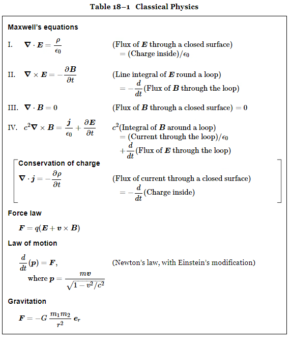

## 矢量场微分

矢量代数基本公式如下
$$
\begin{align}
A\cdot B &=A_xB_x+A_yB_y+A_zB_z\\
A\times B &=\begin{bmatrix}
A_yB_z -A_zB_y & A_zB_x-A_xB_z &A_xB_y-A_yB_x
\end{bmatrix}^T\\
A\times A &=0\\
A\cdot(A\times B) &=0\\
A\cdot(B\times C) &=(A\times B)\cdot C\\
A\times (B\times C) &=B(A\cdot C) - C(A\cdot B)\\
\end{align}
$$
第5个方程可以用平行六面体的体积进行直观解释

第6个方程左边的矢量在BC的平面上，最后可表示成B，C的线性组合

微分学
$$
\begin{array} { c } { \displaystyle \Delta f ( x , \ y , \ z ) = \frac { \partial f } { \partial x } \Delta x + \frac { \partial f } { \partial y } \Delta y + \frac { \partial f } { \partial z } \Delta z } \\ { \displaystyle \frac { \partial ^ { 2 } f } { \partial x \partial y } = \frac { \partial ^ { 2 } f } { \partial y \partial x } } \end{array}
$$
标量场：温度场

矢量场：热流场

热流矢量：单位时间通过垂直流动方向的无限小面积上单位面积的热能，指向热量流动方向
$$
h=\frac{\Delta J}{\Delta a}e_f
$$
与热流方向有一定夹角对应的热流
$$
\begin{array} { r } { \frac { \Delta J } { \Delta a _ { 2 } } = \frac { \Delta J } { \Delta a _ { 1 } } \mathrm { c o s } \, \theta = h \cdot n . } \end{array}
$$
热流方向垂直面$a_1$，则通过两个面的热量相同

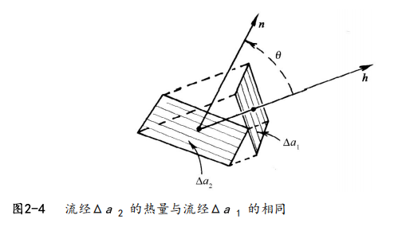

热流的概念也可用水流量来理解

**梯度**

最大斜率上升方向
$$
{ \mathrm { g r a d ~ } } T = \pmb { \nabla } T = \left( { \frac { \partial T } { \partial x } } , \, { \frac { \partial T } { \partial y } } , \, { \frac { \partial T } { \partial z } } \right)
$$
则简化场的变化量表达如下，如温度场的梯度
$$
\Delta T = \nabla T \cdot \Delta R=\nabla T \cdot \begin{bmatrix}
\Delta x   & \Delta y & \Delta z
\end{bmatrix}^T
$$
定义矢量算符$\pmb { \nabla }$
$$
\pmb { \nabla } = \left( { \frac { \partial } { \partial x } } , \, { \frac { \partial } { \partial y } } , \, { \frac { \partial } { \partial z } } \right)
$$
对应有$\pmb { \nabla }_x = \frac { \partial } { \partial x },\pmb { \nabla }_y = \frac { \partial } { \partial y },\pmb { \nabla }_z = \frac { \partial } { \partial z } $

**散度**
$$
\text{div } \pmb{h}=\pmb{\nabla} \cdot \pmb{h} = {\nabla}_xh_x+{\nabla}_yh_y+{\nabla}_zh_z =\frac { \partial h _ { x } } { \partial x } + \frac { \partial h _ { y } } { \partial y } + \frac { \partial h _ { z } } { \partial z }
$$
**旋度**
$$
\text{curl } \pmb{h}=\pmb{\nabla} \times \pmb{h} =\begin{bmatrix}
\nabla_y h _ { { z } } - \nabla_z h _ { { y } }\\
\nabla_z h _ { { x } } - \nabla_x h _ { { z } } \\
\nabla_x h _ { y } - \nabla_y  h _ { x } \\
\end{bmatrix}=\begin{bmatrix}
\frac { \partial h _ { z } } { \partial y } - \frac { \partial h _ { y } } { \partial z }\\
\frac { \partial h _ { x } } { \partial z } - \frac { \partial h _ { z } } { \partial x }  \\
\frac { \partial h _ { y } } { \partial x } - \frac { \partial h _ { x } } { \partial y }  \\
\end{bmatrix}
$$

### 矢量场二阶微商

$$
\pmb{\nabla}\times(\pmb{\nabla} T)=0
$$

证明$[ \nabla \times ( \nabla T ) ] _ { z } = \nabla  { _ { x } } ( \nabla T ) _ { y } - \nabla {  _ { y } } ( \nabla T ) _ { x } = \frac { \partial } { \partial x } \Big ( \frac { \partial T } { \partial y } \Big ) -\frac { \partial } { \partial y } \Big ( \frac { \partial T } { \partial x } \Big )=0$，其它分量也可同样证明

**定理：**如果$\pmb{\nabla}\times A=0$, 则有$A=\pmb{\nabla}\psi$
$$
\pmb{\nabla}\cdot(\pmb{\nabla} \times \pmb h)=0
$$
使用分量容易证明，也可以类似前面矢量代数运算进行理解

**定理：**如果$\pmb{\nabla}\cdot D=0$, 则有$D=\pmb{\nabla} \times C$

$$
\pmb{\nabla}\cdot(\pmb{\nabla} T)=\pmb{\nabla}^2T=标量场
$$
其中$\pmb{\nabla}^2=\frac { \partial ^ { 2 } } { \partial x ^ { 2 } } + \frac { \partial ^ { 2 } } { \partial y ^ { 2 } } + \frac { \partial ^ { 2 } } { \partial z ^ { 2 } }$为拉普拉斯算符，对矢量的运算为$\pmb{\nabla}^2\pmb h=(\pmb{\nabla}^2\pmb h_x,\pmb{\nabla}^2\pmb h_y,\pmb{\nabla}^2\pmb h_z)$

$$
\pmb{\nabla}\times (\pmb{\nabla} \times \pmb h)= \pmb{\nabla}(\pmb{\nabla} \cdot \pmb h)-{\nabla}^2 \pmb h
$$
可使用分量证明

## 矢量场积分

### 线积分

从1到2的任何曲线进行积分。实际上从微分的角度，无限小的微分就是在曲面上取了切平面，所以对应点各方向的微分是线性组合
$$
\psi ( 2 ) - \psi ( 1 ) = \int _ { ( 1 ) } ^ { ( 2 ) } \Psi \cdot \mathrm { d } s
$$
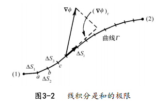

**环流**
$$
\oint_{\Gamma }^{} C_t \text{d}s=\oint_{\Gamma }^{} \pmb C\cdot \text{d}\pmb s
$$
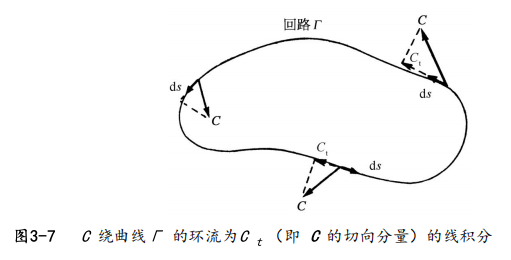

回路一分为2，易证明绕一个回路的环流等于两个分回路的环流和。可进一步分割成无限小的回路

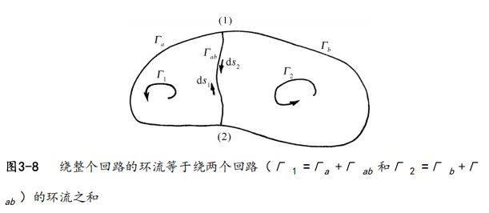

### 斯托克斯定理

闭合曲线的环流等于以该闭合曲线为边界的任意曲面的下旋度的通量
$$
\oint_{\Gamma }^{} \pmb C\cdot \text{d}\pmb s=\int_\text{S}(\pmb \nabla \times \pmb C)_n \Delta a
$$
证明如下
$$
\oint_{\Gamma }^{} \pmb C\cdot \text{d}\pmb s=C_x(1)\Delta x+C_y(2)\Delta y-C_x(3)\Delta x-C_y(4)\Delta y=(\frac{\partial C_y}{\partial x}-\frac{\partial C_x}{\partial y})\Delta x\Delta y=(\pmb \nabla \times \pmb C)_z \Delta a=(\pmb \nabla \times \pmb C)\cdot \pmb n\Delta a
$$
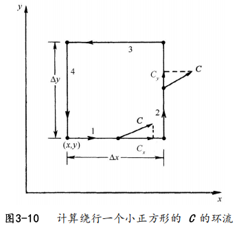

### 通量

热量守恒如下，面积分为$\pmb h$通过该表面的通量。原来含义是流量。$\pmb h$是热量流动的“流密度”
$$
通过S向外流出的总热量=\int _ { S } \boldsymbol { h } \cdot \boldsymbol { n } \mathrm { d } a = - \frac { \mathrm { d } Q } { \mathrm { d } t }
$$
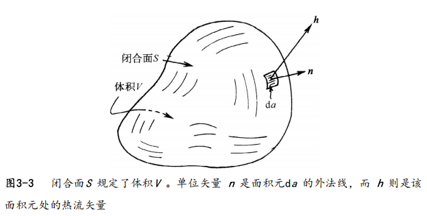

扩展到矢量定义通量
$$
E通过曲面S向的通量=\int _ { S } \boldsymbol { E} \cdot \boldsymbol { n } \mathrm { d } a
$$
通过外表面S的通量，可以表示成该体积分成两部分后所得通量支合。原来积分表示的，通过外表面的通量，等于内部所有各小块的通量和

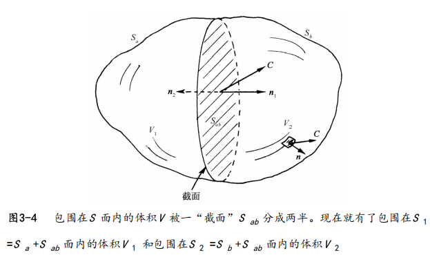

### 高斯定理

通过任意闭合曲面的通量等于曲面体积内的散度积分
$$
\int _\text{S} \pmb C \cdot \boldsymbol { n } \mathrm { d } a  =\int _\text{V}(\pmb{\nabla}\cdot \pmb C)\text{d}V
$$
证明如下：

面1通量$-C_x(1)\Delta y\Delta z$, 面2通量$C_x(2)\Delta y\Delta z=(C_x(1)+\frac{\partial C_x}{\partial x}\Delta x)\Delta y\Delta z$，所以面12通量为
$$
\frac{\partial C_x}{\partial x}\Delta x\Delta y\Delta z
$$
得到6各面的总通量，即一个矢量在P点的散度就是P点附近单位体积的通量——$\pmb C$向外的“流量”
$$
\int _\text{V} C \cdot \boldsymbol { n } \mathrm { d } a = \left( \frac { \partial C _ { x } } { \partial x } + \frac { \partial C _ { y } } { \partial y } + \frac { \partial C _ { z } } { \partial z } \right) \Delta x \Delta y \Delta z =(\pmb{\nabla}\cdot \pmb C)\Delta V
$$
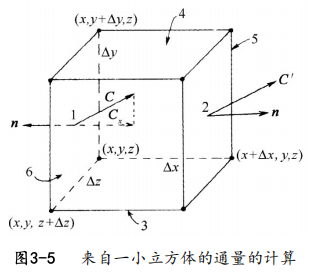

再结合上面对体积划分后的结果即可证明

### 无旋度场和无散度场

**无旋度场**

势函数只与位置相关，如引力场
$$
\oint_{\Gamma }^{} \pmb \nabla \psi \cdot \text{d}\pmb s=\int_\text{S}(\pmb \nabla \times (\pmb \nabla \psi))\cdot \pmb n \Delta a=0
$$
对应证明了$\pmb \nabla \times (\pmb \nabla \psi)=0$

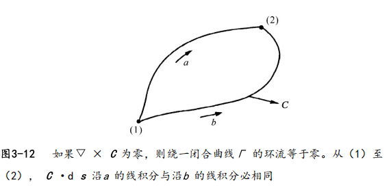

**无散度场**

用一个很大的曲面填满一个小回路，把小回路逐渐缩小至一个点，使得曲面边缘消失不见变成一个闭合曲面。线积分趋于0，则对应通量趋于0
$$
\oint_{\Gamma }^{}  \pmb C \cdot \text{d}\pmb s=\int_{\text{S}}(\pmb \nabla \times \pmb C)\cdot \pmb n \text{d}a=\int_{\text{V}}\pmb \nabla\cdot(\pmb \nabla \times \pmb C)\cdot \pmb n \text{d}a=0
$$
证明了$\pmb \nabla\cdot(\pmb \nabla \times \pmb C)=0$

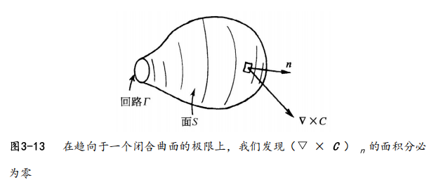

## 理想电路元件

### 电感

$$
V=L\frac{\text{d}I}{\text{d}t}
$$

前提假设

1. 端点a 和b 附近的外部区域里仅有微不足道的磁场。线圈中电流所产生的磁场并未强烈地向外扩展到全部空间，从而不会与电路的其他部分发生相互作用。可选方式：把线圈绕成一个环形的式样，或把线圈绕在某一块适当的铁芯上，从而约束磁场，或通过把线圈放在某一个适当的金属盒之内

2. 忽略线圈导线里的任何电阻

3. 出现在导线表面上用以建立电场的电荷量是可忽略

在一理想导体内部不可能有电场（最微小的场都可能产生无限大的电流，不需要电压也可维持电流，可理解成不需要力也可位置速度）
$$
\oint E \cdot d \pmb { s } =\sideset{}{}{\int _ { a } ^ { b }}_\text{via coil}   E \cdot d \pmb { s } \ + \sideset{}{}{\int _ { b } ^ { a }}_\text{outside} E \cdot d \pmb { s } =\sideset{}{}{\int _ { b } ^ { a }}_\text{outside} E \cdot d \pmb { s }
$$
则有ba之间的电压
$$
V=-\sideset{}{}{\int _ { b } ^ { a }}_\text{outside} E \cdot d \pmb { s }=-\oint E \cdot d \pmb { s }=NS\frac{\partial B}{\partial t}=\frac{nNS}{\epsilon_0 c^2}\frac{\text{d}I}{\text{d}t}=L\frac{\text{d}I}{\text{d}t}
$$
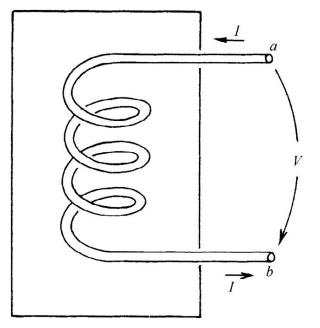

长螺线管内的磁场分析，根据对称性认为螺线管内磁场朝向轴线，外部基本没有磁场，则有
$$
B_0=\frac{nI}{\epsilon_0 c^2}
$$
其中$n=\frac{N}{L}$，即单位长度的螺线管匝数

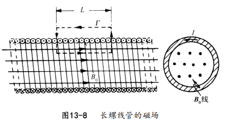

### 电容

两板间有等量的异号电荷，根据高斯定理得到
$$
EA=\frac{Q}{\varepsilon_0 }
$$
所以两板间电压为
$$
V=Ed=\frac{d}{A\varepsilon_0}Q=\frac{Q}{C}
$$
其中$d,A$分别为两板间距，板面积，$C=\frac{A\varepsilon_0 }{d}$为电容.

可类似电感的推导，得到ab点之间的电压，也可以认为理想导线没有压降，所以ab电压就是电容两端电压

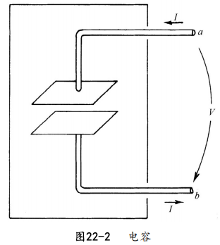

### 电阻

$$
I=\frac{U}{R}
$$

对于实际导电材料，电流与电压间的关系只近似为线性。我们也将看到，这一近似的正比性只有当频率不太高时才被预期与电流和电压的变化频率无关

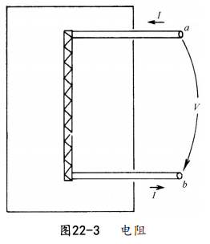

### 发电机

类似前面推理，可得到正弦函数的电压，频率与转动频率相同
$$
V=\frac{\text{d}磁通量}{\text{d}t}=\frac{nBS\sin(wt)}{\text{d}t}=nwBS\cos(wt)
$$

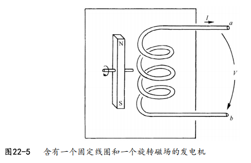

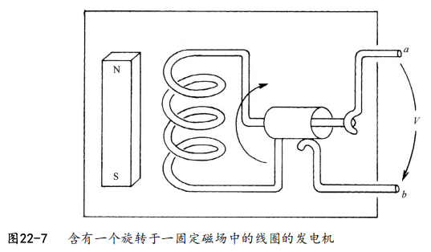

## **半导体**

### 二极管[^2]

沿着箭头方向为导通方向（下图向右）

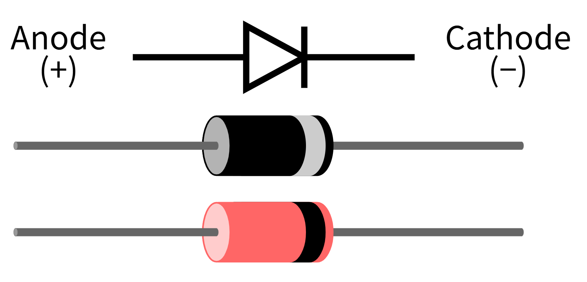

硅外层4电子，磷外层5电子，硅中参杂磷后形成N型半导体，8电子为稳定结构，多余电子成为自由电子，即载流子

硼外层3电子，硅中参杂硼后形成P型半导体，形成空穴

N，P结合后电子扩散形成内建电场，阻碍电子进一步移动，中间部分即为耗尽层，基本没有载流子

- 正向电压，即P接正极，与内建电场相互抵消，耗尽层减小，电子穿过耗尽层，形成电流
- 反向电压，即P接负极，与内建电场方向相同，耗尽层曾扩大，无载流子无法形成电流

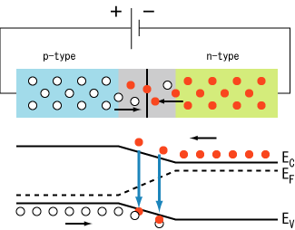

### 三极管[^3]

箭头方向为电流方向

结构为两个P-N节，以NPN为例：

正向电压施加在发射结上，载流子扩散运动和耗尽层中内在电场之间的动态平衡将被打破，这样会使热激发电子注入基极区域。

发射极被注入到基极区域的电子，一方面与这里的多数载流子空穴发生[复合

[基极区域掺杂程度低、物理尺寸薄，并且集电结处于反向偏置状态，大部分电子将通过漂移运动抵达集电极区域，形成集电极电流](https://zh.wikipedia.org/wiki/复合)

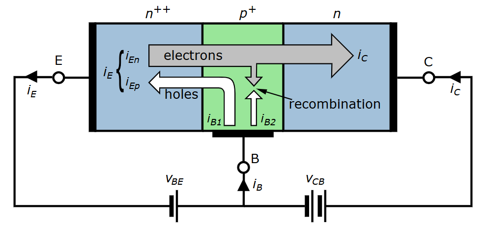

# 引用

[^1]: 费曼物理学讲义
[^2]:[二极管 - 维基百科 --- Diode - Wikipedia](https://en.wikipedia.org/wiki/Diode)
[^3]: [Bipolar junction transistor - Wikipedia](https://en.wikipedia.org/wiki/Bipolar_junction_transistor)
