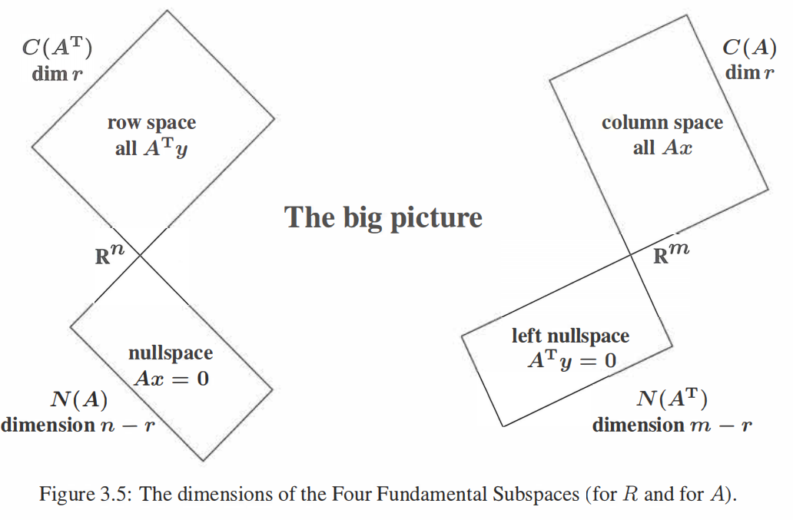
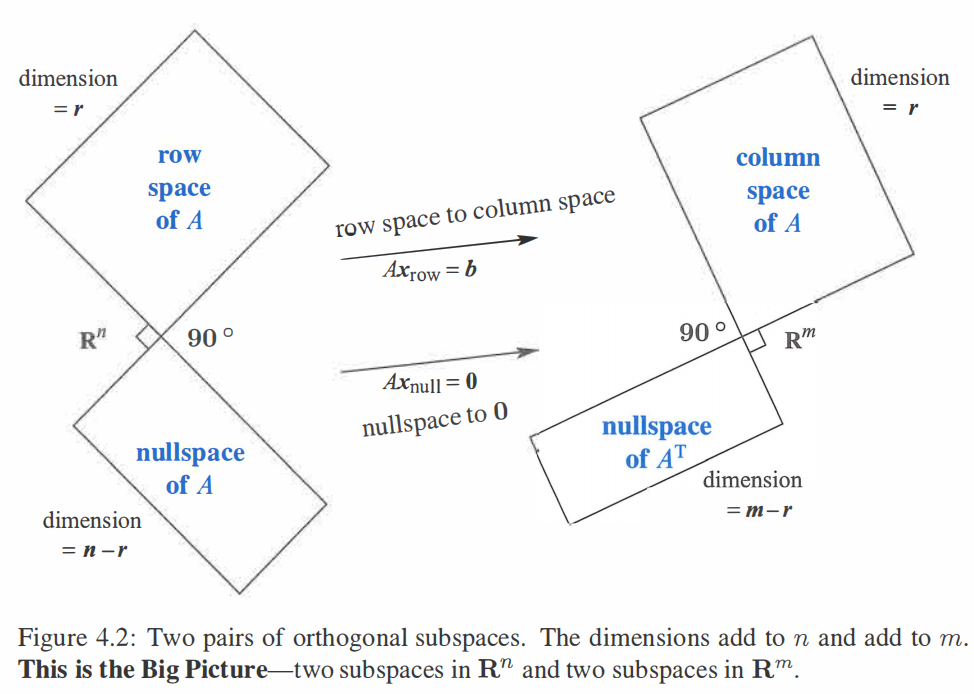
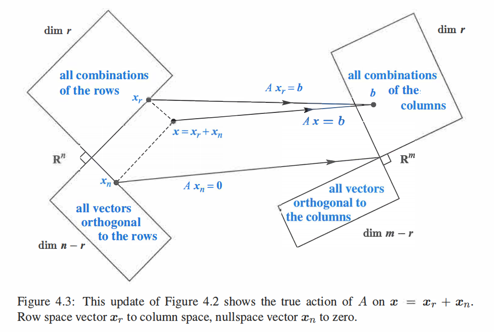
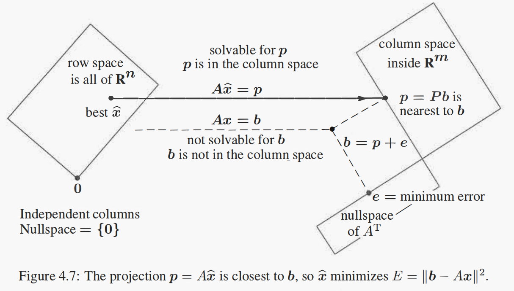

<!-- @import "[TOC]" {cmd="toc" depthFrom=2 depthTo=3 orderedList=false} -->

<!-- code_chunk_output -->

- [Vector Spaces](#vector-spaces)
  - [向量空间基本定义](#向量空间基本定义)
  - [线性独立](#线性独立)
  - [矩阵乘法](#矩阵乘法)
- [4个基本子空间](#4个基本子空间)
  - [行阶梯形矩阵4个子空间](#行阶梯形矩阵4个子空间)
  - [矩阵4个基本子空间](#矩阵4个基本子空间)
  - [列空间和零空间互换表达](#列空间和零空间互换表达)
- [投影矩阵](#投影矩阵)
- [正交基和施密特正交化](#正交基和施密特正交化)
  - [正交基的优良特性](#正交基的优良特性)
  - [施密特正交化](#施密特正交化)
  - [QR分解](#qr分解)
- [行列式](#行列式)
  - [Cramer's Rule](#cramers-rule)
  - [行列式常见含义](#行列式常见含义)
- [特征值 & 特征向量](#特征值--特征向量)
- [矩阵对角化](#矩阵对角化)
  - [矩阵幂计算](#矩阵幂计算)
  - [相似矩阵](#相似矩阵)
- [微分方程](#微分方程)
  - [对称矩阵](#对称矩阵)
- [未同步补充项](#未同步补充项)
  - [小知识点](#小知识点)

<!-- /code_chunk_output -->

重点参考教程[^1]
#  Vector Spaces and Linear Transformations
## Vector Spaces
### 向量空间基本定义
向量空间$\mathcal{V}$(矢量空间)中,向量的加法和乘法满足8个公理, 提供了支持演算需要的重组, 分解与化简得规则:
1. 加法交换律: $x+y=y+x$
2. 加法结合率: $x+(y+z)=(x+y)+z$
3. 矢量单位: 存在位移的$0\in \mathcal{V}$, 使得$x+0=x$
4. 逆元: 存在唯一的$-x\in \mathcal{V}$, 使得$x+(-x)=0$
5. 向量分配率: $(\alpha + \beta)x=\alpha x + \beta x$, $\alpha, \beta \in F$
6. 纯量分配率: $\alpha (x + y)=\alpha x + \alpha y$
7. 结合率:$\alpha(\beta x)=\alpha \beta x$
8. 纯量单位元: 存在唯一$1\in F$使得$1x=x$

其中, 纯量$\alpha, \beta \in F$属于1个体(field), 比如实数系或复数系$\mathbb{R}, \mathbb{C}$

向量空间=向量集合+向量加法与纯量乘法+8个公理, 对应子空间=子集合+向量加法与纯量乘法+8个公理
向量空间需要满足封闭性: ${\forall} x,y \in \mathcal{V}$, 则有$cx+dy \in \mathcal{V}$

**同构向量空间**:实际使用中很多场景可以等效成向量空间, 比如多项式操作:加法和纯量乘法, 可以把多项式表示乘以对应变量的幂为基, 对应项为坐标, $f=a_0+a_1x+a_2x^2+\cdots a_nx^n$, 表示成$(a_0,a_1,\cdots,a_n)$
向量空间是线性代数处理的主要对象, 使向量空间有趣的就是线性变换:
$T(x+y)=T(x)+T(y)$, $T(cx)=cT(x)$
如果$S,T$为线性变换, 可以定义加法和纯量乘法$P=S+T,Q=cT$, 分别表示为$P(x)=S(x)+T(x), Q(x)=cT(x)$, 从这里看**线性变换也是矢量空间**, 微积分就满足线性变换

**同构**: 如果$\mathcal{U}, \mathcal{V}$布于相同数系得矢量空间, 且$x\in \mathcal{U}, y\in \mathcal{V}$存在一一对应关系, 表示为线性变换$y=T(x)$, 则称$\mathcal{U}, \mathcal{V}$同构(isomorphic), $\mathcal{U} \cong  \mathcal{V}$, 即$T$是保留结构得同构映射, 只需要证明任意$n$维度矢量空间$\mathcal{V}$和某个特定$n$维向量空间同构,特定矢量空间选为即$\mathbb{R}^n, \mathbb{C}^n$, 那么任意$n$维矢量空间性质可由特定矢量空间性质得到

比如坐标变换, $\beta=\{x_1,\cdots,x_n\}$为向量空间$\mathcal{V}$一组基, 则对$x\in \mathcal{V}$, 有$x=c_1x_1+\cdots+c_nx_n$, 对应线性变换$L(x) \rightleftharpoons x_{\beta}=(c_1,\cdots,c_n)$, 和上面多项式同理也可得到$n$维坐标值, 所以两个空间从线性变换来看使同构

#### 线性变换用矩阵表示
向量空间中最重要的就是基底, 存在线性变换$T:\mathcal{V}\to \mathcal{W}$, 能够将线性变换用矩阵$A$表示
向量空间$\mathcal{W}$,基底$\alpha=(w_1,w_2,\cdots,w_n)$, $\mathcal{V}$基底$\beta=(v_1,v_2,\cdots,v_n)$, 对于向量$x=\alpha a$, 其中$a=(a_1,a_2,\cdots,a_n)^T$, 向量$y=\beta b$, 其中$b=(b_1,b_2,\cdots,b_n)^T$
则有
$$
T\alpha=\beta \begin{bmatrix}
c_{11}  & \cdots & c_{1n}\\
\vdots  & \vdots & \vdots\\
c_{n1}  & \cdots & c_{nn}
\end{bmatrix}=\beta A
$$
对应
$$
T(x)=T(\alpha a)
=\begin{pmatrix}
T(w_1)a_1  & \cdots &T(w_n)a_n
\end{pmatrix}=\beta Aa
$$
所以从坐标$a$,变换成坐标$Aa$, 本质上使用的是同构,复空间$\mathbb{C}^n$相同

### 线性独立
向量空间的任意向量可由一组最少向量的线性组合表示, 即基底, 即基底之间是不能相互表示,即线性无关, 对应$(v_1,v_2,\cdots,v_n)$线性独立, 等价于仅存在$c_1=c_2=\cdots =c_n=0$, 使得$c_1v_1+c_2v_2+\cdots+c_nv_n=0$

可证明向量空间中任意向量可由基底唯一表示,唯一性非常重要,　证明如下
$x=a_1v_1+a_2v_2+\cdots+a_nv_n$, 同时有$x=b_1v_1+b_2v_2+\cdots+b_nv_n$, 则$0=(a_1-b_1)v_1+(a_2-b_2)v_2+\cdots+(a_n-b_n)v_n$, 又由于线性无关, 所以$\mathbf{a} =\mathbf{b}$

已知矩阵$A$求解向量空间基, 可以化简为行阶最简梯形矩阵, 可以以此得到线性无关项, 以及对应列之间的线性关系. $PA=C$, 其中$P,C$分别为基本矩阵的乘积, 行阶最简梯形矩阵. $C$的线性关系可以表示为$Ck=0$, $k=(k_1,k_2,\cdots,k_n)^T$, 可以证明$Ak=P^{-1}Ck=0$, 说明$C,A$的列对应的线性关系相同, 所以$C$中线性无关的列就是$A$中线性无关的列,可以作为基底. 初等矩阵左乘矩阵$A$就是对行进行操作,不会改变行空间, 并保留列空间的线性关系. 同样的右乘就是对列进行操作, 不改变列空间, 并保留行空间线性关系

#### 矩阵左右乘含义
- 矩阵左乘保留列向量关系
$PA=B$, 其中$A=(a_1,a_2,\cdots,a_n), B=(b_1,b_2,\cdots,b_n)$, 对于任意向量$a_j=Ac\in \mathcal{A}$, 则对应变换后向量$b_j=Pa_j=PAc=Bc$, 即$\mathcal{A}$空间线性关系可推导$\mathcal{B}$线性关系.当$P$可逆则可以通过$\mathcal{B}$推导$\mathcal{A}$线性关系, 但是如果不可逆,那$\mathcal{B}$保留$\mathcal{A}$的线性关系,但是没办法通过$\mathcal{B}$推导$\mathcal{A}$线性关系;
可逆矩阵左乘不改变行空间: $\forall b \in C(B)^T$, 即$b=x^TB=x^TPA=y^TA$, 即$A \subset B$, 同理如果$P$可逆, 则可以证明$B \subset A$, 所以行空间不变$C(A^T)=C(B^T)$
- 矩阵右乘保留行向量关系
有$A^TP^T=B^T$, 上面分析已经得到左乘关系, 即$A^T, B^T$行向量保持关系,如果$P$可逆

### 矩阵乘法
矩阵乘法最初就是简化复合线性变换表示得到的[^7], 比如两个线性映射
$$
\begin{array}{l}
f\left(\begin{array}{l}
x \\
y
\end{array}\right)=\left(\begin{array}{l}
a x+b y \\
c x+d y
\end{array}\right) \\
g\left(\begin{array}{l}
x \\
y
\end{array}\right)=\left(\begin{array}{l}
p x+q y \\
r x+s y
\end{array}\right) .
\end{array}
$$
得到复合映射:
$$
\begin{aligned}
h\left(\begin{array}{l}
x \\
y
\end{array}\right) & =f\left(g\left(\begin{array}{l}
x \\
y
\end{array}\right)\right)=f\left(\begin{array}{l}
p x+q y \\
r x+s y
\end{array}\right) \\
& =\left(\begin{array}{l}
a(p x+q y)+b(r x+s y) \\
c(p x+q y)+d(r x+s y)
\end{array}\right) \\
& =\left(\begin{array}{l}
(a p+b r) x+(a q+b s) y \\
(c p+d r) x+(c q+d s) y
\end{array}\right) .
\end{aligned}
$$
如果用阵列表示线性映射系数, 得到最后的矩阵乘法表示
$$
\left[\begin{array}{ll}
a & b \\
c & d
\end{array}\right]\left[\begin{array}{ll}
p & q \\
r & s
\end{array}\right]=\left[\begin{array}{ll}
a p+b r & a q+b s \\
c p+d r & c q+d s
\end{array}\right]
$$

#### 矩阵乘法的现代定义
最好的理解方式是通过线性组合的定义推导其它表示方式
1. 以列作为计算单元, 线性组合
$$
A \mathbf{x}=\left[\begin{array}{lll}
\mathbf{a}_{1} & \cdots & \mathbf{a}_{n}
\end{array}\right]\left[\begin{array}{c}
x_{1} \\
\vdots \\
x_{n}
\end{array}\right]=\mathbf{a}_{1} x_{1}+\cdots+\mathbf{a}_{n} x_{n}
$$
2. 以列作为单元定义$AB$
参考上面线性组合定义
$$
\begin{aligned}
A(B \mathbf{x}) & =A\left(x_{1} \mathbf{b}_{1}+\cdots+x_{p} \mathbf{b}_{p}\right)=x_{1}\left(A \mathbf{b}_{1}\right)+\cdots+x_{p}\left(A \mathbf{b}_{p}\right) \\
& =\left[\begin{array}{lll}
A \mathbf{b}_{1} & \cdots & A \mathbf{b}_{p}
\end{array}\right]\left[\begin{array}{c}
x_{1} \\
\vdots \\
x_{p}
\end{array}\right]=\left[\begin{array}{lll}
A \mathbf{b}_{1} & \cdots & A \mathbf{b}_{p}
\end{array}\right] \mathbf{x} .
\end{aligned}
$$
这种方式可用于证明分配律
$$
\begin{aligned}
A(B+C) & =A\left[\begin{array}{lll}
\mathbf{b}_{1}+\mathbf{c}_{1} & \cdots & \mathbf{b}_{p}+\mathbf{c}_{p}
\end{array}\right] \\
& =\left[\begin{array}{lll}
A\left(\mathbf{b}_{1}+\mathbf{c}_{1}\right) & \cdots & A\left(\mathbf{b}_{p}+\mathbf{c}_{p}\right)
\end{array}\right] \\
& =\left[\begin{array}{llll}
A \mathbf{b}_{1}+A \mathbf{c}_{1} & \cdots & A \mathbf{b}_{p}+A \mathbf{c}_{p}
\end{array}\right] \\
& =\left[\begin{array}{llll}
A \mathbf{b}_{1} & \cdots & A \mathbf{b}_{p}
\end{array}\right]+\left[\begin{array}{lll}
A \mathbf{c}_{1} & \cdots & A \mathbf{c}_{p}
\end{array}\right] \\
& =A B+A C .
\end{aligned}
$$

3. 以元作为计算单元
参考线性组合表示方式可以得到
$$
A \mathbf{x}=\left[\begin{array}{lll}
\mathbf{a}_{1} & \cdots & \mathbf{a}_{n}
\end{array}\right]\left[\begin{array}{c}
x_{1} \\
\vdots \\
x_{n}
\end{array}\right]=
\begin{bmatrix}
row_1(A)x \\
\vdots \\
row_1(A)x
\end{bmatrix}
$$
进一步推导可得
$$
(A B)_{i j}=\left[\begin{array}{lll}
a_{i 1} & \cdots & a_{i n}
\end{array}\right]\left[\begin{array}{c}
b_{1 j} \\
\vdots \\
b_{n j}
\end{array}\right]=a_{i 1} b_{1 j}+\cdots+a_{i n} b_{n j}
$$

4. 以行作为计算单元定义$AB$
类似上面, 只需要转置一下原本
$$(AB)^T=B^TA^T=\begin{aligned}
\left[\begin{array}{c}
b_{1}^TA^T \\
\vdots \\
b_{p}^TA^T
\end{array}\right]
\end{aligned}
$$
5. 以行列展开计算$AB$
$$
AB=\begin{bmatrix}
a_1  & \cdots  &a_n
\end{bmatrix}\begin{bmatrix}
row_1(B) \\
\vdots \\
row_n(B)
\end{bmatrix}=
a_1row_1(B)+\cdots+a_nrow_n(B)
$$
证明方式: 参考$(AB)_{ij}$计算方式发现和第3个表示方式完全相同
6. 以分块作为计算单元
首先分别推导小分块矩阵计算
- 行x列计算
$$
AB=A(B_1,B_2)=(AB_1,AB_2)=\begin{bmatrix}
\begin{bmatrix}
A_1 \\
A_2
\end{bmatrix}(B_1)  &
\begin{bmatrix}
A_1 \\
A_2
\end{bmatrix}(B_2)
\end{bmatrix}=
\begin{bmatrix}
A_1B_1  & A_1B_2\\
A_2B_1  &A_2B_2
\end{bmatrix}=
\begin{bmatrix}
A_1\\
A_2
\end{bmatrix}\begin{bmatrix}
B_1 & B_2
\end{bmatrix}
$$
- 列x行计算
$$
Ax=\begin{bmatrix}
A_1  &A_2
\end{bmatrix}\begin{bmatrix}
x_1  \\x_2
\end{bmatrix}=A_1x_1+A_2x_2
$$
$$
AB
= (Ab_1,Ab_2,\cdots,Ab_n) \\
=\begin{bmatrix}
\begin{bmatrix}
A_1  &A_2
\end{bmatrix}\begin{bmatrix}
c_1  \\d_1
\end{bmatrix} &
\cdots &
\begin{bmatrix}
A_1  &A_2
\end{bmatrix}\begin{bmatrix}
c_n  \\d_n
\end{bmatrix}
\end{bmatrix}\\=
\begin{bmatrix}
A_1c_1+A_2d_1  & \cdots &A_1c_n+A_2d_n
\end{bmatrix}\\
=A_1\begin{bmatrix}
c_1  & \cdots &c_n
\end{bmatrix}+A_2\begin{bmatrix}
d_1  & \cdots &d_n
\end{bmatrix}\\
=A_1B_1+A_2B_2=\begin{bmatrix}
A_1  &A_2
\end{bmatrix}\begin{bmatrix}
B_1  \\B_2
\end{bmatrix}
$$
最后用$A_1=\begin{bmatrix}A_3  &A_4\end{bmatrix}$, $A_2=\begin{bmatrix}A_5  &A_6 \end{bmatrix}$, $B_1=\begin{bmatrix} B_3  &B_4 \end{bmatrix}$,$B_2=\begin{bmatrix} B_4  &B_6 \end{bmatrix}$, 代入行x列计算, 并结合列x行计算最后得到分块矩阵计算方式
$$
AB=\begin{bmatrix}
A_3  & A_4\\
A_5  &A_6
\end{bmatrix}\begin{bmatrix}
B_3  & B_4\\
B_5  &B_6
\end{bmatrix}=
\begin{bmatrix}
A_3B_3+A_4B_5  & A_3B_4+A_4B_6\\
A_5B_3+A_6B_5  &A_5B_4+A_6B_6
\end{bmatrix}
$$

反过头来所有上述表示最后都可以作为分块矩阵的特例
## 4个基本子空间
对于矩阵$A$来说最终要的4个空间对应列空间$C(A)$, $C(A^T)$, 零空间$N(A)$, $N(A^T)$

一般矩阵可以经过初等行变换转换为行阶梯形矩阵$EA=R$, 首先对行阶梯形矩阵进行分析
### 行阶梯形矩阵4个子空间
针对常见行阶矩阵$m=3,n=5$
$\boldsymbol{R}=\left[\begin{array}{lllll}
\mathbf{1} & \mathbf{3} & \mathbf{5} & 0 & \mathbf{7} \\
0 & 0 & 0 & \mathbf{1} & \mathbf{2} \\
0 & 0 & 0 & 0 & 0
\end{array}\right]$
从行阶梯形矩阵可以得到
1. $Dim(C(R^T))=Dim(C(R))=2$, 行空间和列空间的秩相等$r=2$, 矩阵的行秩=矩阵的列秩=矩阵pivots个数. 可以把矩阵化简成行阶最简梯形比较, 首先$E_1AE_2$交换矩阵的行和列确保能化简成$\begin{bmatrix}
I_r  & F\\
0  & 0
\end{bmatrix}$, 对应化简后矩阵秩为$r$
2. $Dim(N(R))=n-r$, pivots对应列为1,4,自由变量变量对应2,3,5,即对于$Rx=0$,分别单独设置自由变量为1得到最后的解,对应3维
3. $Dim(N(R^T))=m-r$, $R^Tx=0$,对应$x^TR=0$,从$R$中可以看到前2行有pivots,对应线性无关,所以要生成0,对应前两行的系数为0,而最后一行的系数任意,即解$(0, 0, y_3)$, 零空间对应0行的个数

得到$R^n$中$N(R)$, $C(R^T)$, 以及$R^m$中$C(R)$, $N(R^T)$
对应子空间如下,这里暂且把$A$替换成$R$

### 矩阵4个基本子空间
行阶梯形矩阵通过$A$进行初等行变换得到,即$EA=R$, 基本行变换只是在对行空间向量进行重新线性组合,不会改变行空间,所以$C(A^T)=C(R^T)$, $N(A)=N(R)$; 
基本行变换会影响列空间向量,但是$Ax=0$和$Rx=0$等价,因为$E$为可逆矩阵,即$N(A)=N(R)$,即原本$A$中线性相关项在$R$中也线性相关,所以可以通过$R$来找原本$A$中最小线性组合(**这也是行阶最简梯形可以用于获取原矩阵线性无关项的原因**), 即$Dim(N(A))=Dim(N(R)$, $Dim(C(A))=Dim(C(R)$, 虽然空间不一样($A$最后几行一般不是0,但是$R$的最后几行是0),但是维度相同,所以上面的图也适用于$A$

进一步看$R^n$中零空间$Ax=0$,对应空间中向量都与$A$行向量垂直,即$C(A^T)$中每个向量都与零空间垂直, 结合$Dim(C(A^T))+Dim(N(A))=n$,所以两个空间正交互补

对于$Ax=b$图示如下

4个空间基底基本算法[^9]
### 列空间和零空间互换表达
1. 零空间用列空间表达
$A$列空间$C(A)$和零空间$N(A)$可以互换表达, 即隐式表达换成显式$N(A)=C(P)$, 显式表达换成隐式表达$C(A)=N(Q)$
如
$$
A=\begin{bmatrix}
1  &4  &1  &0  &-2 \\
-1 &-4  &0  &1  &5 \\
2  &8  &2  &1  &-2 \\
1  &4  &2  &2  &3
\end{bmatrix}
$$
化成行阶最简梯形为
$$
R=\begin{bmatrix}
1  &4  &0  &0  &-3 \\
0  &0  &1  &0  &1 \\
0  &0  &0  &1  &2 \\
0  &0  &0  &0  &0
\end{bmatrix}
$$
教科书一般是通过求解方程组的形式获取零空间解,即
$$
\begin{aligned}
x_{1}+4 x_{2}-3 x_{5}=0 & \Rightarrow x_{1}=-4 x_{2}+3 x_{5} \\
x_{3}+x_{5}=0 & \Rightarrow x_{3}=-x_{5} \\
x_{4}+2 x_{5}=0 & \Rightarrow x_{4}=-2 x_{5}
\end{aligned}
$$
最后得到
$$
\left[\begin{array}{l}
x_{1} \\
x_{2} \\
x_{3} \\
x_{4} \\
x_{5}
\end{array}\right]=\alpha\left[\begin{array}{r}
-4 \\
1 \\
0 \\
0 \\
0
\end{array}\right]+\beta\left[\begin{array}{r}
3 \\
0 \\
-1 \\
-2 \\
1
\end{array}\right]=\alpha \mathbf{p}_{1}+\beta \mathbf{p}_{2}
$$
即
$$
P=\left[\begin{array}{r}
-4&3 \\
1&0 \\
0&-1 \\
0&-2 \\
0&1
\end{array}\right]
$$
这里可以使用分块矩阵进行计算, 把行阶最简梯形进行列交换得到$R=\left[\begin{array}{r}
I_r&F \\
0&0 \\
\end{array}\right],
P=\left[\begin{array}{r}
-F \\
I_{n-r} \\
\end{array}\right]$
对于交换了列只是交换了变量, 可以在得到$P$之后把对应列交换回去即可[^8],可以记住交换后的序列, 最后求出$P$之后再换回去

2. 列空间用零空间表达
$C(A)=N(Q)$, 求矩阵$Q$, 对应有方程$QA=0$, 即可满足$QAx=0$. 转置得到$A^TQ^T=0$, 所以只需要求得$A^T$的零空间并转置即可, 也可以借助矩阵的4个子空间进行理解.

## 投影矩阵
把空间中向量$b$投影到空间$C(A)$中, 即找到投影后向量和投影前向量最近的值, 对应投影后残余向量$b-Pb$垂直于空间$C(A)$, 根据垂直得到$A^T(b-Ax)=0$, 其中$x$为投影后在空间中的向量, $A^TAx=A^Tb$, 得到$x=(A^TA)^{-1}A^Tb$, 所以投影矩阵$P=(A^TA)^{-1}A^T$

$A^TA$只要$A$中列向量线性无关即可逆, 可以用SVD分解证明. **对于$A$中存在线性相关项, 则$A^TA$不可逆, 可以使用伪逆,待补充**

误差$e=b-Ax$最小证明:
- 几何法
如果$e$与$Ax$不垂直,其它任意向量可以组成三角形,都大于垂直向量
- 代数法
$Ax=b=p+e$, 其中$b\in R^m$, $p\in C(A) \bot e \in N(A^T)$, 只有$Ax=p$有解, $min||Ax-b||^2=min||Ax-p-e||^2=min(||Ax-p||^2+||e||^2)=||e||^2$
- 微积分
$min||Ax-b||^2$即取导数为0的点$f=(Ax-b)^T(Ax-b)=x^TA^TAx-2b^TAx+b^Tb$, 即$df=2(A^TAx-A^Tb)dx$, 所以$A^TAx=A^Tb$对应最小误差的地方
图形表示如下

## 正交基和施密特正交化
### 正交基的优良特性
$Q$所有列单位正交, 对应$Q^TQ=I$
- $Q$不为方阵, 则$Q^T$是$Q$的左逆
- $Q$为方阵, $Q^TQ=I$ -> $Q^T=IQ^{-1}=Q^{-1}I$ -> $QQ^T=I$, $Q^T$为双边逆, 转置即逆

使用正交基投影, 即$Q$代$A$, 则有$Q^TQx=Q^Tb=x$, 投影矩阵为$QQ^T$, 这里没有$A^TA$带来的耦合(或者说协方差矩阵之类的), $x=Q^Tb$也就是$b$分别投影到每个正交基(点乘), 已经**解耦成1维投影**

当$Q$是方阵时, 投影向量$p=QQ^Tb=b$, 即全空间投影还是本身. 这里的$QQ^T=I$非常重要, 很多变换(傅里叶变换)就是基于类似原理进行分解, 把向量或者和函数分解到垂直的空间. $p=q_1(q_1^Tb)+q_2(q_2^Tb)+ \cdots +q_n(q_n^Tb)$

### 施密特正交化
正交基可以解耦投影, 针对空间空任意基可以通过施密特正交化获得正交基. 核心是"Subtract from every new vector its projections in the directions already set"

比如给定一组独立向量$a,b,c$, 正交化得$A,B,C$,最后单位化即为单位正交基
1. $A=a$, 初始向量不变
2. $B=b-A\frac{A^Tb}{A^TA}$, 即把$b$中正交投影到$a$的去除了,剩下的就是垂直于$a$, 可以通过$A^TB=A^Tb-A^Tb=0$证明
3. $C=c-A\frac{A^Tc}{A^TA}-B\frac{B^Tc}{B^TB}$, 分别把正交投影到其它向量的给剔除了

改进的施密特正交化数值计算更加稳定, 相对于直接一次把投影到所有正交基分量减去, 可以逐个减
1. $q_1=\frac{a} {||a||}$
2. $B=b-(q_1^Tb)q_1$, $q_2 = \frac{B} {||B||}$
3. $C^*=c-(q_1^Tc)q_1$, $C=C^*-(q_2^TC^*)q_2$, $q_3=\frac{C}{||C||}$

### QR分解
施密特正交化把空间中线性无关的基变换成单位正交基, 这两组基表示同一个空间, 之间的关系就是$A=QR$, $q_i$只与$a_1\cdots a_i$相关, 对应$R$为三角矩阵
$$
\left[\begin{array}{lll}
\boldsymbol{a} & \boldsymbol{b} & \boldsymbol{c}
\end{array}\right]=\left[\begin{array}{lll}
\boldsymbol{q}_{1} & \boldsymbol{q}_{2} & \boldsymbol{q}_{3} \\
& &
\end{array}\right]\left[\begin{array}{lll}
\boldsymbol{q}_{1}^{\mathrm{T}} \boldsymbol{a} & \boldsymbol{q}_{1}^{\mathrm{T}} \boldsymbol{b} & \boldsymbol{q}_{1}^{\mathrm{T}} \boldsymbol{c} \\
& \boldsymbol{q}_{2}^{\mathrm{T}} \boldsymbol{b} & \boldsymbol{q}_{2}^{\mathrm{T}} \boldsymbol{c} \\
& & \boldsymbol{q}_{3}^{\mathrm{T}} \boldsymbol{c}
\end{array}\right]
$$

很多分解都是为了方便解方程, 对于最小二乘法$A^TAx=A^Tb$, 使用QR分即可得$A^TAx=R^TRx=R^TQb$, 即$Rx=Q^Tb$(R满秩可逆), 由于$R$为上三角矩阵, 直接反过来代入即可求解

使用施密特正交化可以得到$Q$, 则$Q^TA=Q^TQR=R$可用于直接求解$R$
可以用于理解行列式意义[^4], 可以用QR分解帮助理解$|A|=|QR|=|Q||R|$, 所以由$A$列向量组成的空间体积可以由以$Q$为基, $diag(R)$为长度组成的体积, 所以行列式的绝对值就是多面体的体积. 另外不依赖于$|AB|=|A||B|$也可以推导, 第$k$个向量在前$k-1$个向量组成的空间中给出垂直分量,即为$R$对角线上值$r_{kk}$, 所以体积在前面的集成上乘$r_{kk}$, 所以多面体体积$V= {\textstyle \prod_{i=1}^{n} r_{ii}} = |R|$

比如求n个列向量组成的多面体体积, 组成的矩阵$A\in R^{m\times n}$, $V=\sqrt{A^TA}$, $|A^TA|\geq 0$, 即$A^TA$为半正定矩阵. 可以补充$A$垂直子空间中$m-n$个单位正交向量得到$B$,则
$$
|B^TB|=\begin{vmatrix}
A^TA  & 0\\
0  & I_{m-n}
\end{vmatrix} = 
|A^TA|=|B|^2
$$
对应体积的平方, 所以多面体体积$V=\sqrt {B^TB}=\sqrt {A^TA}$, 这里主要针对$A$不是方阵, 如果是方阵, $|A^TA|=|R^TQ^TQR|=|R|^2=V^2$

#### 线性变换把面积伸缩了[^5]
线性变换就是把1个空间变换成另外1个空间, 两个空间之间的面积/体积存在一定的关系, 针对线性变换$Ax$, 可以得到原来单位体积 $V=e_1e_2 \cdots e_n$, 其中空间基为$e_1. e_2,\cdots, e_n$, 则新的空间基为$Ae_1, Ae_2, \cdots, Ae_n$, 对应矩阵$\begin{bmatrix} Ae_1&  Ae_2& \cdots & Ae_n \end{bmatrix}=AI=A$的体积, 即$V=|A|$, 即原本体积放大了$|A|$倍, 针对任意封闭多面体可以分成很多个小立方体近似, 平移不会改变多面体的体积, 所以任意多面体经过线性变换后体积缩放了$|A|$倍. 如果$A$不是方阵, 则放大倍数为$\sqrt{|A^TA|}$, 如果矩阵只有单个元素, 放大倍数就是本生, 属于矩阵的特例

## 行列式
矩阵的行列式就是对应行组成的多面体的体积, 可以简单看成2x2/3x3矩阵推广到nxn, 原本可能就是想求面积或者体积之类的

3个最重要性质如下, 后面几个性质可以通过前3个进行推导[^6], 使用面积(多面体体积更好理解) 
1. 单位矩阵行列式=1, $|I|=1$, 简单理解就是单位立方体(包含多维)
2. 两行交换, 行列式异号. 可以简单使用2x2矩阵进行验证.
求向量面积$A=\begin{bmatrix}
a  & b\\
c  & d
\end{bmatrix}$, 面积$S=ad-bs$, 结合性质3得到$|A|=$
3. 行列式是任1行的线性函数(其他行不变)
$$
\begin{array}{l}
\left|\begin{array}{cc}
t a & t b \\
c & d
\end{array}\right|=t\left|\begin{array}{ll}
a & b \\
c & d
\end{array}\right| \\
\left|\begin{array}{cc}
a+a^{\prime} & b+b^{\prime} \\
c & d
\end{array}\right|=\left|\begin{array}{ll}
a & b \\
c & d
\end{array}\right|+\left|\begin{array}{cc}
a^{\prime} & b^{\prime} \\
c & d
\end{array}\right| .
\end{array}
$$
4. 矩阵两行相同, 则$|A|=0$, 可以通过第二条推导, 交换两行异号
5. 某一行减去其它任一行的倍数,行列式不变. 初等行变换, 可以通过第3条线性进行推导
6. 带有0行的矩阵行列式=0. 直接在原矩阵0行上加上其它任一行不改变行列式, 两行相同对应行列式相等
7. 三角矩阵行列式=对角线pivots值相乘. 可以初等行变换化为对角矩阵, 行列式不变
8. $A$奇异对应$|A|=0$, 反之也成立
9. $|AB|=|A||B|$, 可以使用初等行变换把$A,B$化为对角矩阵得到行列式乘积, $|A|=|LPA|=|D|$, $P, L$, 分别是行交换和初等行变换. $|AB|=|LPAB|=|DB|=|A||B|$, 这里的$L$包括下三角和上三角矩阵, $D$为对角矩阵, 对B每行分别进行乘积, 可由性质3推导: 对角矩阵分解成只有1个元素保留,其它元素为1的矩阵乘积, 相当于每次单独对矩阵某行进行乘积. 或者也可以把矩阵直接化简为初等矩阵的乘积, 初等矩阵本生满足$|P_1P_2|=|P_1||P_2|$, 则$|AB|=|P_1P_2\cdots P_nQ_1Q_2\cdots Q_n|=|P_1P_2\cdots P_n||Q_1Q_2\cdots Q_n|=|A||B|$ 
10. $|A^T|=|A|$, **行列式对于行的性质同样适用于列**. 可用$PA=LU$证明, $|A|=|P^{-1}LU|=|P^{-1}||L||U|$, $|A^{T}|=|U^T||L^T||P^{-T}|$, 可以发现各自相等, 其中$L, U$对三角矩阵, $P$为行交换矩阵, $P^{-1}=P=P^T$

行列式求值
可以使用前三个基本规则确定, 求行列式$|A|$, 首先使用线性性质得到
$$|A|=
\begin{vmatrix}
a_{11} &  a_{12} &  \cdots & a_{1n}\\
a_{21} &  a_{22} &  \cdots & a_{2n}\\
\vdots &  \vdots &  \vdots & \vdots\\
a_{n1} &  a_{n2} &  \cdots & a_{nn}\\
\end{vmatrix} =
\begin{vmatrix}
a_{11} &  0 &  \cdots & 0\\
a_{21} &  a_{22} &  \cdots & a_{2n}\\
\vdots &  \vdots &  \vdots & \vdots\\
a_{n1} &  a_{n2} &  \cdots & a_{nn}\\
\end{vmatrix} +
\begin{vmatrix}
0 &  a_{12} &  \cdots & 0\\
a_{21} &  a_{22} &  \cdots & a_{2n}\\
\vdots &  \vdots &  \vdots & \vdots\\
a_{n1} &  a_{n2} &  \cdots & a_{nn}\\
\end{vmatrix} + \cdots +
\begin{vmatrix}
0 &  0 &  \cdots & a_{1n}\\
a_{21} &  a_{22} &  \cdots & a_{2n}\\
\vdots &  \vdots &  \vdots & \vdots\\
a_{n1} &  a_{n2} &  \cdots & a_{nn}\\
\end{vmatrix}
$$
然后针对单个行列式依次进行再拆分, 第2个行列式为0, 同样的第一列所有除$a_{11}$的元素都可以消除为0, 最后化简成每一行/列只能选取1个元素. 对应总共由$n!$个行列式, 每个行列式可以化简成单位阵, 即行列式值$=||P||||A_i||$, 使用了基本性质1-3
$$
\begin{vmatrix}
a_{11} &  0 &  \cdots & 0\\
a_{21} &  a_{22} &  \cdots & a_{2n}\\
\vdots &  \vdots &  \vdots & \vdots\\
a_{n1} &  a_{n2} &  \cdots & a_{nn}\\
\end{vmatrix} =
\begin{vmatrix}
a_{11} &  0 &  \cdots & 0\\
0 &  a_{22} &  \cdots & a_{2n}\\
\vdots &  \vdots &  \vdots & \vdots\\
a_{n1} &  a_{n2} &  \cdots & a_{nn}\\
\end{vmatrix} +
\begin{vmatrix}
a_{11} &  0 &  \cdots & 0\\
a_{21} &  0 &  \cdots & 0\\
\vdots &  \vdots &  \vdots & \vdots\\
a_{n1} &  a_{n2} &  \cdots & a_{nn}\\
\end{vmatrix} =
\begin{vmatrix}
a_{11} &  0 &  \cdots & 0\\
0 &  a_{22} &  \cdots & a_{2n}\\
\vdots &  \vdots &  \vdots & \vdots\\
0 &  a_{n2} &  \cdots & a_{nn}\\
\end{vmatrix} = 
-1^{1+1-2}a_{11}
\begin{vmatrix}
a_{22} &  \cdots & a_{2n}\\
\vdots &  \vdots & \vdots\\
a_{n2} &  \cdots & a_{nn}\\
\end{vmatrix} = 
a_{11}C_{11}
$$
其中符号取决为$(-1)^{j+i-2}=(-1)^{i+j}$, 对应$a_{ij}$, 其实就是利用行列式基本性质2以及行和列具有相同性质把$a_{ij}$交换到$a_{11}$, 对应$i+j-2$次交换
得到两种计算行列式算法
$|A|=\sum |P|a_{1i}a_{2j}\cdots a_{nk}$, 其中$i, j, k$为列的排列
$|A|=a_{i1}C_{i1} + a_{i2}C_{i2} + \cdots a_{in}C_{in}$, 其中$C_{in}$为代数余子式

###　Cramer's Rule
回到求解方程$Ax=b$, 之前是通过消去法得到的解,这次直接使用代数法
$Ax=b$, 可以扩充矩阵成为
$$
A\begin{bmatrix}
x_1  & 0 & 0\\
x_2  & 1 & 0\\
x_3  & 0 & 1
\end{bmatrix} = 
\begin{bmatrix}
b & a_2 & a_3
\end{bmatrix} = B_1
$$

所以$|A|x_1=|B_1|$, 通过这种方式可以求得$x$, 针对$x_2$, 只需要把$x$放在矩阵第二列即可, 对应方程解$x_1=\frac{|B_1|}{|A|}, x_2=\frac{|B_2|}{|A|}, \cdots, x_n=\frac{|B_n|}{|A|}$, 这就是**Cramer's Rule**, 这种方式计算效率比较低, 但是可以用于简单矩阵的符号推导. 求逆矩阵就是求了3次$Ax=b$方程, 对应求$AA^{-1}=I$, $b$分别为$I$矩阵种的列, 得到$A^{-1}_{ij} = \frac{C_{ji}}{|A|}$, 注意这里不是$C_{ij}$, 整合得到
$$
A^{-1}=\frac{C^T}{|A|}
$$

直接证明$A^{-1}=\frac{C^T}{|A|}$, 等价于$AC^T=|A|I$
$$
\left[\begin{array}{lll}
a_{11} & a_{12} & a_{13} \\
a_{21} & a_{22} & a_{23} \\
a_{31} & a_{32} & a_{33}
\end{array}\right]\left[\begin{array}{lll}
C_{11} & C_{21} & C_{31} \\
C_{12} & C_{22} & C_{32} \\
C_{13} & C_{23} & C_{33}
\end{array}\right]=\left[\begin{array}{ccc}
\operatorname{det} A & 0 & 0 \\
0 & \operatorname{det} A & 0 \\
0 & 0 & \operatorname{det} A
\end{array}\right]
$$
其中$a_{21}C_{11}+a_{22}C_{12}+a_{23}C_{13}=0$, 可以看成是把$A$的第二行拷贝到第1行得到$A^*$行列式$|A^*|=0$

这里可以推导得到2维矩阵逆方便使用, 对于非奇异矩阵,$A=\begin{bmatrix} a  & b\\ c  & d\end{bmatrix}$且 $|A|\ne 0$
则有
$$
A^{-1}=\frac{\begin{bmatrix}
d  & -b\\
-c  & a
\end{bmatrix}}{|A|}
$$

### 行列式常见含义
- 三角形面积
三角形顶点$(x_1, y_1), (x_2, y_2), (x_3, y_3)$, 面接为
$$
\frac{1}{2}\begin{vmatrix}
x_1  & y_1 & 1\\
x_2  & y_2 & 1\\
x_3  & y_3 & 1
\end{vmatrix}
$$
从第三列展开对应就是3个三角形的面积和, 小三角形的1个顶点为原点

- 叉乘, 也可以用反堆成矩阵表示成矩阵和向量的乘积
$$
u \times v=
\begin{vmatrix}
i  & j & k\\
u_1  & u_2 & u_3\\
v_1  & v_2 & v_3
\end{vmatrix}
$$

- 体积, 可以借助叉乘理解, 叉乘就是向量构成的平行四边形面积, 最后增加1个点乘, 只需要把$i, j, k$替换成第3个向量即可
$$
(u\times v)w=
\begin{vmatrix}
w \\
u \\
v
\end{vmatrix}
$$

## 特征值 & 特征向量
$Px=\lambda x$具有很有用的性质, $\lambda$为特征值, $x$为特征向量.
- 投影矩阵, $Px=x, Py=0$, 把空间分成列空间和零空间, 对应特征值$\lambda=1$, $\lambda=0$, 列空间投影为本身, 零空间投影成0
- 反射矩阵, reflection matrix, $R=2P-I$, 对应$Rx=x, Ry=-y$, 对应特征值$\lambda=1$, $\lambda=-1$
- 旋转矩阵, 特征值是复数
- 反对称矩阵, 特征值为纯虚数, 待证明
- 对称矩阵, 特征值为实数. 任何矩阵都可以分解成对称矩阵和反对称矩阵和(卡式分解, Cartesian decomposition)$A=(\frac{A}{2} + \frac{A^T}{2}) + (\frac{A}{2} - \frac{A^T}{2})$

$(A-\lambda I)x=0$, 对应$|A-\lambda x|=0$, 可求得特征值

特征值基本性质
1. $\sum \lambda_i=trac(A)$
$|A-\lambda I|=|\lambda I - A|=0$, 对应$\lambda ^n - (a_{11}+a_{22}+\cdots + a_{nn})\lambda ^{n-1} + \cdots=0$, 同时有$(\lambda - \lambda_1)(\lambda - \lambda_2)\cdots(\lambda - \lambda_n)=0$ 对应有$\lambda ^n - (\lambda_1+\lambda_2+\cdots + \lambda_n)\lambda ^{n-1} + \cdots=0$, 对比$\lambda^{n-1}$系数即可得到证
2. $\prod \lambda_i=|A|$
所有特诊向量集合可得$A(x_1, x_2, \cdots, x_n)=(x_1, x_2, \cdots, x_n)\Lambda$, 即$|A||Q|=|Q||\Lambda|$, $|A|=||Lambda|$, 其中$\Lambda$为特诊值组成的对角矩阵
3. 三角矩阵特征值就是对角线元素pivots, 直接用定义求即可证

## 矩阵对角化
所有矩阵特征值不相等,对应特征向量线性无关, 即$X$可逆, 矩阵可对角化, $AX=X\Lambda$, 对应$\Lambda = X^{-1}AX$, $Ax=X\Lambda X^{-1}x$, 物理意义就是$x$投影到特征向量上缩放后得到的向量, 相当于在特征向量的方向进行了处理
反证法, 假如线性相关, 则$c_1x_1+c_2x_2+\cdots+c_nx_n=0$, 其中系数不全为0(为方便推导可直接把0项去除), 左乘矩阵得到$c_1\lambda_1x_1+c_2\lambda_2x_2+\cdots+c_n\lambda_nx_n=0$, 两式结合消除$x_n$, 则说明前n-1项线性相关, 通过不断递推到$x_1$, 证明$c_1=0$, 也可证明$c_i=0$, 和原本假设相悖, 所以线性无关

矩阵可对角化和可逆没有必然联系
- 矩阵不可逆, 对应特征值$\lambda_i=1$
- 矩阵可对角化, 特征向量是否足够作为空间一组基

能否对角化判定依据: GM=AM
- Geometric Multiplicity: 几何重数, $\lambda_i$对应特征向量的个数, 也就是$A-\lambda I$的零空间维数
- Algebraic Multiplicity: 代数重数, $\lambda_i$重根数, 即$|a\A-\lambda I|根

### 矩阵幂计算
$A^n=(X\Lambda X^{-1})^n=X\Lambda ^n X^{-1}$, 实际中非常有用, 比如求 Fibonacci number第100个, 0, 1, 1, 2, 3......, 后1个数是前来两个数之和, 可以用矩阵表示
$$
u_{k+1}=\begin{bmatrix}
F_{k+2} \\
F_{k+1}
\end{bmatrix} = 
\begin{bmatrix}
1  & 1\\
1  & 0
\end{bmatrix}
\begin{bmatrix}
F_{k+1} \\
F_{k}
\end{bmatrix}=Au_k
$$
这里就可以用到矩阵幂, 实现快速求解$u_{100}=X\Lambda^{100}X^{-1}u_0$

### 相似矩阵
相似矩阵的特征值相等, 可以从对角矩阵开始, $A=X\Lambda X^{-1}$, $X$为特征向量特意选择一组基即可得到对应的$A$, 所以$A,\Lambda$相似. 拓展到任意矩阵$A=BCB^{-1}$, 只需要确保$B$可逆即可,下面证明特征值相等
假如$Cx=\lambda x$, 则$A(Bx)=BCB^{-1}Bx=BCx=\lambda (Bx)$

## 微分方程
把一般微分方程推广到矩阵$\frac{du}{dt}=\lambda u$, 对应$u=e^{\lambda t}u_0$
$\frac{d\mathbf u}{dt}=A\mathbf u$, 假设$\mathbf u=e^{\lambda_it}{x_i}$, 其中$\lambda_i, x_i$分别为$A$的特征值和特征向量, 带回原式刚好满足, n个特诊向量对应n个解, 所以解为, 
$$\mathbf u= c_1e^{\lambda_1t}x_1+c_2e^{\lambda_2t}x_2+\cdots+c_ne^{\lambda_nt}x_n=X\begin{pmatrix}
e^{\lambda_1}  &  & \\
  & \ddots & \\
  &  & e^{\lambda_n }
\end{pmatrix}c
$$
满足$Xc=\mathbf u_0$, 如果$X$可逆, 对应$c=X^{-1}\mathbf u_0$, 类似单变量微分方程, 遇到两个$\lambda_i$相等且只有1个特征向量, 则需要增加解$te^{\lambda_it}$

矩阵形式的微分方程可以从多阶微分方程得到,比如$\ddot x + b\dot x + k x=0$, 常见的单位质量弹簧阻尼系统, 对应$\dot x = \dot x$, $\ddot x=-kx-b\dot x$, 对应矩阵$\frac{d\mathbf u}{dt}=A\mathbf u$, 使用矩阵得到的解和直接微分方程解相同, 只不过会附带$\dot x$状态. 其余高阶微分方程也可以通过这种方式进行求解
$$
\begin{bmatrix}
\dot x \\
\ddot x
\end{bmatrix} = 
\begin{bmatrix}
0  & 1\\
-k & -b
\end{bmatrix}
\begin{bmatrix}
x \\
\dot x
\end{bmatrix}
$$

这里接触指数函数定义矩阵指数, 如果特征向量足够且线性无关,有
$e^{At}=I+At+\frac{At^2}{2}+\cdots=X\begin{pmatrix}
e^{\lambda_1}  &  & \\
  & \ddots & \\
  &  & e^{\lambda_n }
\end{pmatrix}X^{-1}$, 所以矩阵微分方程的解有可以写成$\mathbf u=e^{At}\mathbf u_0$, 这里只是针对齐次常微分方程的解,相当于零空间解,非齐次方程还需要得到特解+通解, 实际使用中通常使用数值法**Runge-Kutta**求常微分方程. 微分方程参考[Differential Equations and Linear Algebra](math.mit.edu/dela)
对应导数
$\frac{de^{At}}{dt}=Ae^{At}=e^{At}A$

### 对称矩阵
1. 实对称矩阵特征向量是实数
证明: $Sx=\lambda x$, 则有$S\overline{x}=\overline{\lambda}\overline{x}$, 即$\overline{x}^TS=\overline{x}^T\overline{\lambda}$, 进一步得到$\overline{x}^TSx=\overline{x}^T\overline{\lambda}x$
另一方面,$\overline{x}^TSx=\overline{x}^T\lambda x$, 
和上式比较得到$(\lambda-\overline{\lambda})\overline{x}^Tx=0$, 又由于$\overline{x}^T x\ne 0$, 所以$\overline{\lambda}=\lambda$, 即特征值为实数.
    - 实矩阵$Ax=\lambda x$, 对应有$A\overline{x}=\overline{\lambda}\overline{x}$, 所以实矩阵对应的特征值共轭,特征向量共轭
2. 实对称矩阵不同特征值对应的特征向量垂直
$$\left(\lambda_{1} \boldsymbol{x}\right)^{\mathrm{T}} \boldsymbol{y}=(S \boldsymbol{x})^{\mathrm{T}} \boldsymbol{y}=\boldsymbol{x}^{\mathrm{T}} S^{\mathrm{T}} \boldsymbol{y}=\boldsymbol{x}^{\mathrm{T}} S \boldsymbol{y}=\boldsymbol{x}^{\mathrm{T}} \lambda_{2} \boldsymbol{y}$$
其中$\lambda_1\ne \lambda_2$, 所以$\mathbf x^T \mathbf y=0$,即垂直

$S=Q\Lambda Q^T$ 待证明即使有相同特征值的对称矩阵也满足

## 未同步补充项
待证明:对称矩阵pivots符号=特征值的符号
正定矩阵: 所有特征值都是正数

### 小知识点
1. 矩阵左逆和右逆相等[^2], 针对方阵
之前学习的时候更多的是直接定义$AA^{-1}=I$以及$A^{-1}A=I$, 可以通过结合律进行推导, 假设$BA=I$, $AC=I$, 则有 $(BA)C=B(AC)$, 即$C=B$
结合律证明$(AB)C=A(BC)$
等式左边: $(AB)C=AB(c_1,c_2,...,c_n)=(ABc_1,ABc_2,...,ABc_n)$
等式右边: $A(BC)=A(Bc_1,Bc_2,...,Bc_n)=(ABc_1,ABc_2,...,ABc_n)$

2. 高斯消元法(Gauss-Jordan)
就是用多个初等矩阵[^3](**基本矩阵, 单位阵经过1次初等行/列变换得到: 两行(列)互换、某行乘以非零常数、把第i行(列)加上第j行(列)的k倍**) 左乘目标矩阵简化为行阶梯形矩阵, 一般用于方程求逆、矩阵的秩、线性方程组求解. 
求$Ax=b$, 对增广矩阵进行高斯消元$(A,b)$, 得到$(U,c)$(**A=LU分解**, 可以进一步分解$U$为对角矩阵$A=LDU$), 再反向求解$x$,从$x_n$开始. 
矩阵求逆类似$AA^{-1}=I$, 可以看成$n$个方程$Ax_i=e_i$, 最后得到逆矩阵, 这里可以不用反向求$x_i$, 可以直接再用初等矩阵把$A$变换为对角阵(元素积为$|A|$), 最后变为单位阵, 则右边的直接就是$A^{-1}$, 即$(A,I)$通过初等变换得到$(I,A^{-1})$. 矩阵求逆计算量较大, 所以matlab建议直接使用 `A\b`代替`inv(A)b`
LU分解, 当$A^T=A$即**对称矩阵**(最重要的矩阵), 分别分解$A^T=U^TDL^T、A=LDU$, 本生$A=A^T$, 所以分解出来的$L=U^T、L^T=U$, 即$A=LDL^T$
针对方程求解$Ax=b$解$x$=特解+零空间解, 首先使用高斯消元得到行阶梯形矩阵, 可以得到pivot(行阶梯形矩阵中每行第一个非零)和free variables(自由变量), 特解可以选取自由变量区零对应方程解, 零空间解则直接就是各个自由变量各自分别取1得到的解

3. 对角线优势的矩阵可逆
对角线元素绝对值大于同行其他元素绝对值之和$|a_{ii}|>\sum_{j \neq i}{a_{ij}}$. 矩阵不可逆=>$Ax=0$存在非零解, 对于任意非0$x$, 假设$x_i$绝对值最大, 则$A_ix_i \neq 0$, 因为$a_{ii}x_i$比其余项之和还大, 所以解只有$x=0$, 对应$A$可逆

4. 矩阵转置
$(Ax)^T=x^TA^T$ 证明$(Ax)^T=\begin{bmatrix}  a_1x\\  a_2x\\  ...\\  a_nx \end{bmatrix}^T=[x^Ta_1^T,x^Ta_2^T,...,x^Ta_n^T]=x^TA^T$ 或者$Ax$是$A$的列向量线性组合, $x^TA^T$是$A^T$行向量线性组合, 相同向量的相同组合
$(AB)^T=B^TA^T$ 证明同理, 只需要将$B=(b_1,b_2,...,b_n)$类似证明
$(A^T)^{-1})=((A^{-1})^{T}$ 证明 $A^T((A^{-1})^T)=(A^{-1}A)^T=I$

[^1]: https://ccjou.wordpress.com/%e9%96%b1%e8%ae%80%e5%b0%8e%e5%bc%95/%e7%9f%a9%e9%99%a3%e7%90%86%e8%ab%96%e5%ad%b8%e7%bf%92%e5%b0%8e%e5%bc%95/
[^2]: Gilbert Strang, Introduction to Linear Algebra, 3rd edition, Wellesley-Cambridge Press, 2003.
[^3]: https://en.wikipedia.org/wiki/Elementary_matrix
[^4]: https://ccjou.wordpress.com/2010/04/29/%E8%A1%8C%E5%88%97%E5%BC%8F%E7%9A%84%E5%B9%BE%E4%BD%95%E6%84%8F%E7%BE%A9/
[^5]: https://ccjou.wordpress.com/2011/01/03/%e7%b7%9a%e6%80%a7%e8%ae%8a%e6%8f%9b%e6%8a%8a%e9%9d%a2%e7%a9%8d%e4%bc%b8%e7%b8%ae%e4%ba%86/#comment-7584
[^6]: https://ccjou.wordpress.com/2010/12/01/%E8%A1%8C%E5%88%97%E5%BC%8F%E7%9A%84%E9%81%8B%E7%AE%97%E5%85%AC%E5%BC%8F%E8%88%87%E6%80%A7%E8%B3%AA/
[^7]: https://ccjou.wordpress.com/2010/06/18/%e7%b7%9a%e6%80%a7%e4%bb%a3%e6%95%b8%e7%9a%84%e7%ac%ac%e4%b8%80%e5%a0%82%e8%aa%b2-%e7%9f%a9%e9%99%a3%e4%b9%98%e6%b3%95%e7%9a%84%e5%ae%9a%e7%be%a9/
[^8]: https://ccjou.wordpress.com/2011/07/04/%E8%A1%8C%E7%A9%BA%E9%96%93%E8%88%87%E9%9B%B6%E7%A9%BA%E9%96%93%E7%9A%84%E4%BA%92%E6%8F%9B%E8%A1%A8%E9%81%94/
[^9]: https://ccjou.wordpress.com/2012/11/19/%E7%9F%A9%E9%99%A3%E7%9A%84%E5%9B%9B%E5%80%8B%E5%9F%BA%E6%9C%AC%E5%AD%90%E7%A9%BA%E9%96%93%E5%9F%BA%E5%BA%95%E7%AE%97%E6%B3%95/