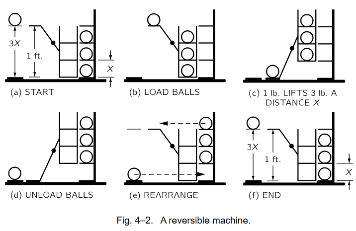

# 能量守恒[^1]

可以以一些公式计算各种能量，最后发现全部数量加在一起恒定

最开始由生物学发现

现象：船员在热带地区静脉血比在欧洲更鲜红

推论：炎热环境减少产热，导致氧化作用减弱，剩余氧气过多，呈现鲜红色。食物的化学能->体温（热能）+机械能，能量守恒

## 重力势能

物体从一高度下落能砸坏东西，即具有与高度相关的能量，假设有可逆机（即不消耗能量），左边物体降落1ft对应右边上升x，对应系统回到了初始状态，即1ft≥3x，可逆机反向运动，对应1ft≤3x，综合看结果是1ft=3x。那么如下图所示得到$f=3x$，否则要么耗散要么增加了能量。

推广：该方法应用到基本粒子，$x$趋近于无穷小，变化的小球数量，则$f=nx$趋近于连续，不规则物体可以拆分成多分基本粒子。
所以经过可逆机后重力势能没有变化，定义为高度和重量的乘积（都是相对的，和度量有关，不同的比例尺或者单位最终只有系数差异）

所以有
$$
重力势能=(重量)\times(高度)=mgh
$$
能量只是一个数字，可以乘系数，或者认为系数就是改变单位（量纲）

**几个事实和严密的推理可以推断出很多大自然的知识**

与位置相关的能量为势能，电荷中有电势能，一般的原则是
$$
能量变化=(力)\times(力作用通过的距离)
$$
可以从重力势能中引申，小球掉落h，对应重力势能损失mgh，即功=力x距离

## 动能

可以由重力势能定义，高处下落一个物体，重力势能转化成动能
$$
mgh=mg\frac{1}{2}gt^2=\frac{1}{2}mv^2=T
$$
使用矢量推导功率计算方式
$$
\frac{dT}{dt}=\frac{d\frac{1}{2}m\boldsymbol{v}\cdot \boldsymbol{v}}{dt}=\boldsymbol{v}\frac{dm\boldsymbol{v}}{dt}=\boldsymbol{F}\cdot \boldsymbol{v}
$$
则有
$$
\Delta T=\int_1^2\boldsymbol{F}\cdot \boldsymbol{s}
$$
对应有
$$
动能变化=(合外力)\times(力作用通过的距离)
$$
合力也可以分开成分力，则最终每个分力做的功之和对应动能变化

**矢量定义意味着可以分解3个反向分别进行计算求和**，比如只受到重力则可以只计算重力方向的位移即可

## 其他能量

- 弹性势能
- 热能
- 电能（包含辐射能，即光能）
- 核能
- 质能（由于纯粹的纯在就有能量产生）

化学能包含电子动能，以及电子与质子相互作用的电能

## 功与势能

物理学中的功和生理学中的功有差异

人提着重物不动，物理学认为没有做功，但实际上人会出汗，颤抖。骨骼肌作用：接受神经脉冲后抽搐一下然后松弛下来，提起重物时，骨骼肌接受大量神经脉冲保持大量抽搐，生理学做功

> 人和其他动物有两种肌肉：
> 横纹肌或骨骼肌：例如手臂中的肌肉，可以随意控制，提起重物疲劳后开始颤抖，肌肉疲劳了，反应不够快
> 平滑肌：如直肠的肌肉，工作非常缓慢，但能够保持一种“姿势”，长时间负荷下仍然保持一定位置而不感受到疲劳

### 落体的能量

> 定义和推导是两回事，比如这里定义了重力势能和动能$U=mgh,T=\frac{1}{2}mv^2$，但是满足的关系需要重新进行严格验证，如能量守恒

反过来可以使用定义来验证能量守恒，自由落体能量包含动能和重力势能：$E=\frac{1}{2}mv^2+mgh$
$$
\frac{dE}{dt}=-mg\frac{dh}{dt}+mg\frac{dh}{dt}=0
$$
说明能量守恒。也可证明在无摩擦不规则斜坡上下落物体的能量守恒

### 万有引力势能

沿着径向从点1运动到点2，对应有
$$
T_2-T_1=\int_1^2-\frac{GMm}{r^2}\text{d}r=\frac{GMm}{r_2}-\frac{GMm}{r_1}
$$
所以有$T_2-\frac{GMm}{r_2}=T_1-\frac{GMm}{r_1}$，对应势能
$$
U=-\frac{GMm}{r}
$$
圆周方向运动垂直受力方向不做功，对应动能不变，势能不变，所以引力势能场是一个径向场，只与半径相关。势能从近地面扩展到星空

#### 势与场

> 力和场

选定无穷远处为零势能点（选其他点也可以类似推导，只是这样更方便），即上式选择点1为无穷远，对应$r_1=+\infty$，对应有
$$
\int_1^2\boldsymbol{F}\cdot \boldsymbol{s}=\frac{GMm}{r_2}=-U
$$
势场（矢量场）：
$\boldsymbol{F}=m\boldsymbol{C}$，其中$\boldsymbol{C}=G M/\boldsymbol{r}^2$ ，即可以通过势场计算力

势函数（标量）：
$U=−∫_1^2 \boldsymbol{F}⋅d\boldsymbol{s}=−m∫_1^2 \boldsymbol{C}⋅d\boldsymbol{s}=m\Psi $
这里通过$\Psi $来表示势函数，求多个质量点产生的势函数很好计算
$$
\Psi(p)=\sum_i -\frac{Gm_i}{r_i},i=1,2,\dots
$$
通过势函数变化同样可以计算每个方向的受力
比如$x$方向很小距离则有
$F_x=-\frac{\Delta U}{\Delta x}=-\frac{\partial U}{\partial x}$

集合三个方向则有从标量到矢量，$∇$梯度：
$$
F=−\Delta U,C=−\Delta \Psi
$$
电场也可以这样类比

### 能量求和

多粒子能量求和，动能比较简单$\sum_i\frac{1}{2}m_iv_i^2$，势能求和理解，分成几步从无穷远、不存在力的地方一个一个挪动到当前位置，演变成当前状态

刚开始没有物体，挪动物体1到当前位置不做功，然后把第2个物体挪动到当前位置，克服万有引力做工$W_{12}=-\frac{Gm_1m_2}{r_{12}}$，同理挪动第3个物体做功包含两部分$W_{13}=-\frac{Gm_1m_3}{r_{13}},W_{23}=-\frac{Gm_2m_3}{r_{23}}$，演变成最终状态则是所有物体对具有的势能
$$
U=\sum_{ij}-\frac{Gm_im_j}{r_{ij}}
$$
能量守恒可以直接求导证明
$$
\sum_i\frac{1}{2}m_iv_i^2+\sum_{ij}-\frac{Gm_im_j}{r_{ij}}=\text{const.}
$$

## 直观理解

- **时间平移对称性**（物理定律不依赖于绝对时间） → **能量守恒**

> 诺特定理说：**每一种连续对称性，都对应一个守恒量。**
>
> - **空间平移对称性**（物理定律不依赖于绝对位置） → **动量守恒**
> - **旋转对称性**（物理定律不依赖于绝对方向） → **角动量守恒**
> - **时间平移对称性**（物理定律不依赖于绝对时间） → **能量守恒**

如果今天做和明天做，结果完全一样（只要初始条件相同），那就说明物理定律不依赖于**起始的绝对时刻**。换句话说，把整个实验在时间轴上平移任意一个时间间隔 $t_0$，物理过程的规律不变。这就是**时间平移对称性**

考虑一个在势场 $V(x)$ 中运动的粒子。它的总能量 $E=\frac{1}{2} mv^2+V(x)$。如果势场 $V(x)$**不显含时间**（即 $∂V/∂t=0$），那么你可以从牛顿方程推导出 $dE/dt=0$。反过来，如果$V(x)$显含时间（比如势场在随时间变化），那么能量就不守恒。而“势场不显含时间”恰恰是**物理定律不依赖于绝对时间**的直接体现——因为你无法区分今天是势场$V(x)$还是明天是 $V(x)$；它总是同一个函数。所以，时间平移对称性直接导致能量守恒。严格推导需要使用量子力学

# 引用

[^1]: [The Feynman Lectures on Physics Vol. I Ch. 4: Conservation of Energy](https://www.feynmanlectures.caltech.edu/I_04.html)
